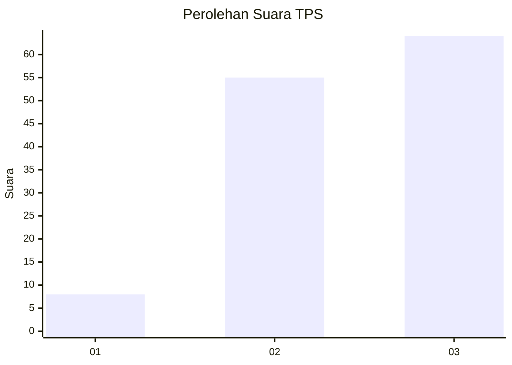
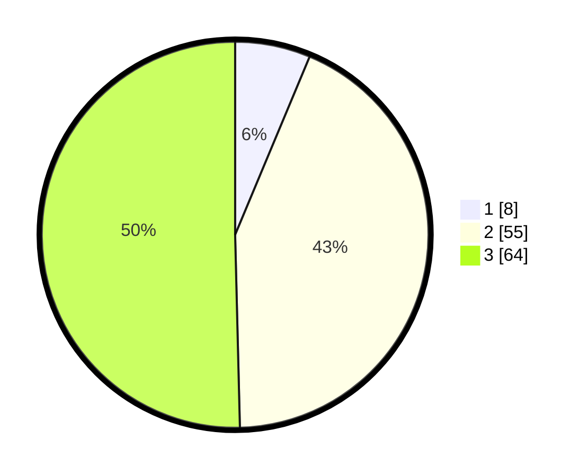

# Hasil

## Grafik

## Tabel

| No. | Nama Paslon    | Suara | Suara (raw) | Persentase |
|:--- |:-------------- | -----:| -----------:| ----------:|
| 1   | ANIES MUHAIMIN | 8     | [8][p-1]    | 6,30       |
| 2   | PRABOWO GIBRAN | 55    | [55][p-2]   | 43,31      |
| 3   | GANJAR MAHFUD  | 64    | [64][p-3]   | 50,39      |

[p-1]: https://github.com/gigit-pemilu/pemilu-2024-33-jawa-tengah/blob/main/pilpres/hitung-suara/sub/33-jawa-tengah/sub/24-kendal/sub/04-patean/sub/2012-kalices/sub/001-tps/sub/paslon-1.txt
[p-2]: https://github.com/gigit-pemilu/pemilu-2024-33-jawa-tengah/blob/main/pilpres/hitung-suara/sub/33-jawa-tengah/sub/24-kendal/sub/04-patean/sub/2012-kalices/sub/001-tps/sub/paslon-2.txt
[p-3]: https://github.com/gigit-pemilu/pemilu-2024-33-jawa-tengah/blob/main/pilpres/hitung-suara/sub/33-jawa-tengah/sub/24-kendal/sub/04-patean/sub/2012-kalices/sub/001-tps/sub/paslon-3.txt

## Foto C Plano

https://sirekap-obj-formc.kpu.go.id/11ca/pemilu/ppwp/33/24/04/20/12/3324042012001-20240217-134131--e4ad510d-ee5d-4e21-98a8-1857ec5524f2.jpg

https://sirekap-obj-formc.kpu.go.id/11ca/pemilu/ppwp/33/24/04/20/12/3324042012001-20240214-141306--ca2d37c3-bf6f-45e3-8121-7e8ebdad85e5.jpg

https://sirekap-obj-formc.kpu.go.id/11ca/pemilu/ppwp/33/24/04/20/12/3324042012001-20240214-141423--60764a45-6882-4f2c-90f7-94ead35f0452.jpg

## Metadata

| Key        | Value               |
| ---------- | ------------------- |
| Time Stamp | 2024-02-17 13:42:09 |

