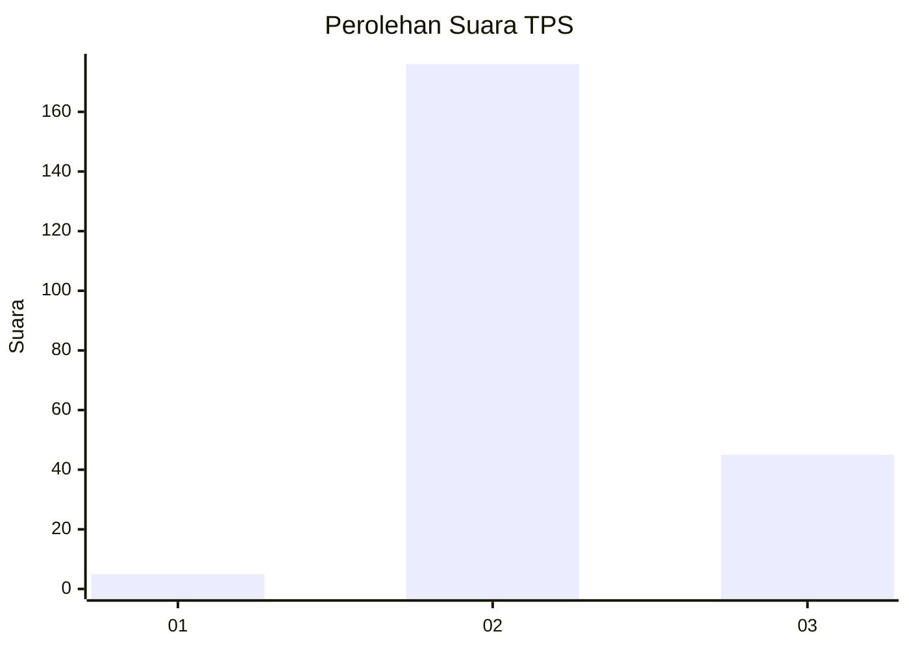

# Hasil

## Grafik

## Tabel

| No. | Nama Paslon    | Suara | Suara (raw) | Persentase |
|:--- |:-------------- | -----:| -----------:| ----------:|
| 1   | ANIES MUHAIMIN | 5     | [5][p-1]    | 2,21       |
| 2   | PRABOWO GIBRAN | 176   | [176][p-2]  | 77,88      |
| 3   | GANJAR MAHFUD  | 45    | [45][p-3]   | 19,91      |

[p-1]: https://github.com/gigit-pemilu/pemilu-2024-33-jawa-tengah/blob/main/pilpres/hitung-suara/sub/33-jawa-tengah/sub/24-kendal/sub/05-singorojo/sub/2001-cening/sub/002-tps/sub/paslon-1.txt
[p-2]: https://github.com/gigit-pemilu/pemilu-2024-33-jawa-tengah/blob/main/pilpres/hitung-suara/sub/33-jawa-tengah/sub/24-kendal/sub/05-singorojo/sub/2001-cening/sub/002-tps/sub/paslon-2.txt
[p-3]: https://github.com/gigit-pemilu/pemilu-2024-33-jawa-tengah/blob/main/pilpres/hitung-suara/sub/33-jawa-tengah/sub/24-kendal/sub/05-singorojo/sub/2001-cening/sub/002-tps/sub/paslon-3.txt

## Foto C Plano

https://sirekap-obj-formc.kpu.go.id/b09d/pemilu/ppwp/33/24/05/20/01/3324052001002-20240215-024859--18dbe5a9-da43-4b75-908b-5ea84383356a.jpg

https://sirekap-obj-formc.kpu.go.id/b09d/pemilu/ppwp/33/24/05/20/01/3324052001002-20240215-025002--f4ef503c-de01-4c93-8cb3-89c940e8689d.jpg

https://sirekap-obj-formc.kpu.go.id/b09d/pemilu/ppwp/33/24/05/20/01/3324052001002-20240215-025048--47f5e195-9e17-4823-92f2-a392adf835f4.jpg

## Metadata

| Key        | Value               |
| ---------- | ------------------- |
| Time Stamp | 2024-02-15 19:30:26 |

