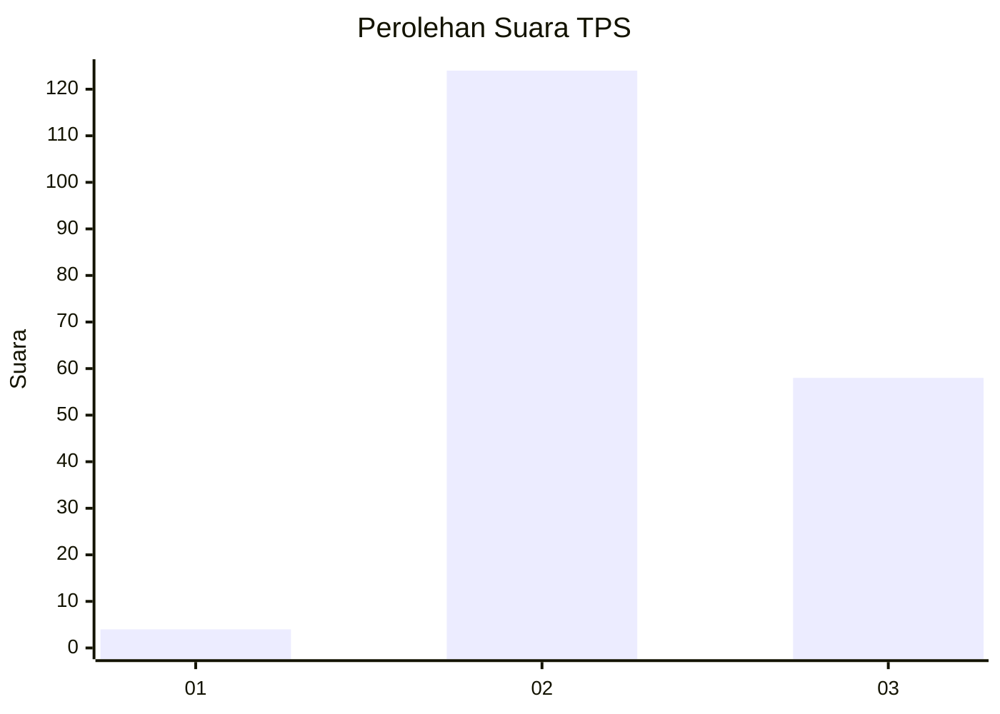
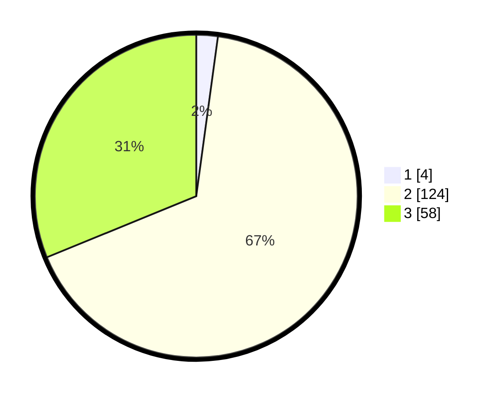

# Hasil

## Grafik

## Tabel

| No. | Nama Paslon    | Suara | Suara (raw) | Persentase |
|:--- |:-------------- | -----:| -----------:| ----------:|
| 1   | ANIES MUHAIMIN | 4     | [4][p-1]    | 2,15       |
| 2   | PRABOWO GIBRAN | 124   | [124][p-2]  | 66,67      |
| 3   | GANJAR MAHFUD  | 58    | [58][p-3]   | 31,18      |

[p-1]: https://github.com/gigit-pemilu/pemilu-2024/blob/main/pilpres/hitung-suara/sub/33-jawa-tengah/sub/24-kendal/sub/05-singorojo/sub/2001-cening/sub/004-tps/sub/paslon-1.txt
[p-2]: https://github.com/gigit-pemilu/pemilu-2024/blob/main/pilpres/hitung-suara/sub/33-jawa-tengah/sub/24-kendal/sub/05-singorojo/sub/2001-cening/sub/004-tps/sub/paslon-2.txt
[p-3]: https://github.com/gigit-pemilu/pemilu-2024/blob/main/pilpres/hitung-suara/sub/33-jawa-tengah/sub/24-kendal/sub/05-singorojo/sub/2001-cening/sub/004-tps/sub/paslon-3.txt

## Foto C Plano

https://sirekap-obj-formc.kpu.go.id/aa04/pemilu/ppwp/33/24/05/20/01/3324052001004-20240214-222820--ce1a152c-694b-4f2a-bbd0-224b4f3ae7aa.jpg

https://sirekap-obj-formc.kpu.go.id/aa04/pemilu/ppwp/33/24/05/20/01/3324052001004-20240214-222951--1d0f2b29-29e3-4aca-8071-d5ca0ba08e3f.jpg

https://sirekap-obj-formc.kpu.go.id/aa04/pemilu/ppwp/33/24/05/20/01/3324052001004-20240214-223056--f290e914-b4df-439d-ab7a-132cf297f2e3.jpg

## Metadata

| Key        | Value               |
| ---------- | ------------------- |
| Time Stamp | 2024-02-16 22:01:00 |

