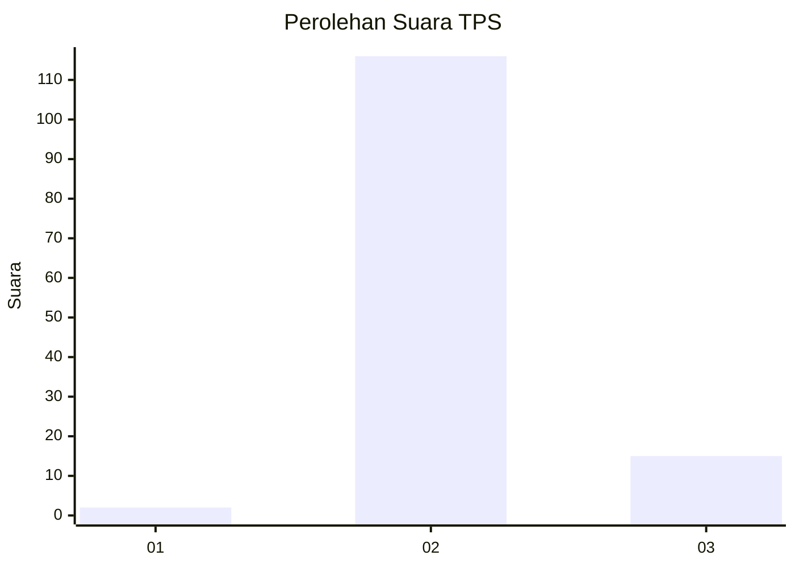
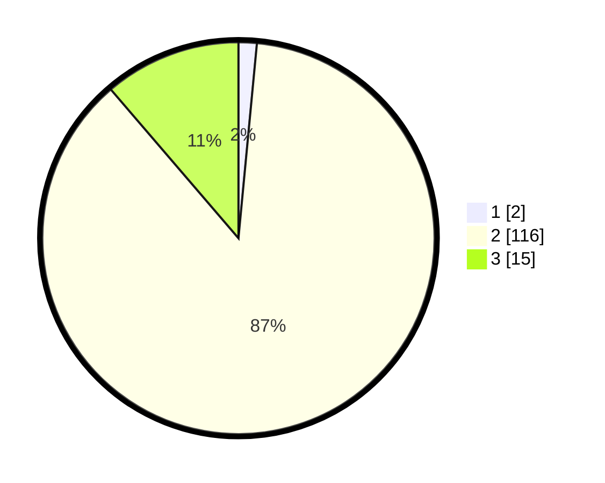

# Hasil

## Grafik

## Tabel

| No. | Nama Paslon    | Suara | Suara (raw) | Persentase |
|:--- |:-------------- | -----:| -----------:| ----------:|
| 1   | ANIES MUHAIMIN | 2     | [2][p-1]    | 1,50       |
| 2   | PRABOWO GIBRAN | 116   | [116][p-2]  | 87,22      |
| 3   | GANJAR MAHFUD  | 15    | [15][p-3]   | 11,28      |

[p-1]: https://github.com/gigit-pemilu/pemilu-2024/blob/main/pilpres/hitung-suara/sub/33-jawa-tengah/sub/24-kendal/sub/05-singorojo/sub/2001-cening/sub/010-tps/sub/paslon-1.txt
[p-2]: https://github.com/gigit-pemilu/pemilu-2024/blob/main/pilpres/hitung-suara/sub/33-jawa-tengah/sub/24-kendal/sub/05-singorojo/sub/2001-cening/sub/010-tps/sub/paslon-2.txt
[p-3]: https://github.com/gigit-pemilu/pemilu-2024/blob/main/pilpres/hitung-suara/sub/33-jawa-tengah/sub/24-kendal/sub/05-singorojo/sub/2001-cening/sub/010-tps/sub/paslon-3.txt

## Foto C Plano

https://sirekap-obj-formc.kpu.go.id/63c7/pemilu/ppwp/33/24/05/20/01/3324052001010-20240215-023116--75c76281-d55d-4b5d-8ae1-b49431a134fe.jpg

https://sirekap-obj-formc.kpu.go.id/63c7/pemilu/ppwp/33/24/05/20/01/3324052001010-20240215-022952--e08f7e71-4e5f-40ee-9474-134ee023d352.jpg

https://sirekap-obj-formc.kpu.go.id/63c7/pemilu/ppwp/33/24/05/20/01/3324052001010-20240215-022817--df0b0a9f-ade7-477f-8b4a-bc6dc771df42.jpg

## Metadata

| Key        | Value               |
| ---------- | ------------------- |
| Time Stamp | 2024-02-16 22:01:00 |

