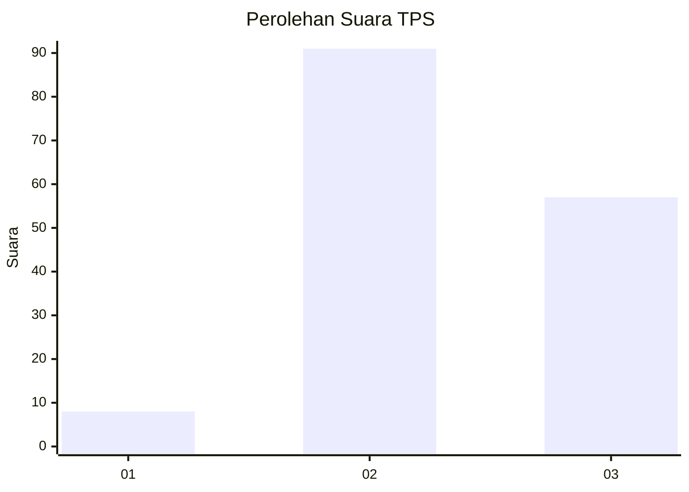
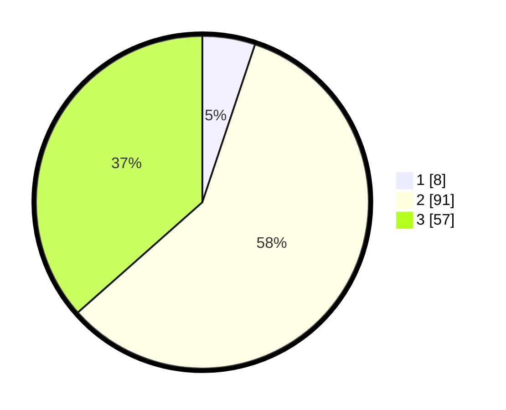

# Hasil

## Grafik

## Tabel

| No. | Nama Paslon    | Suara | Suara (raw) | Persentase |
|:--- |:-------------- | -----:| -----------:| ----------:|
| 1   | ANIES MUHAIMIN | 8     | [8][p-1]    | 5,13       |
| 2   | PRABOWO GIBRAN | 91    | [91][p-2]   | 58,33      |
| 3   | GANJAR MAHFUD  | 57    | [57][p-3]   | 36,54      |

[p-1]: https://github.com/gigit-pemilu/pemilu-2024-33-jawa-tengah/blob/main/pilpres/hitung-suara/sub/33-jawa-tengah/sub/24-kendal/sub/08-kaliwungu/sub/2003-sumberejo/sub/001-tps/sub/paslon-1.txt
[p-2]: https://github.com/gigit-pemilu/pemilu-2024-33-jawa-tengah/blob/main/pilpres/hitung-suara/sub/33-jawa-tengah/sub/24-kendal/sub/08-kaliwungu/sub/2003-sumberejo/sub/001-tps/sub/paslon-2.txt
[p-3]: https://github.com/gigit-pemilu/pemilu-2024-33-jawa-tengah/blob/main/pilpres/hitung-suara/sub/33-jawa-tengah/sub/24-kendal/sub/08-kaliwungu/sub/2003-sumberejo/sub/001-tps/sub/paslon-3.txt

## Foto C Plano

https://sirekap-obj-formc.kpu.go.id/9d44/pemilu/ppwp/33/24/08/20/03/3324082003001-20240215-183116--0f48ced8-1184-4c9b-97a0-fb36c3bc6ccb.jpg

https://sirekap-obj-formc.kpu.go.id/9d44/pemilu/ppwp/33/24/08/20/03/3324082003001-20240214-195547--eabb40ff-1ecd-42b3-bba1-8fc30d17d0a2.jpg

https://sirekap-obj-formc.kpu.go.id/9d44/pemilu/ppwp/33/24/08/20/03/3324082003001-20240214-195646--32035025-3eee-47ed-8da4-38fc7cdae011.jpg

## Metadata

| Key        | Value               |
| ---------- | ------------------- |
| Time Stamp | 2024-02-15 21:30:27 |

