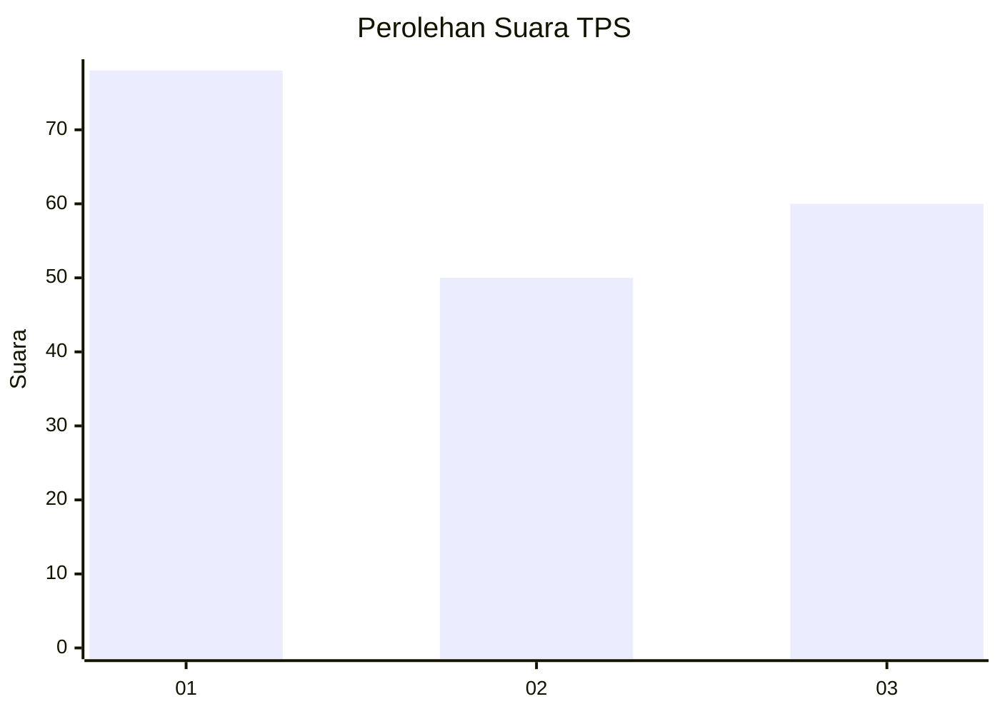
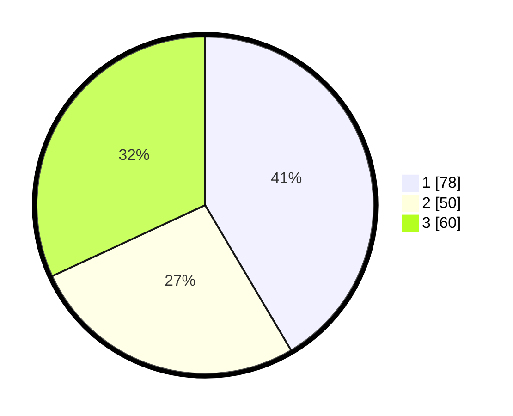

# Hasil

## Grafik

## Tabel

| No. | Nama Paslon    | Suara | Suara (raw) | Persentase |
|:--- |:-------------- | -----:| -----------:| ----------:|
| 1   | ANIES MUHAIMIN | 78    | [78][p-1]   | 41,49      |
| 2   | PRABOWO GIBRAN | 50    | [50][p-2]   | 26,60      |
| 3   | GANJAR MAHFUD  | 60    | [60][p-3]   | 31,91      |

[p-1]: https://github.com/gigit-pemilu/pemilu-2024/blob/main/pilpres/hitung-suara/sub/33-jawa-tengah/sub/24-kendal/sub/14-patebon/sub/2009-purwosari/sub/005-tps/sub/paslon-1.txt
[p-2]: https://github.com/gigit-pemilu/pemilu-2024/blob/main/pilpres/hitung-suara/sub/33-jawa-tengah/sub/24-kendal/sub/14-patebon/sub/2009-purwosari/sub/005-tps/sub/paslon-2.txt
[p-3]: https://github.com/gigit-pemilu/pemilu-2024/blob/main/pilpres/hitung-suara/sub/33-jawa-tengah/sub/24-kendal/sub/14-patebon/sub/2009-purwosari/sub/005-tps/sub/paslon-3.txt

## Foto C Plano

https://sirekap-obj-formc.kpu.go.id/a230/pemilu/ppwp/33/24/14/20/09/3324142009005-20240214-214732--5e334c4c-347c-4d23-b99e-b89fb3563500.jpg

https://sirekap-obj-formc.kpu.go.id/a230/pemilu/ppwp/33/24/14/20/09/3324142009005-20240214-215119--82d12162-f47b-44d7-bbad-52a8b3442437.jpg

https://sirekap-obj-formc.kpu.go.id/a230/pemilu/ppwp/33/24/14/20/09/3324142009005-20240214-215352--cbda6c00-537d-4ec3-b3ab-60dd01a86624.jpg

## Metadata

| Key        | Value               |
| ---------- | ------------------- |
| Time Stamp | 2024-02-15 22:40:13 |

