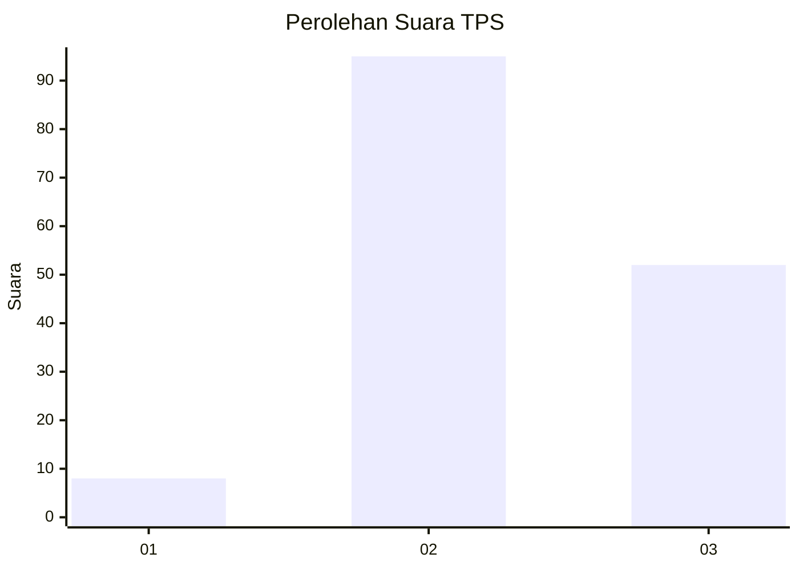
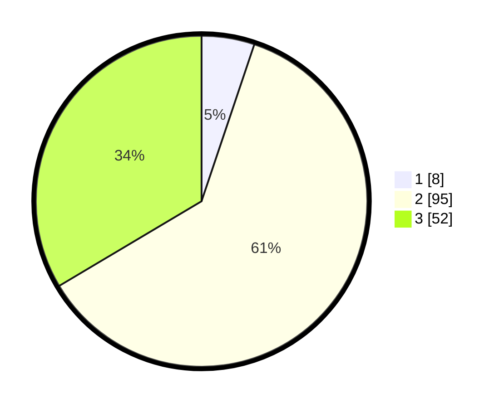

# Hasil

## Grafik

## Tabel

| No. | Nama Paslon    | Suara | Suara (raw) | Persentase |
|:--- |:-------------- | -----:| -----------:| ----------:|
| 1   | ANIES MUHAIMIN | 8     | [8][p-1]    | 5,16       |
| 2   | PRABOWO GIBRAN | 95    | [95][p-2]   | 61,29      |
| 3   | GANJAR MAHFUD  | 52    | [52][p-3]   | 33,55      |

[p-1]: https://github.com/gigit-pemilu/pemilu-2024-33-jawa-tengah/blob/main/pilpres/hitung-suara/sub/33-jawa-tengah/sub/24-kendal/sub/16-rowosari/sub/2001-wonotenggang/sub/004-tps/sub/paslon-1.txt
[p-2]: https://github.com/gigit-pemilu/pemilu-2024-33-jawa-tengah/blob/main/pilpres/hitung-suara/sub/33-jawa-tengah/sub/24-kendal/sub/16-rowosari/sub/2001-wonotenggang/sub/004-tps/sub/paslon-2.txt
[p-3]: https://github.com/gigit-pemilu/pemilu-2024-33-jawa-tengah/blob/main/pilpres/hitung-suara/sub/33-jawa-tengah/sub/24-kendal/sub/16-rowosari/sub/2001-wonotenggang/sub/004-tps/sub/paslon-3.txt

## Foto C Plano

https://sirekap-obj-formc.kpu.go.id/7147/pemilu/ppwp/33/24/16/20/01/3324162001004-20240214-141527--32d856ec-e915-4fb2-9b51-a4ffb8dd8353.jpg

https://sirekap-obj-formc.kpu.go.id/7147/pemilu/ppwp/33/24/16/20/01/3324162001004-20240214-141618--31475270-64c1-4806-8853-c2c90b097f55.jpg

https://sirekap-obj-formc.kpu.go.id/7147/pemilu/ppwp/33/24/16/20/01/3324162001004-20240214-141717--05455181-69e4-440f-827f-fc0332c6e445.jpg

## Metadata

| Key        | Value               |
| ---------- | ------------------- |
| Time Stamp | 2024-02-14 21:46:01 |

