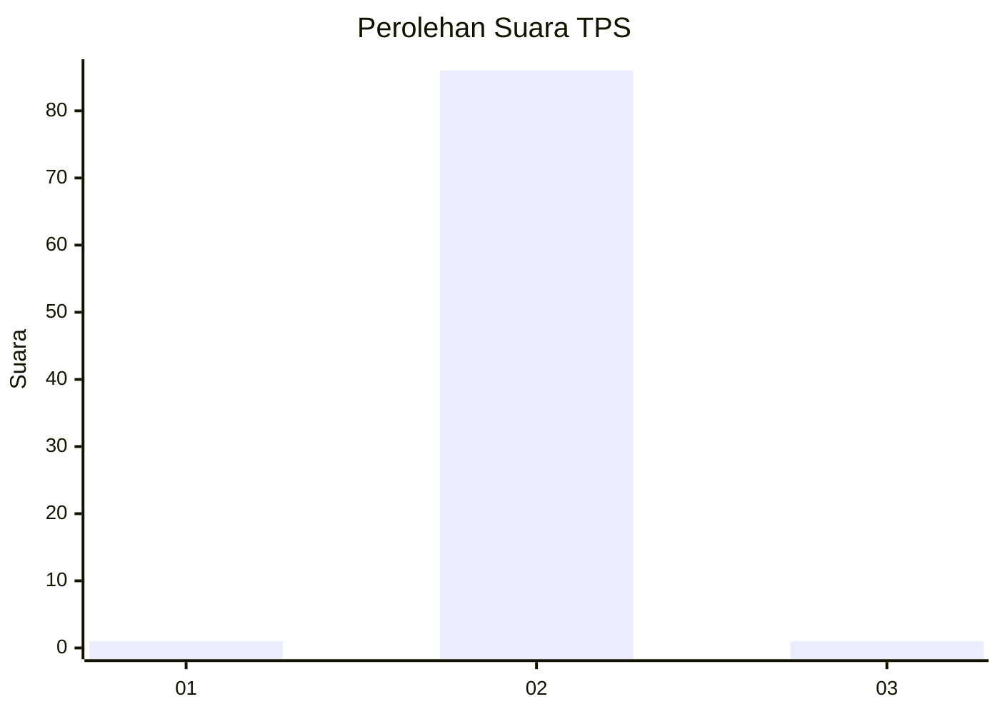
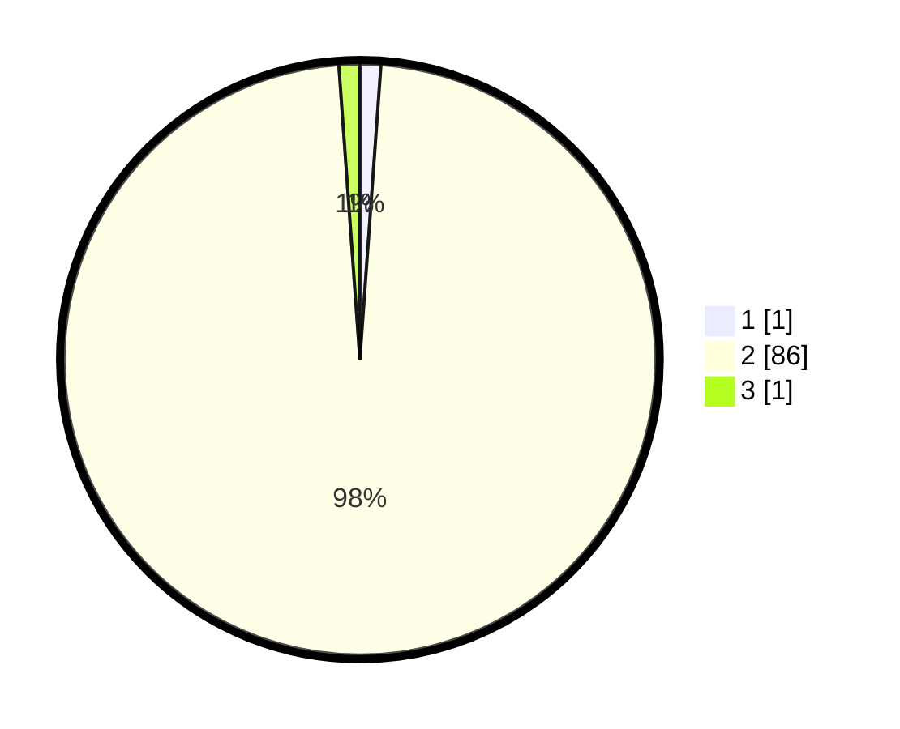

# Hasil

## Grafik

## Tabel

| No. | Nama Paslon    | Suara | Suara (raw) | Persentase |
|:--- |:-------------- | -----:| -----------:| ----------:|
| 1   | ANIES MUHAIMIN | 1     | [1][p-1]    | 1,14       |
| 2   | PRABOWO GIBRAN | 86    | [86][p-2]   | 97,73      |
| 3   | GANJAR MAHFUD  | 1     | [1][p-3]    | 1,14       |

[p-1]: https://github.com/gigit-pemilu/pemilu-2024-33-jawa-tengah/blob/main/pilpres/hitung-suara/sub/33-jawa-tengah/sub/24-kendal/sub/16-rowosari/sub/2015-gempolsewu/sub/010-tps/sub/paslon-1.txt
[p-2]: https://github.com/gigit-pemilu/pemilu-2024-33-jawa-tengah/blob/main/pilpres/hitung-suara/sub/33-jawa-tengah/sub/24-kendal/sub/16-rowosari/sub/2015-gempolsewu/sub/010-tps/sub/paslon-2.txt
[p-3]: https://github.com/gigit-pemilu/pemilu-2024-33-jawa-tengah/blob/main/pilpres/hitung-suara/sub/33-jawa-tengah/sub/24-kendal/sub/16-rowosari/sub/2015-gempolsewu/sub/010-tps/sub/paslon-3.txt

## Foto C Plano

https://sirekap-obj-formc.kpu.go.id/5056/pemilu/ppwp/33/24/16/20/15/3324162015010-20240216-161055--ab4cd0b2-669d-4918-ae8f-6011b5df1c1b.jpg

https://sirekap-obj-formc.kpu.go.id/5056/pemilu/ppwp/33/24/16/20/15/3324162015010-20240216-160838--3160dddf-cdf4-43b6-8755-8a35b652af85.jpg

https://sirekap-obj-formc.kpu.go.id/5056/pemilu/ppwp/33/24/16/20/15/3324162015010-20240216-160932--6a350d0c-9906-43ac-ac8f-4cafd8536324.jpg

## Metadata

| Key        | Value               |
| ---------- | ------------------- |
| Time Stamp | 2024-02-16 16:25:10 |

## DATA PEMILIH TETAP

Jumlah pemilih dalam DPT: **0**.
 * L: **0**.
 * P: **0**.

## DATA PENGGUNA HAK PILIH

Jumlah pengguna hak pilih dalam DPT: **757**.
 * L: **0**.
 * P: **5**.

Jumlah pengguna hak pilih dalam DPTb: **70**.
 * L: **5**.
 * P: **777**.

Jumlah pengguna hak pilih dalam DPK: **777**.
 * L: **5**.
 * P: **777**.

Jumlah pengguna hak pilih: **185**.
 * L: **88**.
 * P: **97**.

## JUMLAH SUARA SAH DAN TIDAK SAH

JUMLAH SELURUH SUARA SAH: **177**.

JUMLAH SUARA TIDAK SAH: **8**.

JUMLAH SELURUH SUARA SAH DAN SUARA TIDAK SAH: **185**.

