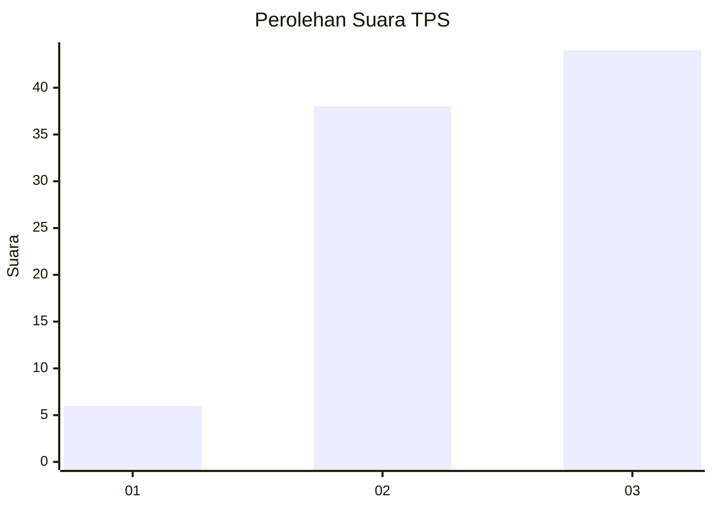
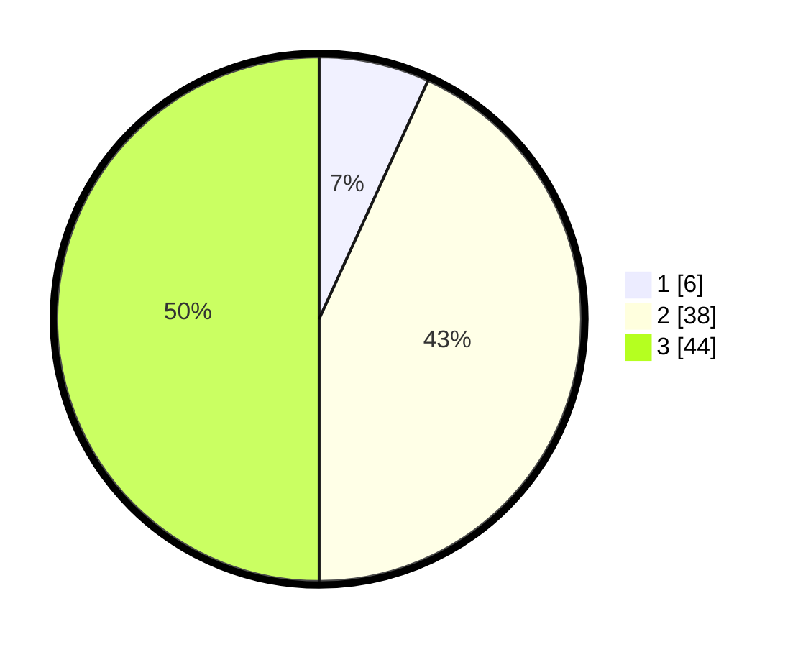

# Hasil

## Grafik

## Tabel

| No. | Nama Paslon    | Suara | Suara (raw) | Persentase |
|:--- |:-------------- | -----:| -----------:| ----------:|
| 1   | ANIES MUHAIMIN | 6     | [6][p-1]    | 6,82       |
| 2   | PRABOWO GIBRAN | 38    | [38][p-2]   | 43,18      |
| 3   | GANJAR MAHFUD  | 44    | [44][p-3]   | 50,00      |

[p-1]: https://github.com/gigit-pemilu/pemilu-2024-33-jawa-tengah/blob/main/pilpres/hitung-suara/sub/33-jawa-tengah/sub/25-batang/sub/01-wonotunggal/sub/2001-silurah/sub/005-tps/sub/paslon-1.txt
[p-2]: https://github.com/gigit-pemilu/pemilu-2024-33-jawa-tengah/blob/main/pilpres/hitung-suara/sub/33-jawa-tengah/sub/25-batang/sub/01-wonotunggal/sub/2001-silurah/sub/005-tps/sub/paslon-2.txt
[p-3]: https://github.com/gigit-pemilu/pemilu-2024-33-jawa-tengah/blob/main/pilpres/hitung-suara/sub/33-jawa-tengah/sub/25-batang/sub/01-wonotunggal/sub/2001-silurah/sub/005-tps/sub/paslon-3.txt

## Foto C Plano

https://sirekap-obj-formc.kpu.go.id/73cc/pemilu/ppwp/33/25/01/20/01/3325012001005-20240214-221738--d65d996c-bc65-4a8b-8a04-45427e678bba.jpg

https://sirekap-obj-formc.kpu.go.id/73cc/pemilu/ppwp/33/25/01/20/01/3325012001005-20240214-221811--ef65497e-9b1f-487e-b0e1-dcbc0c7cfefd.jpg

https://sirekap-obj-formc.kpu.go.id/73cc/pemilu/ppwp/33/25/01/20/01/3325012001005-20240214-221846--8f285db8-d713-4d24-ac0d-5d53e0957f98.jpg

## Metadata

| Key        | Value               |
| ---------- | ------------------- |
| Time Stamp | 2024-02-15 21:01:18 |

## DATA PEMILIH TETAP

Jumlah pemilih dalam DPT: **122**.
 * L: **66**.
 * P: **56**.

## DATA PENGGUNA HAK PILIH

Jumlah pengguna hak pilih dalam DPT: **104**.
 * L: **54**.
 * P: **50**.

Jumlah pengguna hak pilih dalam DPTb: **1**.
 * L: **1**.
 * P: **0**.

Jumlah pengguna hak pilih dalam DPK: **0**.
 * L: **0**.
 * P: **0**.

Jumlah pengguna hak pilih: **105**.
 * L: **55**.
 * P: **50**.

## JUMLAH SUARA SAH DAN TIDAK SAH

JUMLAH SELURUH SUARA SAH: **88**.

JUMLAH SUARA TIDAK SAH: **17**.

JUMLAH SELURUH SUARA SAH DAN SUARA TIDAK SAH: **105**.

