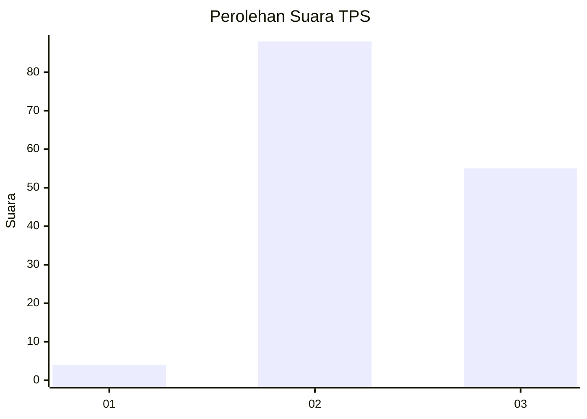
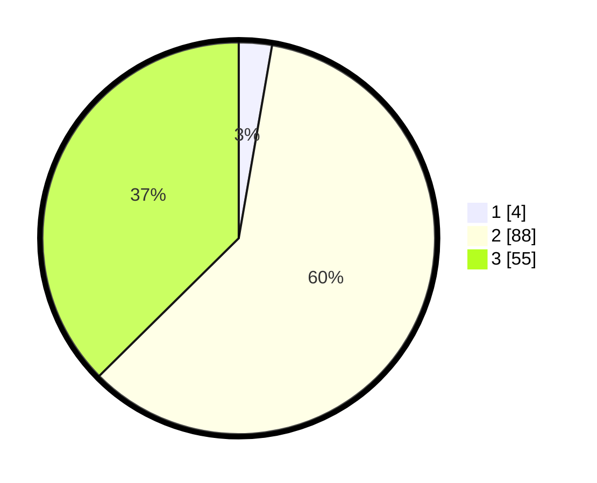

# Hasil

## Grafik

## Tabel

| No. | Nama Paslon    | Suara | Suara (raw) | Persentase |
|:--- |:-------------- | -----:| -----------:| ----------:|
| 1   | ANIES MUHAIMIN | 4     | [4][p-1]    | 2,72       |
| 2   | PRABOWO GIBRAN | 88    | [88][p-2]   | 59,86      |
| 3   | GANJAR MAHFUD  | 55    | [55][p-3]   | 37,41      |

[p-1]: https://github.com/gigit-pemilu/pemilu-2024-33-jawa-tengah/blob/main/pilpres/hitung-suara/sub/33-jawa-tengah/sub/25-batang/sub/01-wonotunggal/sub/2009-brayo/sub/005-tps/sub/paslon-1.txt
[p-2]: https://github.com/gigit-pemilu/pemilu-2024-33-jawa-tengah/blob/main/pilpres/hitung-suara/sub/33-jawa-tengah/sub/25-batang/sub/01-wonotunggal/sub/2009-brayo/sub/005-tps/sub/paslon-2.txt
[p-3]: https://github.com/gigit-pemilu/pemilu-2024-33-jawa-tengah/blob/main/pilpres/hitung-suara/sub/33-jawa-tengah/sub/25-batang/sub/01-wonotunggal/sub/2009-brayo/sub/005-tps/sub/paslon-3.txt

## Foto C Plano

https://sirekap-obj-formc.kpu.go.id/dfc3/pemilu/ppwp/33/25/01/20/09/3325012009005-20240214-214652--13179c68-bb98-4ea1-b7c7-4c4397c96b3a.jpg

https://sirekap-obj-formc.kpu.go.id/dfc3/pemilu/ppwp/33/25/01/20/09/3325012009005-20240215-001556--728399c0-36d4-47dc-844e-7f475ab765af.jpg

https://sirekap-obj-formc.kpu.go.id/dfc3/pemilu/ppwp/33/25/01/20/09/3325012009005-20240215-001510--663477c9-d2f2-485a-bbc0-6aae0cef28b1.jpg

## Metadata

| Key        | Value               |
| ---------- | ------------------- |
| Time Stamp | 2024-02-15 23:29:50 |

