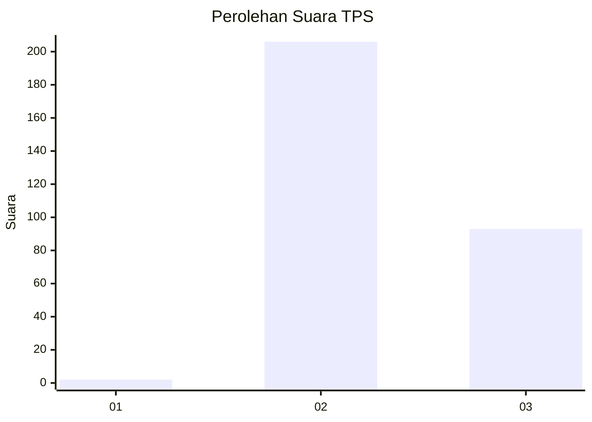
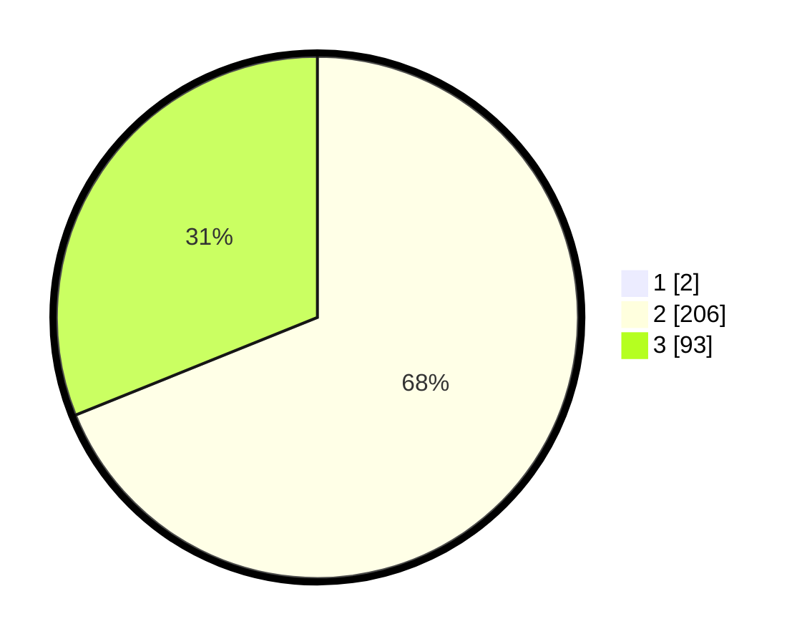

# Hasil

## Grafik

## Tabel

| No. | Nama Paslon    | Suara | Suara (raw) | Persentase |
|:--- |:-------------- | -----:| -----------:| ----------:|
| 1   | ANIES MUHAIMIN | 2     | [2][p-1]    | 0,66       |
| 2   | PRABOWO GIBRAN | 206   | [206][p-2]  | 68,44      |
| 3   | GANJAR MAHFUD  | 93    | [93][p-3]   | 30,90      |

[p-1]: https://github.com/gigit-pemilu/pemilu-2024/blob/main/pilpres/hitung-suara/sub/33-jawa-tengah/sub/25-batang/sub/03-blado/sub/2013-kambangan/sub/012-tps/sub/paslon-1.txt
[p-2]: https://github.com/gigit-pemilu/pemilu-2024/blob/main/pilpres/hitung-suara/sub/33-jawa-tengah/sub/25-batang/sub/03-blado/sub/2013-kambangan/sub/012-tps/sub/paslon-2.txt
[p-3]: https://github.com/gigit-pemilu/pemilu-2024/blob/main/pilpres/hitung-suara/sub/33-jawa-tengah/sub/25-batang/sub/03-blado/sub/2013-kambangan/sub/012-tps/sub/paslon-3.txt

## Foto C Plano

https://sirekap-obj-formc.kpu.go.id/bd2d/pemilu/ppwp/33/25/03/20/13/3325032013012-20240214-214254--e458d80d-63d2-4945-b9a3-2848c7099775.jpg

https://sirekap-obj-formc.kpu.go.id/bd2d/pemilu/ppwp/33/25/03/20/13/3325032013012-20240214-214405--a57477ae-aecd-4411-9331-a77ac35cd313.jpg

https://sirekap-obj-formc.kpu.go.id/bd2d/pemilu/ppwp/33/25/03/20/13/3325032013012-20240214-213951--7b4d3397-ee8f-4dc9-abc7-0f4fae9c8925.jpg

## Metadata

| Key        | Value               |
| ---------- | ------------------- |
| Time Stamp | 2024-02-15 15:00:29 |

## DATA PEMILIH TETAP

Jumlah pemilih dalam DPT: **233**.
 * L: **833**.
 * P: **200**.

## DATA PENGGUNA HAK PILIH

Jumlah pengguna hak pilih dalam DPT: **293**.
 * L: **669**.
 * P: **893**.

Jumlah pengguna hak pilih dalam DPTb: **4**.
 * L: **3**.
 * P: **6**.

Jumlah pengguna hak pilih dalam DPK: **802**.
 * L: **5**.
 * P: **4**.

Jumlah pengguna hak pilih: **299**.
 * L: **154**.
 * P: **95**.

## JUMLAH SUARA SAH DAN TIDAK SAH

JUMLAH SELURUH SUARA SAH: **205**.

JUMLAH SUARA TIDAK SAH: **8**.

JUMLAH SELURUH SUARA SAH DAN SUARA TIDAK SAH: **202**.

