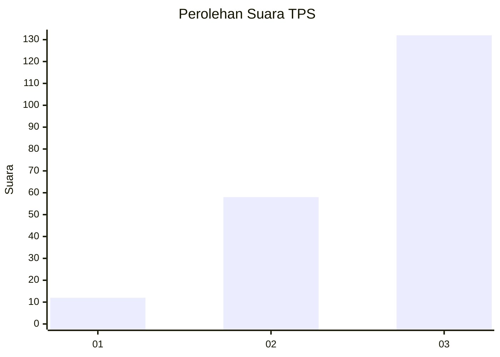
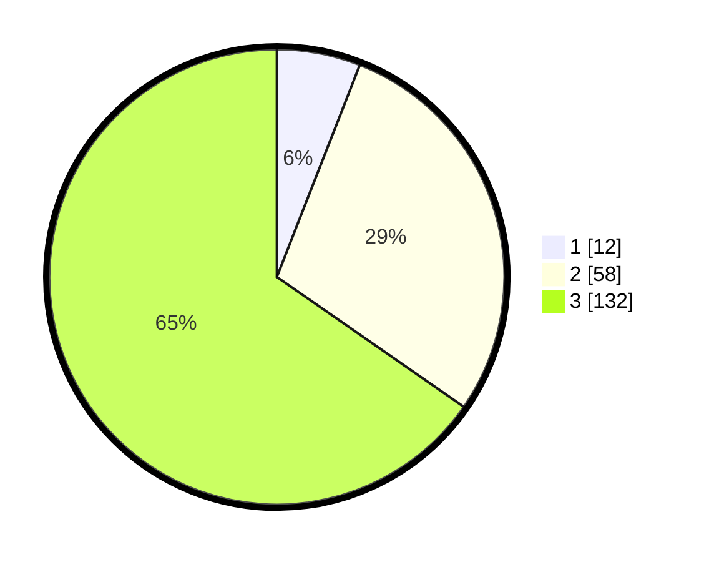

# Hasil

## Grafik

## Tabel

| No. | Nama Paslon    | Suara | Suara (raw) | Persentase |
|:--- |:-------------- | -----:| -----------:| ----------:|
| 1   | ANIES MUHAIMIN | 12    | [12][p-1]   | 5,94       |
| 2   | PRABOWO GIBRAN | 58    | [58][p-2]   | 28,71      |
| 3   | GANJAR MAHFUD  | 132   | [132][p-3]  | 65,35      |

[p-1]: https://github.com/gigit-pemilu/pemilu-2024-33-jawa-tengah/blob/main/pilpres/hitung-suara/sub/33-jawa-tengah/sub/25-batang/sub/04-reban/sub/2009-kumesu/sub/002-tps/sub/paslon-1.txt
[p-2]: https://github.com/gigit-pemilu/pemilu-2024-33-jawa-tengah/blob/main/pilpres/hitung-suara/sub/33-jawa-tengah/sub/25-batang/sub/04-reban/sub/2009-kumesu/sub/002-tps/sub/paslon-2.txt
[p-3]: https://github.com/gigit-pemilu/pemilu-2024-33-jawa-tengah/blob/main/pilpres/hitung-suara/sub/33-jawa-tengah/sub/25-batang/sub/04-reban/sub/2009-kumesu/sub/002-tps/sub/paslon-3.txt

## Foto C Plano

https://sirekap-obj-formc.kpu.go.id/9b68/pemilu/ppwp/33/25/04/20/09/3325042009002-20240214-215533--61cf599d-f8c8-4de8-825c-4fcc4ca0213e.jpg

https://sirekap-obj-formc.kpu.go.id/9b68/pemilu/ppwp/33/25/04/20/09/3325042009002-20240214-215826--5c716d7e-721f-47cd-a8ab-ad87d60eb298.jpg

https://sirekap-obj-formc.kpu.go.id/9b68/pemilu/ppwp/33/25/04/20/09/3325042009002-20240214-215949--1f5e072b-f6b0-4f57-9ddf-1337b526db38.jpg

## Metadata

| Key        | Value               |
| ---------- | ------------------- |
| Time Stamp | 2024-02-15 15:00:29 |

