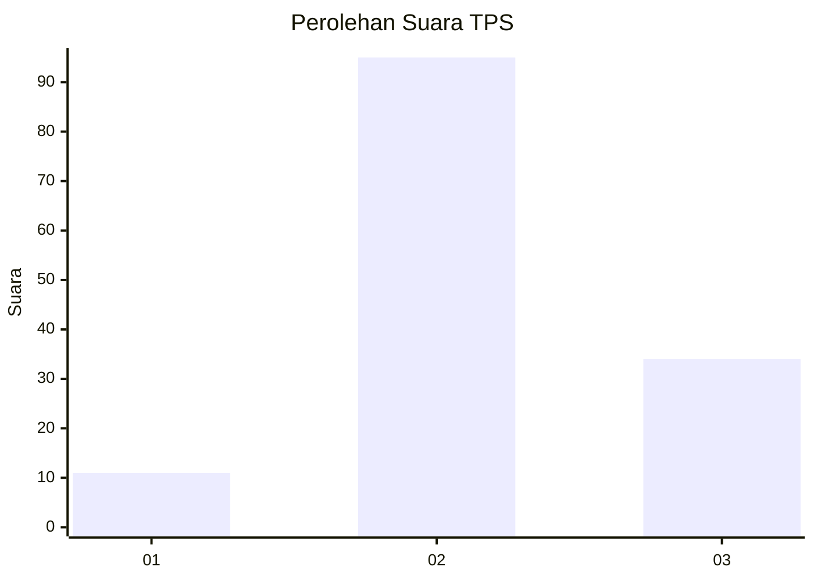
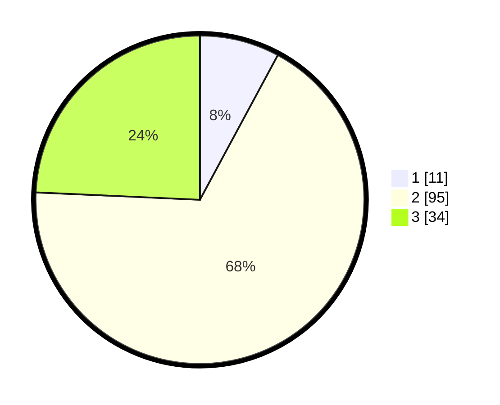

# Hasil

## Grafik

## Tabel

| No. | Nama Paslon    | Suara | Suara (raw) | Persentase |
|:--- |:-------------- | -----:| -----------:| ----------:|
| 1   | ANIES MUHAIMIN | 11    | [11][p-1]   | 7,86       |
| 2   | PRABOWO GIBRAN | 95    | [95][p-2]   | 67,86      |
| 3   | GANJAR MAHFUD  | 34    | [34][p-3]   | 24,29      |

[p-1]: https://github.com/gigit-pemilu/pemilu-2024-33-jawa-tengah/blob/main/pilpres/hitung-suara/sub/33-jawa-tengah/sub/25-batang/sub/04-reban/sub/2011-padomasan/sub/008-tps/sub/paslon-1.txt
[p-2]: https://github.com/gigit-pemilu/pemilu-2024-33-jawa-tengah/blob/main/pilpres/hitung-suara/sub/33-jawa-tengah/sub/25-batang/sub/04-reban/sub/2011-padomasan/sub/008-tps/sub/paslon-2.txt
[p-3]: https://github.com/gigit-pemilu/pemilu-2024-33-jawa-tengah/blob/main/pilpres/hitung-suara/sub/33-jawa-tengah/sub/25-batang/sub/04-reban/sub/2011-padomasan/sub/008-tps/sub/paslon-3.txt

## Foto C Plano

https://sirekap-obj-formc.kpu.go.id/d28b/pemilu/ppwp/33/25/04/20/11/3325042011008-20240214-203817--8f6eee93-6266-47b8-bf24-5d4f550732cd.jpg

https://sirekap-obj-formc.kpu.go.id/d28b/pemilu/ppwp/33/25/04/20/11/3325042011008-20240214-204007--d22304b2-3525-4f84-bbf5-ff0182f889ba.jpg

https://sirekap-obj-formc.kpu.go.id/d28b/pemilu/ppwp/33/25/04/20/11/3325042011008-20240214-204118--7d43b2d1-6155-4439-a5a4-559c0860dfd6.jpg

## Metadata

| Key        | Value               |
| ---------- | ------------------- |
| Time Stamp | 2024-02-15 23:29:50 |

