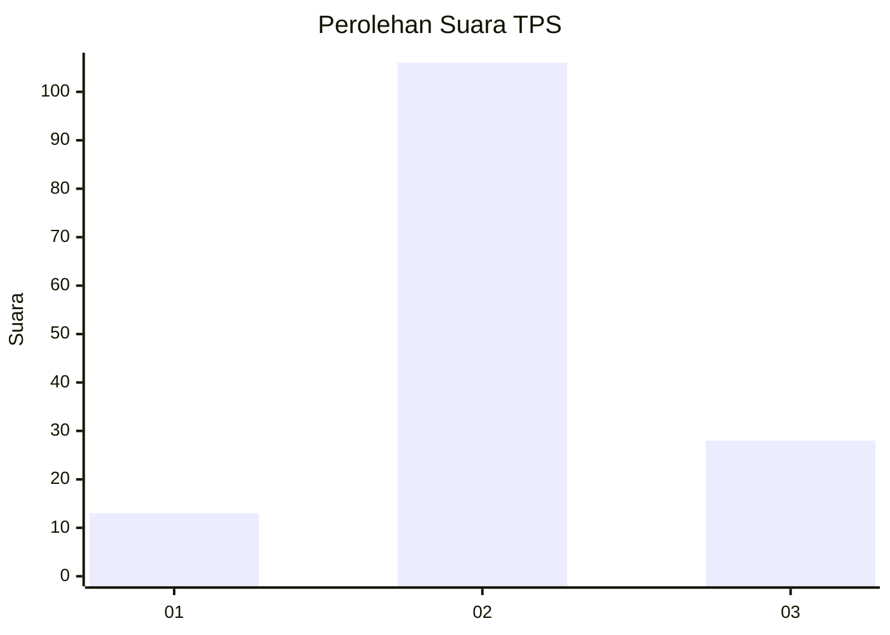
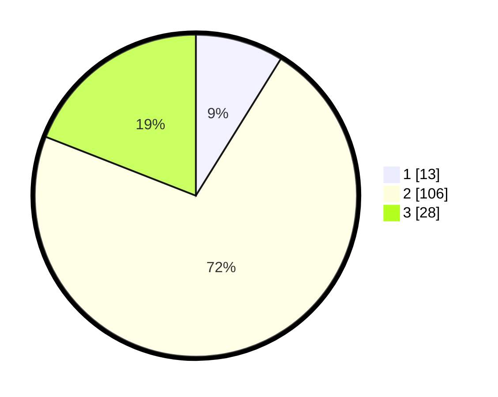

# Hasil

## Grafik

## Tabel

| No. | Nama Paslon    | Suara | Suara (raw) | Persentase |
|:--- |:-------------- | -----:| -----------:| ----------:|
| 1   | ANIES MUHAIMIN | 13    | [13][p-1]   | 8,84       |
| 2   | PRABOWO GIBRAN | 106   | [106][p-2]  | 72,11      |
| 3   | GANJAR MAHFUD  | 28    | [28][p-3]   | 19,05      |

[p-1]: https://github.com/gigit-pemilu/pemilu-2024-33-jawa-tengah/blob/main/pilpres/hitung-suara/sub/33-jawa-tengah/sub/25-batang/sub/05-bawang/sub/2001-pranten/sub/001-tps/sub/paslon-1.txt
[p-2]: https://github.com/gigit-pemilu/pemilu-2024-33-jawa-tengah/blob/main/pilpres/hitung-suara/sub/33-jawa-tengah/sub/25-batang/sub/05-bawang/sub/2001-pranten/sub/001-tps/sub/paslon-2.txt
[p-3]: https://github.com/gigit-pemilu/pemilu-2024-33-jawa-tengah/blob/main/pilpres/hitung-suara/sub/33-jawa-tengah/sub/25-batang/sub/05-bawang/sub/2001-pranten/sub/001-tps/sub/paslon-3.txt

## Foto C Plano

https://sirekap-obj-formc.kpu.go.id/8300/pemilu/ppwp/33/25/05/20/01/3325052001001-20240215-003215--dda02c65-1635-4f7f-a1c9-99d8bf17dbd2.jpg

https://sirekap-obj-formc.kpu.go.id/8300/pemilu/ppwp/33/25/05/20/01/3325052001001-20240215-003218--87a900a2-0afa-4a73-b05a-2ab8d4b553a9.jpg

https://sirekap-obj-formc.kpu.go.id/8300/pemilu/ppwp/33/25/05/20/01/3325052001001-20240215-003221--b9871659-f73a-4f77-97bd-382feab61754.jpg

## Metadata

| Key        | Value               |
| ---------- | ------------------- |
| Time Stamp | 2024-02-16 10:30:29 |

