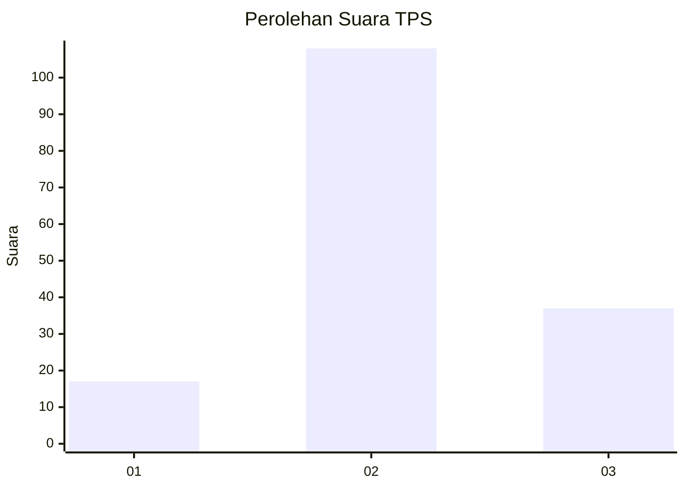
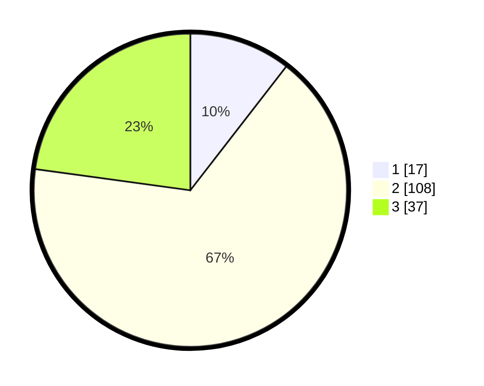

# Hasil

## Grafik

## Tabel

| No. | Nama Paslon    | Suara | Suara (raw) | Persentase |
|:--- |:-------------- | -----:| -----------:| ----------:|
| 1   | ANIES MUHAIMIN | 17    | [17][p-1]   | 10,49      |
| 2   | PRABOWO GIBRAN | 108   | [108][p-2]  | 66,67      |
| 3   | GANJAR MAHFUD  | 37    | [37][p-3]   | 22,84      |

[p-1]: https://github.com/gigit-pemilu/pemilu-2024/blob/main/pilpres/hitung-suara/sub/33-jawa-tengah/sub/25-batang/sub/05-bawang/sub/2001-pranten/sub/005-tps/sub/paslon-1.txt
[p-2]: https://github.com/gigit-pemilu/pemilu-2024/blob/main/pilpres/hitung-suara/sub/33-jawa-tengah/sub/25-batang/sub/05-bawang/sub/2001-pranten/sub/005-tps/sub/paslon-2.txt
[p-3]: https://github.com/gigit-pemilu/pemilu-2024/blob/main/pilpres/hitung-suara/sub/33-jawa-tengah/sub/25-batang/sub/05-bawang/sub/2001-pranten/sub/005-tps/sub/paslon-3.txt

## Foto C Plano

https://sirekap-obj-formc.kpu.go.id/6bca/pemilu/ppwp/33/25/05/20/01/3325052001005-20240214-221425--ebca6bba-fc6f-4b42-bbe8-a161a0eb3b8c.jpg

https://sirekap-obj-formc.kpu.go.id/6bca/pemilu/ppwp/33/25/05/20/01/3325052001005-20240214-221129--e37a5b4c-d142-4842-8510-9dbbfc350b64.jpg

https://sirekap-obj-formc.kpu.go.id/6bca/pemilu/ppwp/33/25/05/20/01/3325052001005-20240214-221552--bc2e4a2a-55ca-4fae-a2af-4b5f4990e90d.jpg

## Metadata

| Key        | Value               |
| ---------- | ------------------- |
| Time Stamp | 2024-02-15 12:00:28 |

