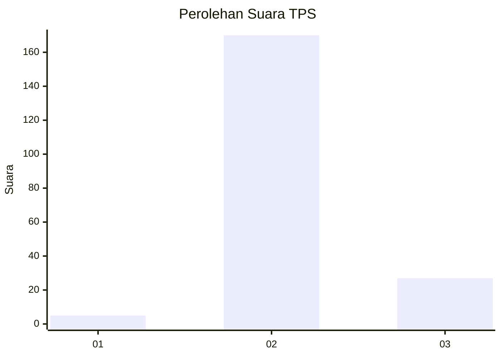
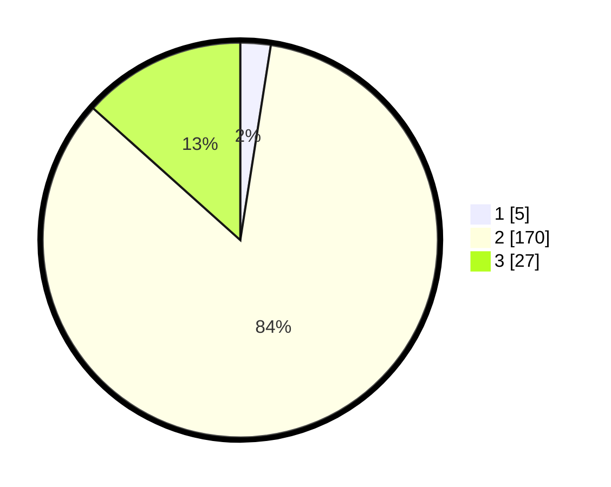

# Hasil

## Grafik

## Tabel

| No. | Nama Paslon    | Suara | Suara (raw) | Persentase |
|:--- |:-------------- | -----:| -----------:| ----------:|
| 1   | ANIES MUHAIMIN | 5     | [5][p-1]    | 2,48       |
| 2   | PRABOWO GIBRAN | 170   | [170][p-2]  | 84,16      |
| 3   | GANJAR MAHFUD  | 27    | [27][p-3]   | 13,37      |

[p-1]: https://github.com/gigit-pemilu/pemilu-2024/blob/main/pilpres/hitung-suara/sub/33-jawa-tengah/sub/25-batang/sub/05-bawang/sub/2001-pranten/sub/007-tps/sub/paslon-1.txt
[p-2]: https://github.com/gigit-pemilu/pemilu-2024/blob/main/pilpres/hitung-suara/sub/33-jawa-tengah/sub/25-batang/sub/05-bawang/sub/2001-pranten/sub/007-tps/sub/paslon-2.txt
[p-3]: https://github.com/gigit-pemilu/pemilu-2024/blob/main/pilpres/hitung-suara/sub/33-jawa-tengah/sub/25-batang/sub/05-bawang/sub/2001-pranten/sub/007-tps/sub/paslon-3.txt

## Foto C Plano

https://sirekap-obj-formc.kpu.go.id/39c4/pemilu/ppwp/33/25/05/20/01/3325052001007-20240215-033306--10f69b1f-3d44-405a-9dc1-f87942207099.jpg

https://sirekap-obj-formc.kpu.go.id/39c4/pemilu/ppwp/33/25/05/20/01/3325052001007-20240215-080524--c1bfaa2f-6586-4549-9c20-1068d697b50b.jpg

https://sirekap-obj-formc.kpu.go.id/39c4/pemilu/ppwp/33/25/05/20/01/3325052001007-20240215-034022--e3d490f3-c084-45c5-b776-8fad75b4c4df.jpg

## Metadata

| Key        | Value               |
| ---------- | ------------------- |
| Time Stamp | 2024-02-15 22:00:27 |

