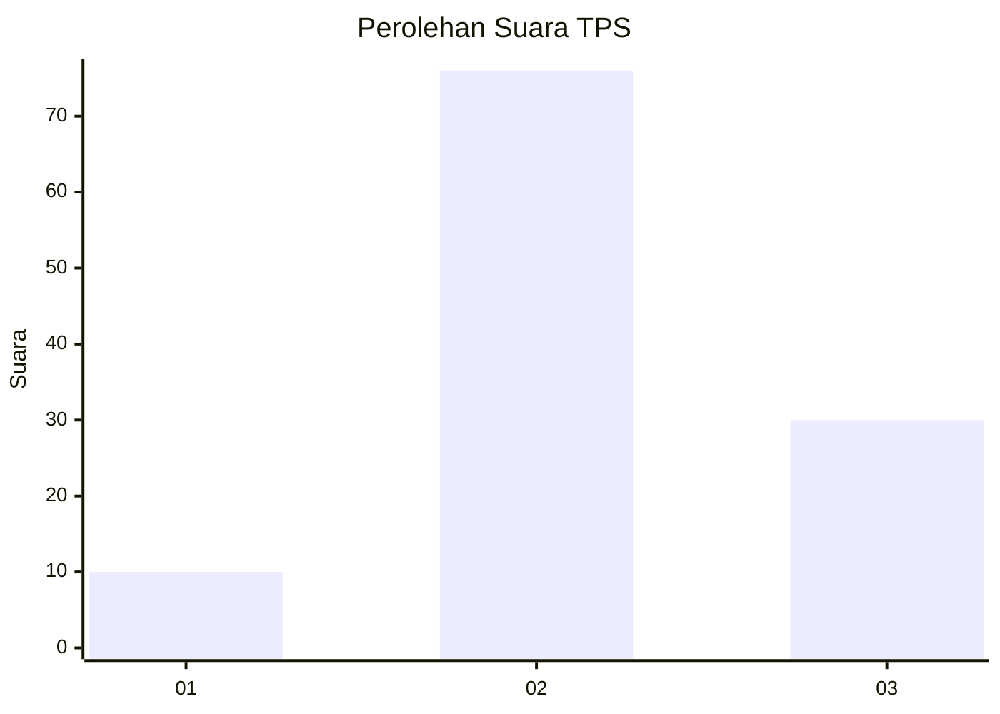
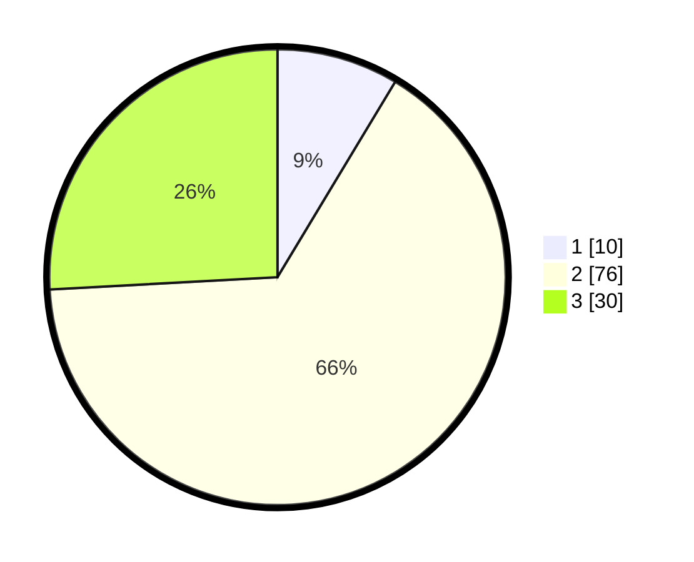

# Hasil

## Grafik

## Tabel

| No. | Nama Paslon    | Suara | Suara (raw) | Persentase |
|:--- |:-------------- | -----:| -----------:| ----------:|
| 1   | ANIES MUHAIMIN | 10    | [10][p-1]   | 8,62       |
| 2   | PRABOWO GIBRAN | 76    | [76][p-2]   | 65,52      |
| 3   | GANJAR MAHFUD  | 30    | [30][p-3]   | 25,86      |

[p-1]: https://github.com/gigit-pemilu/pemilu-2024/blob/main/pilpres/hitung-suara/sub/33-jawa-tengah/sub/25-batang/sub/05-bawang/sub/2002-deles/sub/008-tps/sub/paslon-1.txt
[p-2]: https://github.com/gigit-pemilu/pemilu-2024/blob/main/pilpres/hitung-suara/sub/33-jawa-tengah/sub/25-batang/sub/05-bawang/sub/2002-deles/sub/008-tps/sub/paslon-2.txt
[p-3]: https://github.com/gigit-pemilu/pemilu-2024/blob/main/pilpres/hitung-suara/sub/33-jawa-tengah/sub/25-batang/sub/05-bawang/sub/2002-deles/sub/008-tps/sub/paslon-3.txt

## Foto C Plano

https://sirekap-obj-formc.kpu.go.id/3514/pemilu/ppwp/33/25/05/20/02/3325052002008-20240215-044645--69dc9709-9c74-4845-a04b-805d45957c61.jpg

https://sirekap-obj-formc.kpu.go.id/3514/pemilu/ppwp/33/25/05/20/02/3325052002008-20240215-044818--b45ed159-9f6b-4d0d-b255-43e21187f7c1.jpg

https://sirekap-obj-formc.kpu.go.id/3514/pemilu/ppwp/33/25/05/20/02/3325052002008-20240215-060033--f5b40803-3f11-4628-8c91-dff7b41c08d0.jpg

## Metadata

| Key        | Value               |
| ---------- | ------------------- |
| Time Stamp | 2024-02-15 22:00:27 |

