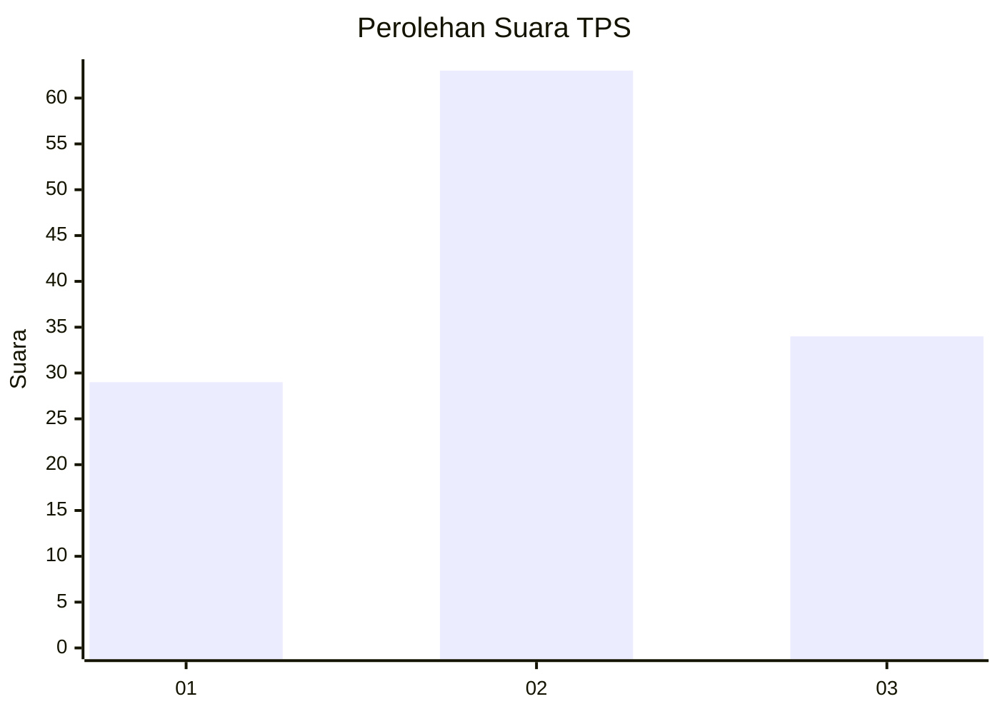
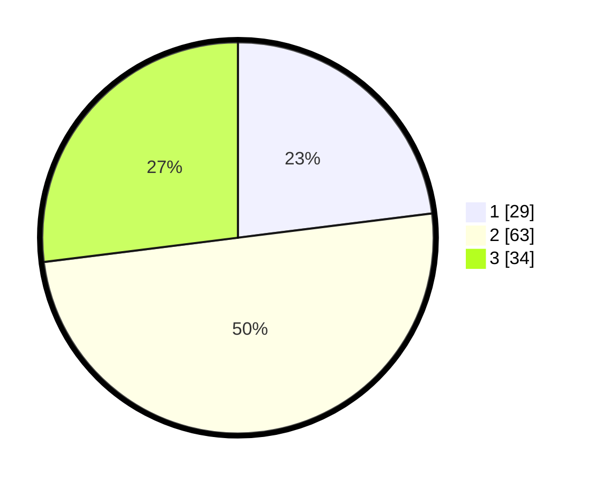

# Hasil

## Grafik

## Tabel

| No. | Nama Paslon    | Suara | Suara (raw) | Persentase |
|:--- |:-------------- | -----:| -----------:| ----------:|
| 1   | ANIES MUHAIMIN | 29    | [29][p-1]   | 23,02      |
| 2   | PRABOWO GIBRAN | 63    | [63][p-2]   | 50,00      |
| 3   | GANJAR MAHFUD  | 34    | [34][p-3]   | 26,98      |

[p-1]: https://github.com/gigit-pemilu/pemilu-2024-33-jawa-tengah/blob/main/pilpres/hitung-suara/sub/33-jawa-tengah/sub/25-batang/sub/05-bawang/sub/2003-gunungsari/sub/001-tps/sub/paslon-1.txt
[p-2]: https://github.com/gigit-pemilu/pemilu-2024-33-jawa-tengah/blob/main/pilpres/hitung-suara/sub/33-jawa-tengah/sub/25-batang/sub/05-bawang/sub/2003-gunungsari/sub/001-tps/sub/paslon-2.txt
[p-3]: https://github.com/gigit-pemilu/pemilu-2024-33-jawa-tengah/blob/main/pilpres/hitung-suara/sub/33-jawa-tengah/sub/25-batang/sub/05-bawang/sub/2003-gunungsari/sub/001-tps/sub/paslon-3.txt

## Foto C Plano

https://sirekap-obj-formc.kpu.go.id/5e12/pemilu/ppwp/33/25/05/20/03/3325052003001-20240214-214408--865649b4-25f6-43d3-b5b1-bc7a5e1ebc0c.jpg

https://sirekap-obj-formc.kpu.go.id/5e12/pemilu/ppwp/33/25/05/20/03/3325052003001-20240214-193614--687ce94b-5575-4b90-b892-db938e50c5e1.jpg

https://sirekap-obj-formc.kpu.go.id/5e12/pemilu/ppwp/33/25/05/20/03/3325052003001-20240214-214303--fbd0b67f-b8b2-430f-bc5a-bca462fc24e1.jpg

## Metadata

| Key        | Value               |
| ---------- | ------------------- |
| Time Stamp | 2024-02-15 19:30:26 |

