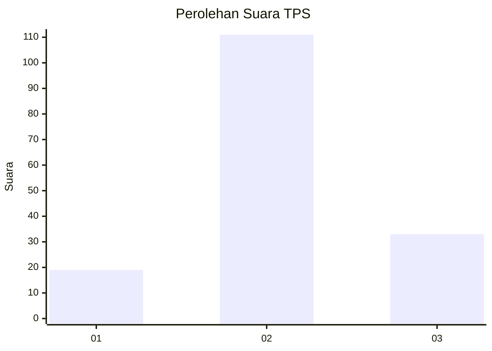
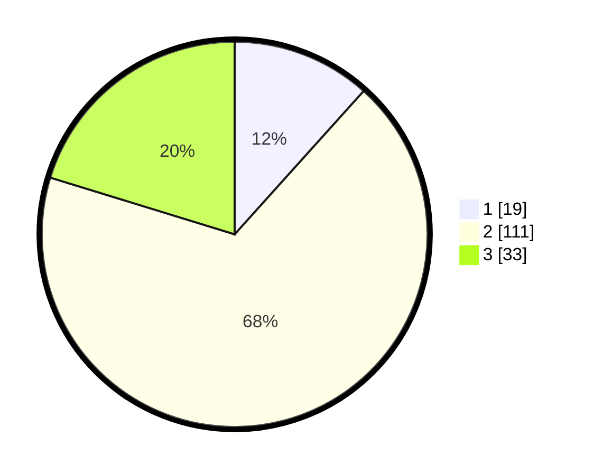

# Hasil

## Grafik

## Tabel

| No. | Nama Paslon    | Suara | Suara (raw) | Persentase |
|:--- |:-------------- | -----:| -----------:| ----------:|
| 1   | ANIES MUHAIMIN | 19    | [19][p-1]   | 11,66      |
| 2   | PRABOWO GIBRAN | 111   | [111][p-2]  | 68,10      |
| 3   | GANJAR MAHFUD  | 33    | [33][p-3]   | 20,25      |

[p-1]: https://github.com/gigit-pemilu/pemilu-2024/blob/main/pilpres/hitung-suara/sub/33-jawa-tengah/sub/25-batang/sub/05-bawang/sub/2005-kebaturan/sub/003-tps/sub/paslon-1.txt
[p-2]: https://github.com/gigit-pemilu/pemilu-2024/blob/main/pilpres/hitung-suara/sub/33-jawa-tengah/sub/25-batang/sub/05-bawang/sub/2005-kebaturan/sub/003-tps/sub/paslon-2.txt
[p-3]: https://github.com/gigit-pemilu/pemilu-2024/blob/main/pilpres/hitung-suara/sub/33-jawa-tengah/sub/25-batang/sub/05-bawang/sub/2005-kebaturan/sub/003-tps/sub/paslon-3.txt

## Foto C Plano

https://sirekap-obj-formc.kpu.go.id/1f1a/pemilu/ppwp/33/25/05/20/05/3325052005003-20240214-224739--340b16b5-c8f1-4fb0-aa51-3011ac1cd840.jpg

https://sirekap-obj-formc.kpu.go.id/1f1a/pemilu/ppwp/33/25/05/20/05/3325052005003-20240214-225044--e69cb5c3-91b2-455c-897b-b294ce389c01.jpg

https://sirekap-obj-formc.kpu.go.id/1f1a/pemilu/ppwp/33/25/05/20/05/3325052005003-20240214-225237--776001b2-442a-4dc6-b74f-f8766f67a571.jpg

## Metadata

| Key        | Value               |
| ---------- | ------------------- |
| Time Stamp | 2024-02-16 10:30:29 |

