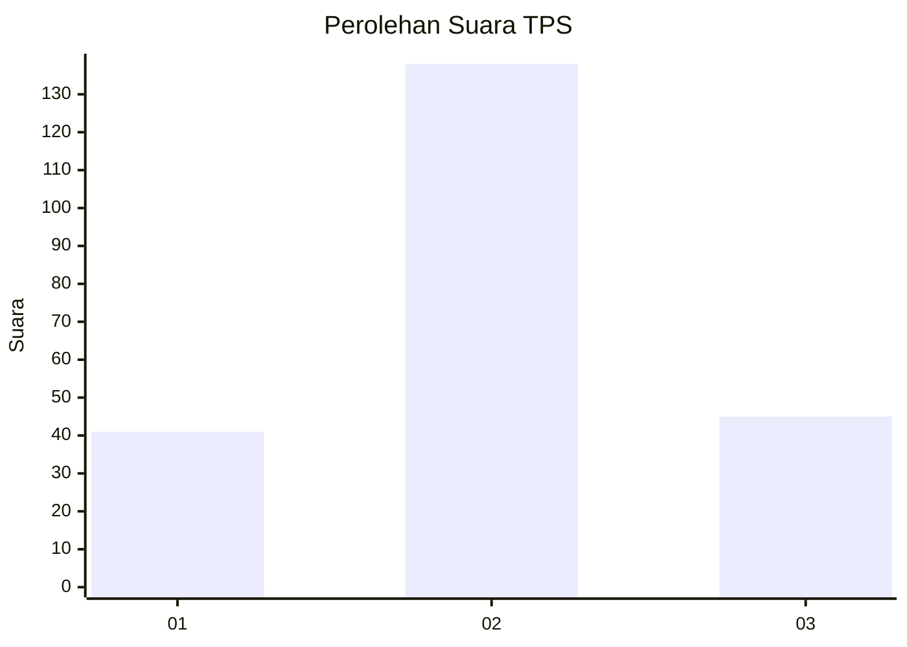
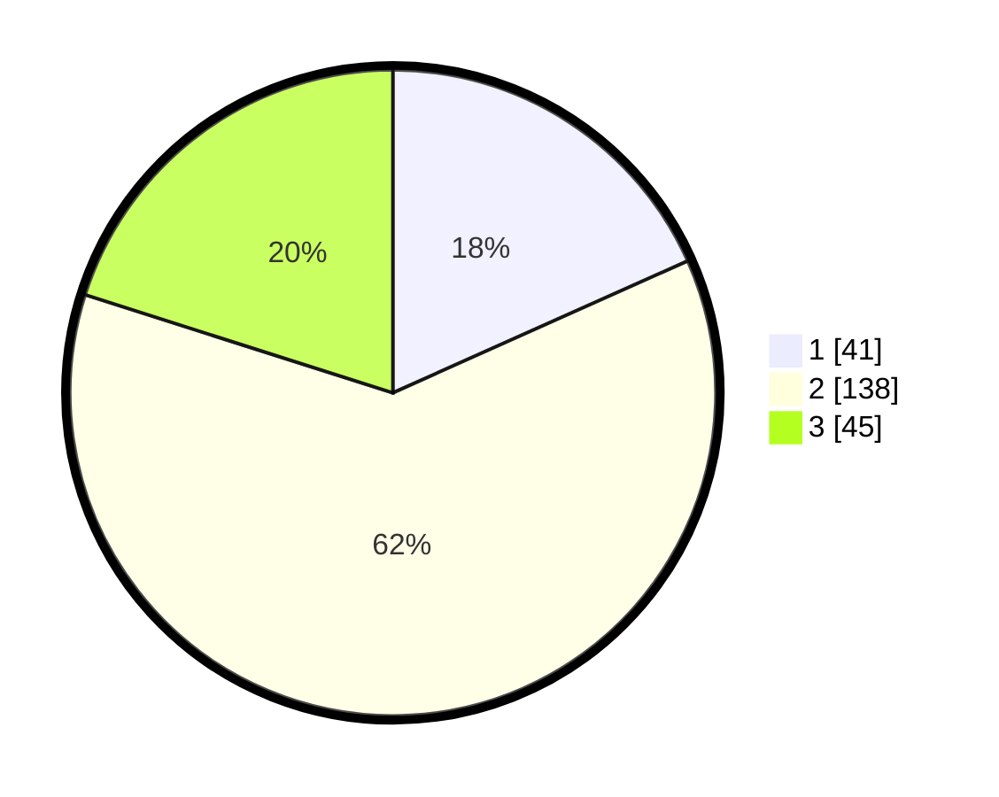

# Hasil

## Grafik

## Tabel

| No. | Nama Paslon    | Suara | Suara (raw) | Persentase |
|:--- |:-------------- | -----:| -----------:| ----------:|
| 1   | ANIES MUHAIMIN | 41    | [41][p-1]   | 18,30      |
| 2   | PRABOWO GIBRAN | 138   | [138][p-2]  | 61,61      |
| 3   | GANJAR MAHFUD  | 45    | [45][p-3]   | 20,09      |

[p-1]: https://github.com/gigit-pemilu/pemilu-2024/blob/main/pilpres/hitung-suara/sub/33-jawa-tengah/sub/25-batang/sub/05-bawang/sub/2009-jlamprang/sub/004-tps/sub/paslon-1.txt
[p-2]: https://github.com/gigit-pemilu/pemilu-2024/blob/main/pilpres/hitung-suara/sub/33-jawa-tengah/sub/25-batang/sub/05-bawang/sub/2009-jlamprang/sub/004-tps/sub/paslon-2.txt
[p-3]: https://github.com/gigit-pemilu/pemilu-2024/blob/main/pilpres/hitung-suara/sub/33-jawa-tengah/sub/25-batang/sub/05-bawang/sub/2009-jlamprang/sub/004-tps/sub/paslon-3.txt

## Foto C Plano

https://sirekap-obj-formc.kpu.go.id/b1f0/pemilu/ppwp/33/25/05/20/09/3325052009004-20240214-224036--b5504eb1-5cee-4a38-97c6-f16144c2d7a8.jpg

https://sirekap-obj-formc.kpu.go.id/b1f0/pemilu/ppwp/33/25/05/20/09/3325052009004-20240214-234748--0d8edddf-e3b1-4be3-a548-d2bb78db885b.jpg

https://sirekap-obj-formc.kpu.go.id/b1f0/pemilu/ppwp/33/25/05/20/09/3325052009004-20240214-234846--5f932371-a3b6-4b37-a185-b2a58dc00161.jpg

## Metadata

| Key        | Value               |
| ---------- | ------------------- |
| Time Stamp | 2024-02-15 22:30:27 |

