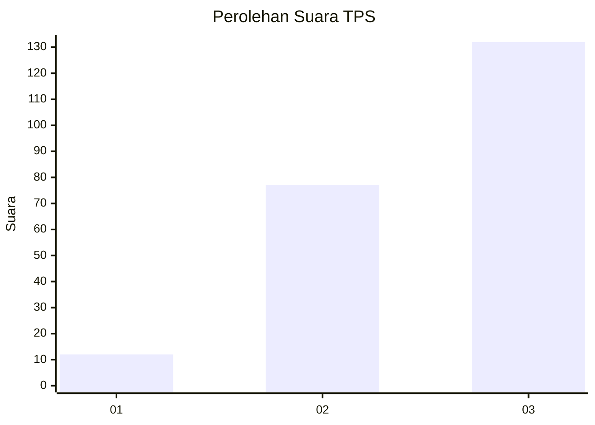
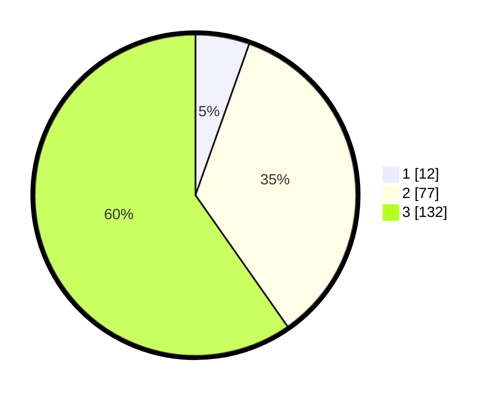

# Hasil

## Grafik

## Tabel

| No. | Nama Paslon    | Suara | Suara (raw) | Persentase |
|:--- |:-------------- | -----:| -----------:| ----------:|
| 1   | ANIES MUHAIMIN | 12    | [12][p-1]   | 5,43       |
| 2   | PRABOWO GIBRAN | 77    | [77][p-2]   | 34,84      |
| 3   | GANJAR MAHFUD  | 132   | [132][p-3]  | 59,73      |

[p-1]: https://github.com/gigit-pemilu/pemilu-2024-33-jawa-tengah/blob/main/pilpres/hitung-suara/sub/33-jawa-tengah/sub/25-batang/sub/05-bawang/sub/2011-candigugur/sub/004-tps/sub/paslon-1.txt
[p-2]: https://github.com/gigit-pemilu/pemilu-2024-33-jawa-tengah/blob/main/pilpres/hitung-suara/sub/33-jawa-tengah/sub/25-batang/sub/05-bawang/sub/2011-candigugur/sub/004-tps/sub/paslon-2.txt
[p-3]: https://github.com/gigit-pemilu/pemilu-2024-33-jawa-tengah/blob/main/pilpres/hitung-suara/sub/33-jawa-tengah/sub/25-batang/sub/05-bawang/sub/2011-candigugur/sub/004-tps/sub/paslon-3.txt

## Foto C Plano

https://sirekap-obj-formc.kpu.go.id/8f95/pemilu/ppwp/33/25/05/20/11/3325052011004-20240214-215023--2a6f104f-7c4e-44ba-8aed-285abca70957.jpg

https://sirekap-obj-formc.kpu.go.id/8f95/pemilu/ppwp/33/25/05/20/11/3325052011004-20240215-002618--00e41970-5dc3-4056-b21b-85ae262b76c3.jpg

https://sirekap-obj-formc.kpu.go.id/8f95/pemilu/ppwp/33/25/05/20/11/3325052011004-20240214-214844--fb81de83-6760-4895-afb6-d7536b5589ca.jpg

## Metadata

| Key        | Value               |
| ---------- | ------------------- |
| Time Stamp | 2024-02-24 22:31:28 |

