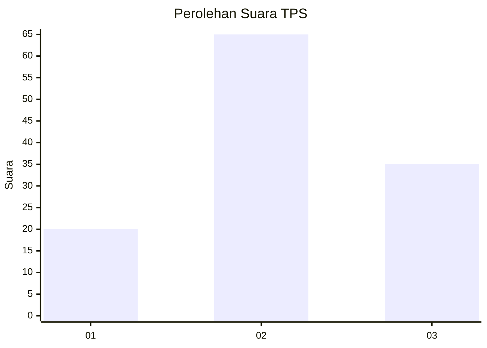
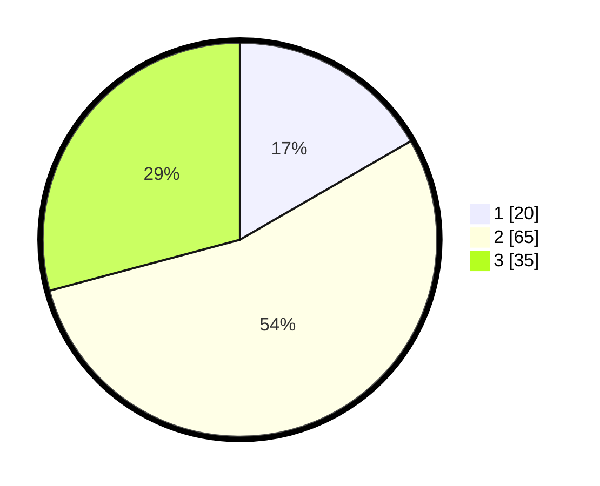

# Hasil

## Grafik

## Tabel

| No. | Nama Paslon    | Suara | Suara (raw) | Persentase |
|:--- |:-------------- | -----:| -----------:| ----------:|
| 1   | ANIES MUHAIMIN | 20    | [20][p-1]   | 16,67      |
| 2   | PRABOWO GIBRAN | 65    | [65][p-2]   | 54,17      |
| 3   | GANJAR MAHFUD  | 35    | [35][p-3]   | 29,17      |

[p-1]: https://github.com/gigit-pemilu/pemilu-2024/blob/main/pilpres/hitung-suara/sub/33-jawa-tengah/sub/25-batang/sub/05-bawang/sub/2015-soka/sub/004-tps/sub/paslon-1.txt
[p-2]: https://github.com/gigit-pemilu/pemilu-2024/blob/main/pilpres/hitung-suara/sub/33-jawa-tengah/sub/25-batang/sub/05-bawang/sub/2015-soka/sub/004-tps/sub/paslon-2.txt
[p-3]: https://github.com/gigit-pemilu/pemilu-2024/blob/main/pilpres/hitung-suara/sub/33-jawa-tengah/sub/25-batang/sub/05-bawang/sub/2015-soka/sub/004-tps/sub/paslon-3.txt

## Foto C Plano

https://sirekap-obj-formc.kpu.go.id/fcd6/pemilu/ppwp/33/25/05/20/15/3325052015004-20240215-022703--917f01a1-576d-4e23-829a-5ec9bb5b6dec.jpg

https://sirekap-obj-formc.kpu.go.id/fcd6/pemilu/ppwp/33/25/05/20/15/3325052015004-20240214-200807--3cc0287c-1b71-4ee9-add8-2a35afeca73a.jpg

https://sirekap-obj-formc.kpu.go.id/fcd6/pemilu/ppwp/33/25/05/20/15/3325052015004-20240214-200827--d6f857c3-0a53-4abd-8eb9-3c0d6e4078bf.jpg

## Metadata

| Key        | Value               |
| ---------- | ------------------- |
| Time Stamp | 2024-02-15 22:30:27 |

