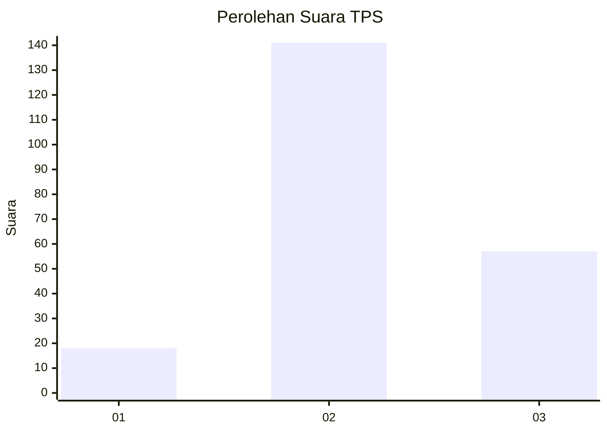
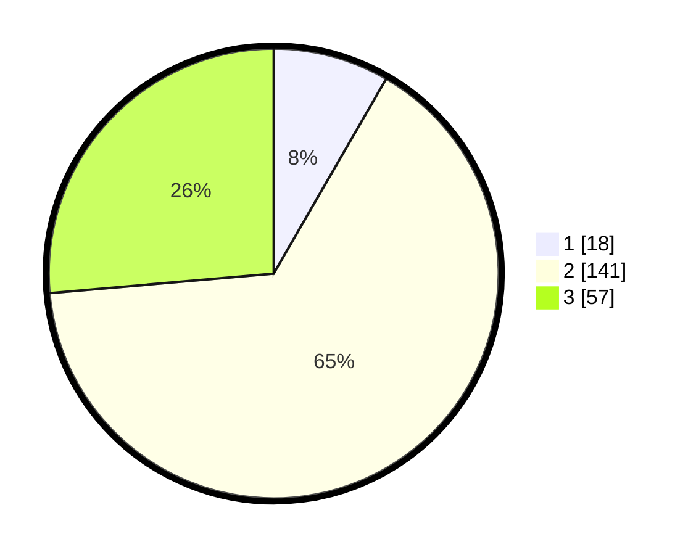

# Hasil

## Grafik

## Tabel

| No. | Nama Paslon    | Suara | Suara (raw) | Persentase |
|:--- |:-------------- | -----:| -----------:| ----------:|
| 1   | ANIES MUHAIMIN | 18    | [18][p-1]   | 8,33       |
| 2   | PRABOWO GIBRAN | 141   | [141][p-2]  | 65,28      |
| 3   | GANJAR MAHFUD  | 57    | [57][p-3]   | 26,39      |

[p-1]: https://github.com/gigit-pemilu/pemilu-2024/blob/main/pilpres/hitung-suara/sub/33-jawa-tengah/sub/25-batang/sub/05-bawang/sub/2016-sibebek/sub/003-tps/sub/paslon-1.txt
[p-2]: https://github.com/gigit-pemilu/pemilu-2024/blob/main/pilpres/hitung-suara/sub/33-jawa-tengah/sub/25-batang/sub/05-bawang/sub/2016-sibebek/sub/003-tps/sub/paslon-2.txt
[p-3]: https://github.com/gigit-pemilu/pemilu-2024/blob/main/pilpres/hitung-suara/sub/33-jawa-tengah/sub/25-batang/sub/05-bawang/sub/2016-sibebek/sub/003-tps/sub/paslon-3.txt

## Foto C Plano

https://sirekap-obj-formc.kpu.go.id/a7c9/pemilu/ppwp/33/25/05/20/16/3325052016003-20240214-185740--d0088db9-e90d-43d3-b2a5-472d750ca72d.jpg

https://sirekap-obj-formc.kpu.go.id/a7c9/pemilu/ppwp/33/25/05/20/16/3325052016003-20240214-185917--6fc75e05-0863-4574-b456-f980ad379ce4.jpg

https://sirekap-obj-formc.kpu.go.id/a7c9/pemilu/ppwp/33/25/05/20/16/3325052016003-20240214-190049--f1618f02-b9c6-42d9-be1c-49b4bcd5b8dd.jpg

## Metadata

| Key        | Value               |
| ---------- | ------------------- |
| Time Stamp | 2024-02-15 22:30:27 |

