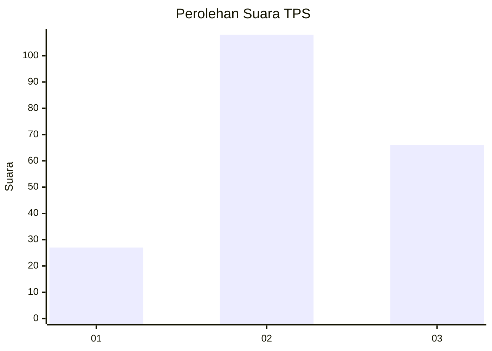
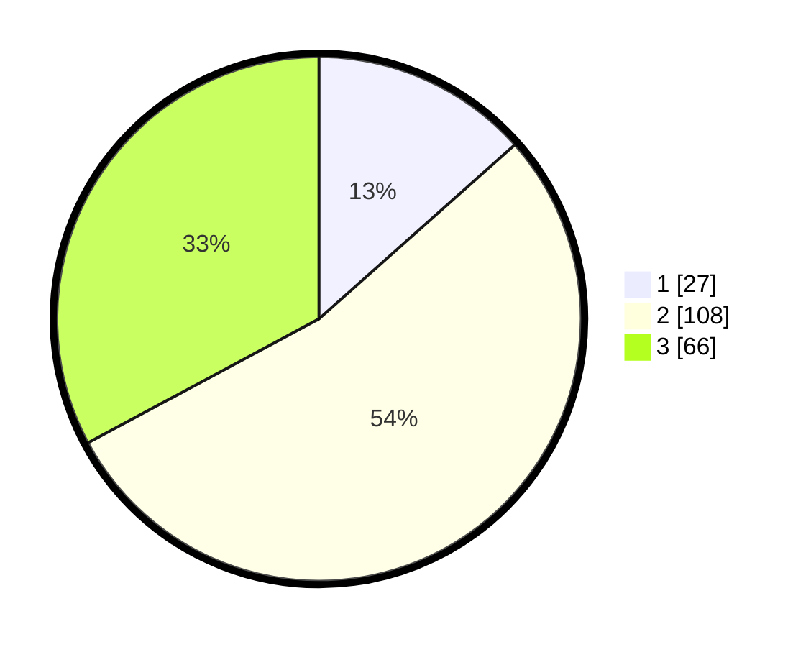

# Hasil

## Grafik

## Tabel

| No. | Nama Paslon    | Suara | Suara (raw) | Persentase |
|:--- |:-------------- | -----:| -----------:| ----------:|
| 1   | ANIES MUHAIMIN | 27    | [27][p-1]   | 13,43      |
| 2   | PRABOWO GIBRAN | 108   | [108][p-2]  | 53,73      |
| 3   | GANJAR MAHFUD  | 66    | [66][p-3]   | 32,84      |

[p-1]: https://github.com/gigit-pemilu/pemilu-2024/blob/main/pilpres/hitung-suara/sub/33-jawa-tengah/sub/25-batang/sub/06-tersono/sub/2002-sendang/sub/002-tps/sub/paslon-1.txt
[p-2]: https://github.com/gigit-pemilu/pemilu-2024/blob/main/pilpres/hitung-suara/sub/33-jawa-tengah/sub/25-batang/sub/06-tersono/sub/2002-sendang/sub/002-tps/sub/paslon-2.txt
[p-3]: https://github.com/gigit-pemilu/pemilu-2024/blob/main/pilpres/hitung-suara/sub/33-jawa-tengah/sub/25-batang/sub/06-tersono/sub/2002-sendang/sub/002-tps/sub/paslon-3.txt

## Foto C Plano

https://sirekap-obj-formc.kpu.go.id/0dc0/pemilu/ppwp/33/25/06/20/02/3325062002002-20240214-213859--9df2cf1b-3f54-4e6d-b167-532f79eef54e.jpg

https://sirekap-obj-formc.kpu.go.id/0dc0/pemilu/ppwp/33/25/06/20/02/3325062002002-20240214-214040--c799646b-5a92-4245-8a8c-83b29ad16c62.jpg

https://sirekap-obj-formc.kpu.go.id/0dc0/pemilu/ppwp/33/25/06/20/02/3325062002002-20240214-214229--156115cf-b7f0-40c5-a248-afaf58c71573.jpg

## Metadata

| Key        | Value               |
| ---------- | ------------------- |
| Time Stamp | 2024-02-15 21:30:27 |

