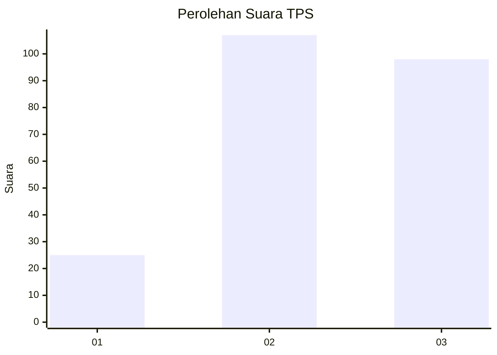
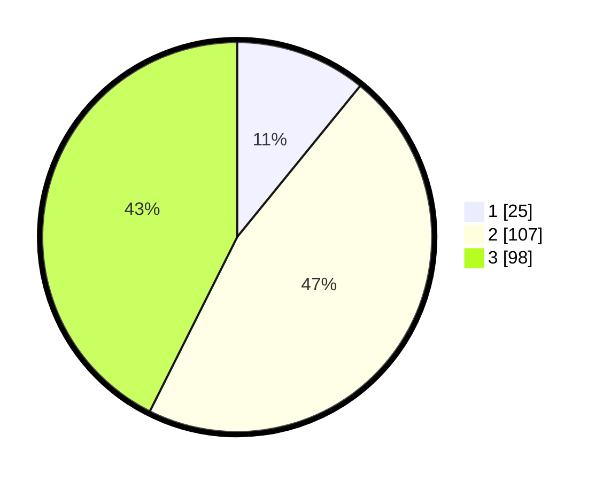

# Hasil

## Grafik

## Tabel

| No. | Nama Paslon    | Suara | Suara (raw) | Persentase |
|:--- |:-------------- | -----:| -----------:| ----------:|
| 1   | ANIES MUHAIMIN | 25    | [25][p-1]   | 10,87      |
| 2   | PRABOWO GIBRAN | 107   | [107][p-2]  | 46,52      |
| 3   | GANJAR MAHFUD  | 98    | [98][p-3]   | 42,61      |

[p-1]: https://github.com/gigit-pemilu/pemilu-2024/blob/main/pilpres/hitung-suara/sub/33-jawa-tengah/sub/25-batang/sub/06-tersono/sub/2003-banteng/sub/001-tps/sub/paslon-1.txt
[p-2]: https://github.com/gigit-pemilu/pemilu-2024/blob/main/pilpres/hitung-suara/sub/33-jawa-tengah/sub/25-batang/sub/06-tersono/sub/2003-banteng/sub/001-tps/sub/paslon-2.txt
[p-3]: https://github.com/gigit-pemilu/pemilu-2024/blob/main/pilpres/hitung-suara/sub/33-jawa-tengah/sub/25-batang/sub/06-tersono/sub/2003-banteng/sub/001-tps/sub/paslon-3.txt

## Foto C Plano

https://sirekap-obj-formc.kpu.go.id/389e/pemilu/ppwp/33/25/06/20/03/3325062003001-20240215-011342--b2dd9c26-19d3-4af0-a024-421822c242b1.jpg

https://sirekap-obj-formc.kpu.go.id/389e/pemilu/ppwp/33/25/06/20/03/3325062003001-20240215-011754--b0f47572-1a1a-4afb-93ba-702711d2ceeb.jpg

https://sirekap-obj-formc.kpu.go.id/389e/pemilu/ppwp/33/25/06/20/03/3325062003001-20240215-011949--92740038-92a3-40b0-b361-bf383a0c463e.jpg

## Metadata

| Key        | Value               |
| ---------- | ------------------- |
| Time Stamp | 2024-02-15 21:30:27 |

