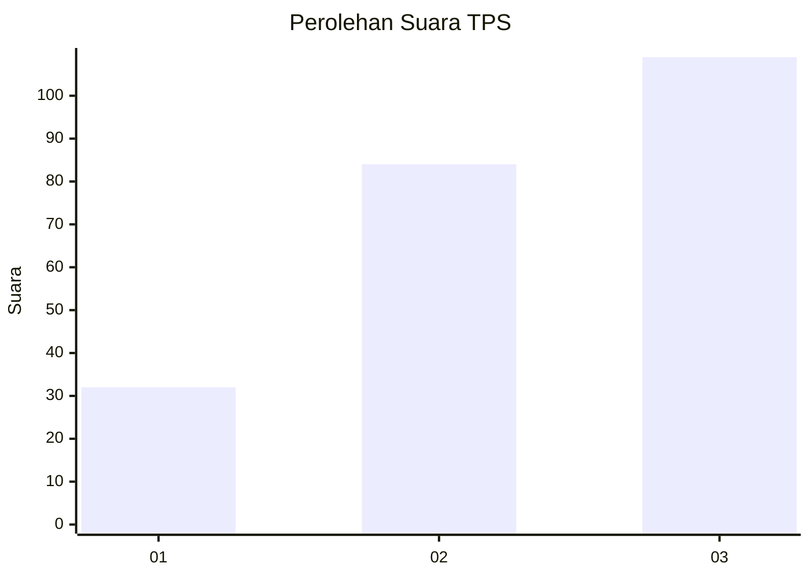
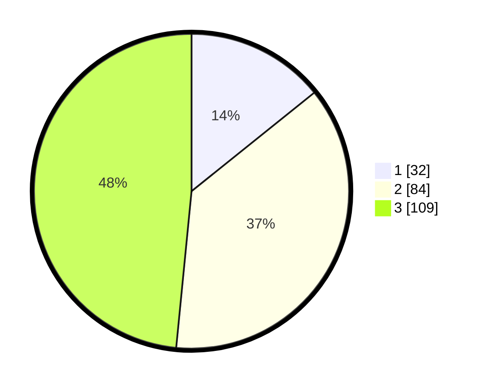

# Hasil

## Grafik

## Tabel

| No. | Nama Paslon    | Suara | Suara (raw) | Persentase |
|:--- |:-------------- | -----:| -----------:| ----------:|
| 1   | ANIES MUHAIMIN | 32    | [32][p-1]   | 14,22      |
| 2   | PRABOWO GIBRAN | 84    | [84][p-2]   | 37,33      |
| 3   | GANJAR MAHFUD  | 109   | [109][p-3]  | 48,44      |

[p-1]: https://github.com/gigit-pemilu/pemilu-2024/blob/main/pilpres/hitung-suara/sub/33-jawa-tengah/sub/25-batang/sub/06-tersono/sub/2003-banteng/sub/003-tps/sub/paslon-1.txt
[p-2]: https://github.com/gigit-pemilu/pemilu-2024/blob/main/pilpres/hitung-suara/sub/33-jawa-tengah/sub/25-batang/sub/06-tersono/sub/2003-banteng/sub/003-tps/sub/paslon-2.txt
[p-3]: https://github.com/gigit-pemilu/pemilu-2024/blob/main/pilpres/hitung-suara/sub/33-jawa-tengah/sub/25-batang/sub/06-tersono/sub/2003-banteng/sub/003-tps/sub/paslon-3.txt

## Foto C Plano

https://sirekap-obj-formc.kpu.go.id/f74d/pemilu/ppwp/33/25/06/20/03/3325062003003-20240214-235500--f25f0250-515c-4dad-a987-7310b6af1163.jpg

https://sirekap-obj-formc.kpu.go.id/f74d/pemilu/ppwp/33/25/06/20/03/3325062003003-20240214-234525--942a5eae-35cb-4ccc-84b0-3fc9ba2e8e3f.jpg

https://sirekap-obj-formc.kpu.go.id/f74d/pemilu/ppwp/33/25/06/20/03/3325062003003-20240214-234617--7e01fcc2-6111-4e09-be1b-d38a3d5d0a3b.jpg

## Metadata

| Key        | Value               |
| ---------- | ------------------- |
| Time Stamp | 2024-02-15 21:30:27 |

