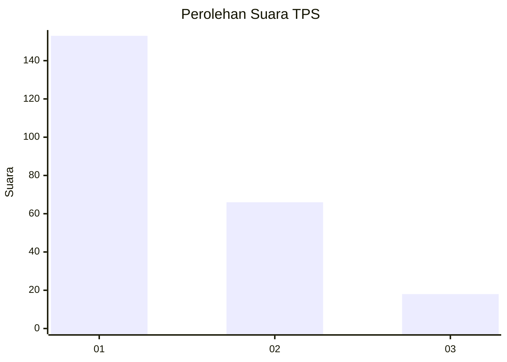
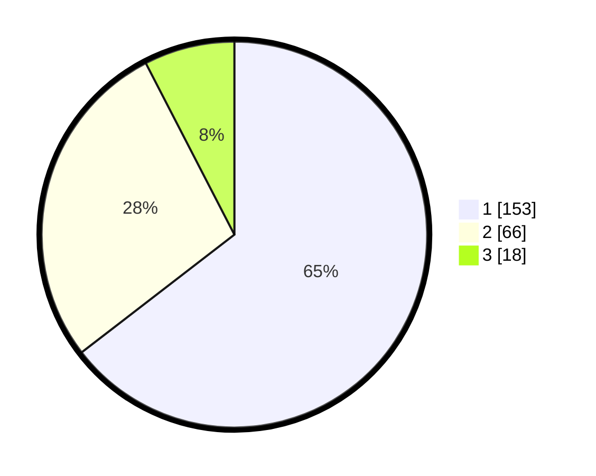

# Hasil

## Grafik

## Tabel

| No. | Nama Paslon    | Suara | Suara (raw) | Persentase |
|:--- |:-------------- | -----:| -----------:| ----------:|
| 1   | ANIES MUHAIMIN | 153   | [153][p-1]  | 64,56      |
| 2   | PRABOWO GIBRAN | 66    | [66][p-2]   | 27,85      |
| 3   | GANJAR MAHFUD  | 18    | [18][p-3]   | 7,59       |

[p-1]: https://github.com/gigit-pemilu/pemilu-2024/blob/main/pilpres/hitung-suara/sub/33-jawa-tengah/sub/25-batang/sub/06-tersono/sub/2020-kranggan/sub/008-tps/sub/paslon-1.txt
[p-2]: https://github.com/gigit-pemilu/pemilu-2024/blob/main/pilpres/hitung-suara/sub/33-jawa-tengah/sub/25-batang/sub/06-tersono/sub/2020-kranggan/sub/008-tps/sub/paslon-2.txt
[p-3]: https://github.com/gigit-pemilu/pemilu-2024/blob/main/pilpres/hitung-suara/sub/33-jawa-tengah/sub/25-batang/sub/06-tersono/sub/2020-kranggan/sub/008-tps/sub/paslon-3.txt

## Foto C Plano

https://sirekap-obj-formc.kpu.go.id/fade/pemilu/ppwp/33/25/06/20/20/3325062020008-20240217-225257--cc21c5fe-dfa4-4bd7-bc2f-d9a7abfd722e.jpg

https://sirekap-obj-formc.kpu.go.id/fade/pemilu/ppwp/33/25/06/20/20/3325062020008-20240214-191145--a240ca58-d7a9-43a2-9795-7114d18675a6.jpg

https://sirekap-obj-formc.kpu.go.id/fade/pemilu/ppwp/33/25/06/20/20/3325062020008-20240214-180551--798d7476-c928-43d9-83c5-a84bda5c068c.jpg

## Metadata

| Key        | Value               |
| ---------- | ------------------- |
| Time Stamp | 2024-02-19 06:16:00 |

