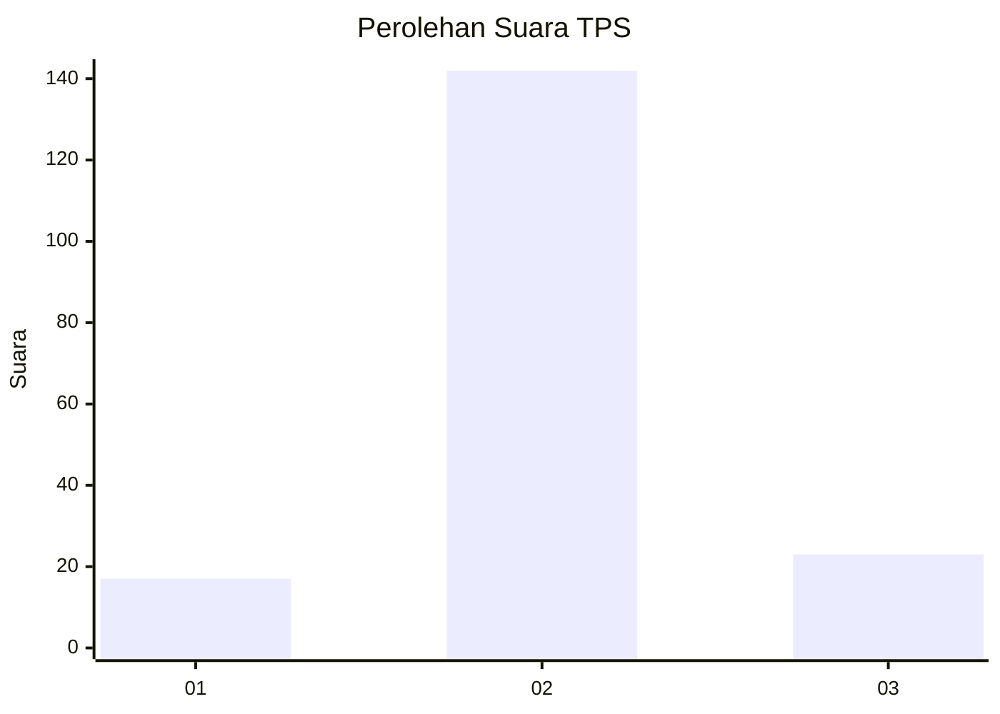
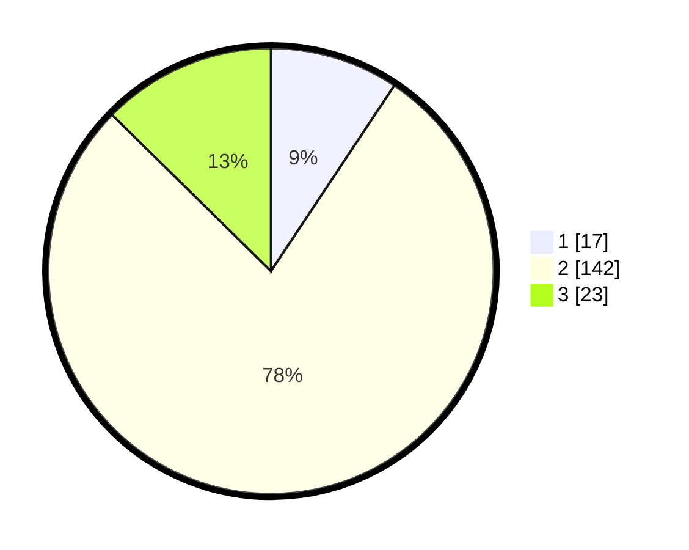

# Hasil

## Grafik

## Tabel

| No. | Nama Paslon    | Suara | Suara (raw) | Persentase |
|:--- |:-------------- | -----:| -----------:| ----------:|
| 1   | ANIES MUHAIMIN | 17    | [17][p-1]   | 9,34       |
| 2   | PRABOWO GIBRAN | 142   | [142][p-2]  | 78,02      |
| 3   | GANJAR MAHFUD  | 23    | [23][p-3]   | 12,64      |

[p-1]: https://github.com/gigit-pemilu/pemilu-2024/blob/main/pilpres/hitung-suara/sub/33-jawa-tengah/sub/25-batang/sub/06-tersono/sub/2022-harjowinangun-timur/sub/001-tps/sub/paslon-1.txt
[p-2]: https://github.com/gigit-pemilu/pemilu-2024/blob/main/pilpres/hitung-suara/sub/33-jawa-tengah/sub/25-batang/sub/06-tersono/sub/2022-harjowinangun-timur/sub/001-tps/sub/paslon-2.txt
[p-3]: https://github.com/gigit-pemilu/pemilu-2024/blob/main/pilpres/hitung-suara/sub/33-jawa-tengah/sub/25-batang/sub/06-tersono/sub/2022-harjowinangun-timur/sub/001-tps/sub/paslon-3.txt

## Foto C Plano

https://sirekap-obj-formc.kpu.go.id/7a78/pemilu/ppwp/33/25/06/20/22/3325062022001-20240215-010141--84f00284-153f-409e-b7f6-2eeda69167b3.jpg

https://sirekap-obj-formc.kpu.go.id/7a78/pemilu/ppwp/33/25/06/20/22/3325062022001-20240215-010136--a6d4d441-a973-4708-91ec-92415133c638.jpg

https://sirekap-obj-formc.kpu.go.id/7a78/pemilu/ppwp/33/25/06/20/22/3325062022001-20240215-010145--9bc0dbf4-fa10-436f-bb32-9fb8a188d4be.jpg

## Metadata

| Key        | Value               |
| ---------- | ------------------- |
| Time Stamp | 2024-02-15 22:30:27 |

