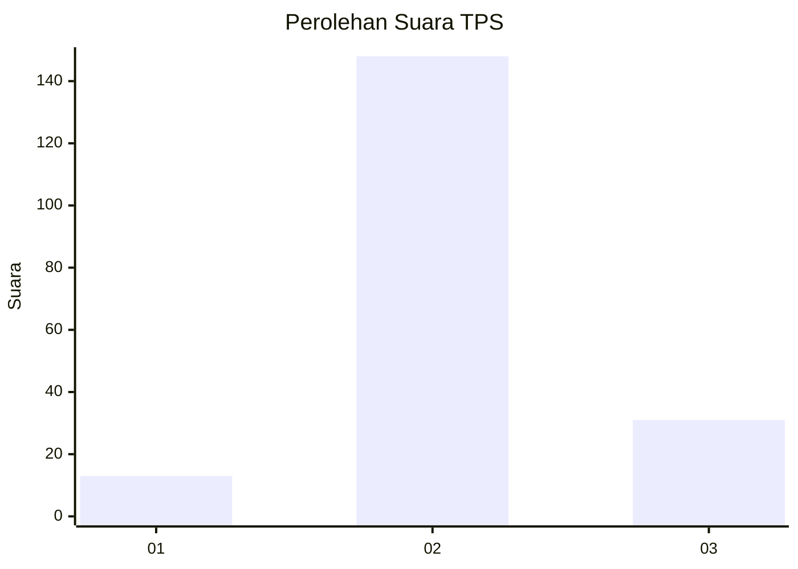
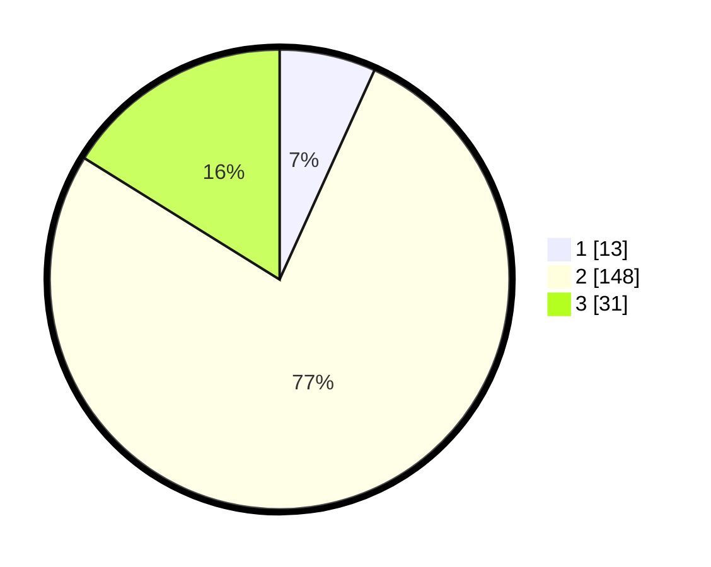

# Hasil

## Grafik

## Tabel

| No. | Nama Paslon    | Suara | Suara (raw) | Persentase |
|:--- |:-------------- | -----:| -----------:| ----------:|
| 1   | ANIES MUHAIMIN | 13    | [13][p-1]   | 6,77       |
| 2   | PRABOWO GIBRAN | 148   | [148][p-2]  | 77,08      |
| 3   | GANJAR MAHFUD  | 31    | [31][p-3]   | 16,15      |

[p-1]: https://github.com/gigit-pemilu/pemilu-2024/blob/main/pilpres/hitung-suara/sub/33-jawa-tengah/sub/25-batang/sub/06-tersono/sub/2022-harjowinangun-timur/sub/002-tps/sub/paslon-1.txt
[p-2]: https://github.com/gigit-pemilu/pemilu-2024/blob/main/pilpres/hitung-suara/sub/33-jawa-tengah/sub/25-batang/sub/06-tersono/sub/2022-harjowinangun-timur/sub/002-tps/sub/paslon-2.txt
[p-3]: https://github.com/gigit-pemilu/pemilu-2024/blob/main/pilpres/hitung-suara/sub/33-jawa-tengah/sub/25-batang/sub/06-tersono/sub/2022-harjowinangun-timur/sub/002-tps/sub/paslon-3.txt

## Foto C Plano

https://sirekap-obj-formc.kpu.go.id/1b74/pemilu/ppwp/33/25/06/20/22/3325062022002-20240215-013412--11b20a45-6a44-40be-a8ce-c24404bf36ca.jpg

https://sirekap-obj-formc.kpu.go.id/1b74/pemilu/ppwp/33/25/06/20/22/3325062022002-20240215-013536--25b73b2d-3128-4f32-8d37-28b86fc5ed71.jpg

https://sirekap-obj-formc.kpu.go.id/1b74/pemilu/ppwp/33/25/06/20/22/3325062022002-20240214-200914--e7892a6c-caef-4548-9963-43ad9384d8cc.jpg

## Metadata

| Key        | Value               |
| ---------- | ------------------- |
| Time Stamp | 2024-02-15 22:30:27 |

