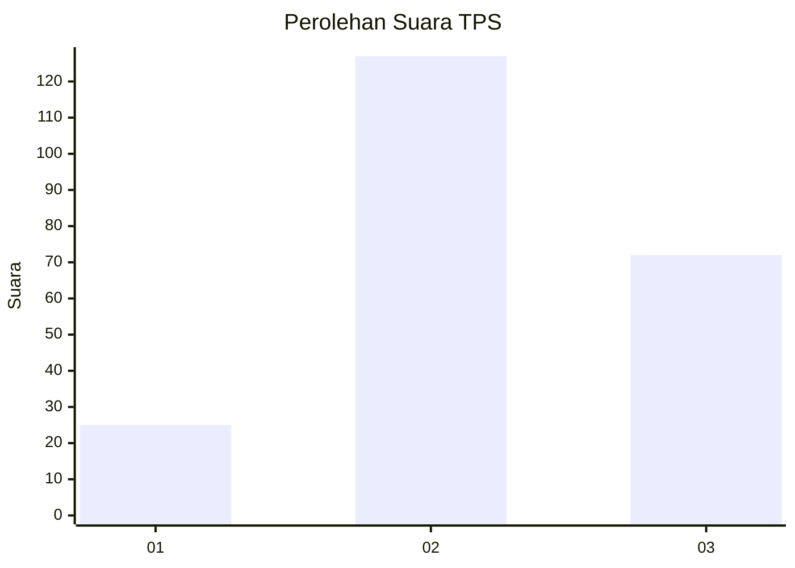
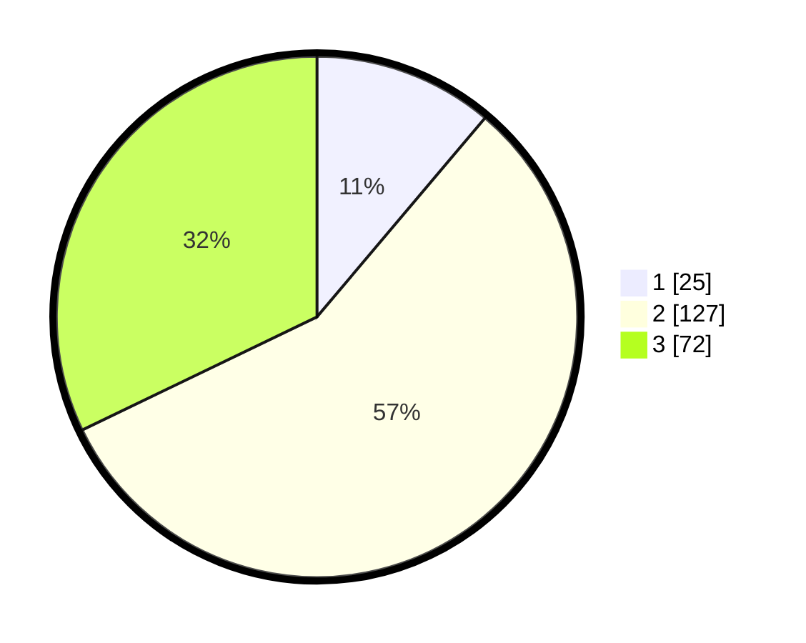

# Hasil

## Grafik

## Tabel

| No. | Nama Paslon    | Suara | Suara (raw) | Persentase |
|:--- |:-------------- | -----:| -----------:| ----------:|
| 1   | ANIES MUHAIMIN | 25    | [25][p-1]   | 11,16      |
| 2   | PRABOWO GIBRAN | 127   | [127][p-2]  | 56,70      |
| 3   | GANJAR MAHFUD  | 72    | [72][p-3]   | 32,14      |

[p-1]: https://github.com/gigit-pemilu/pemilu-2024-33-jawa-tengah/blob/main/pilpres/hitung-suara/sub/33-jawa-tengah/sub/25-batang/sub/07-gringsing/sub/2005-surodadi/sub/002-tps/sub/paslon-1.txt
[p-2]: https://github.com/gigit-pemilu/pemilu-2024-33-jawa-tengah/blob/main/pilpres/hitung-suara/sub/33-jawa-tengah/sub/25-batang/sub/07-gringsing/sub/2005-surodadi/sub/002-tps/sub/paslon-2.txt
[p-3]: https://github.com/gigit-pemilu/pemilu-2024-33-jawa-tengah/blob/main/pilpres/hitung-suara/sub/33-jawa-tengah/sub/25-batang/sub/07-gringsing/sub/2005-surodadi/sub/002-tps/sub/paslon-3.txt

## Foto C Plano

https://sirekap-obj-formc.kpu.go.id/f04f/pemilu/ppwp/33/25/07/20/05/3325072005002-20240215-001428--31bb7946-0e78-4d1c-84e9-50096f82aab3.jpg

https://sirekap-obj-formc.kpu.go.id/f04f/pemilu/ppwp/33/25/07/20/05/3325072005002-20240215-001717--d03b60cf-614a-452c-abd1-a4818089671f.jpg

https://sirekap-obj-formc.kpu.go.id/f04f/pemilu/ppwp/33/25/07/20/05/3325072005002-20240215-002324--f7f04c70-ce91-45bf-a381-0eb3eb9db2dc.jpg

## Metadata

| Key        | Value               |
| ---------- | ------------------- |
| Time Stamp | 2024-02-15 22:40:13 |

