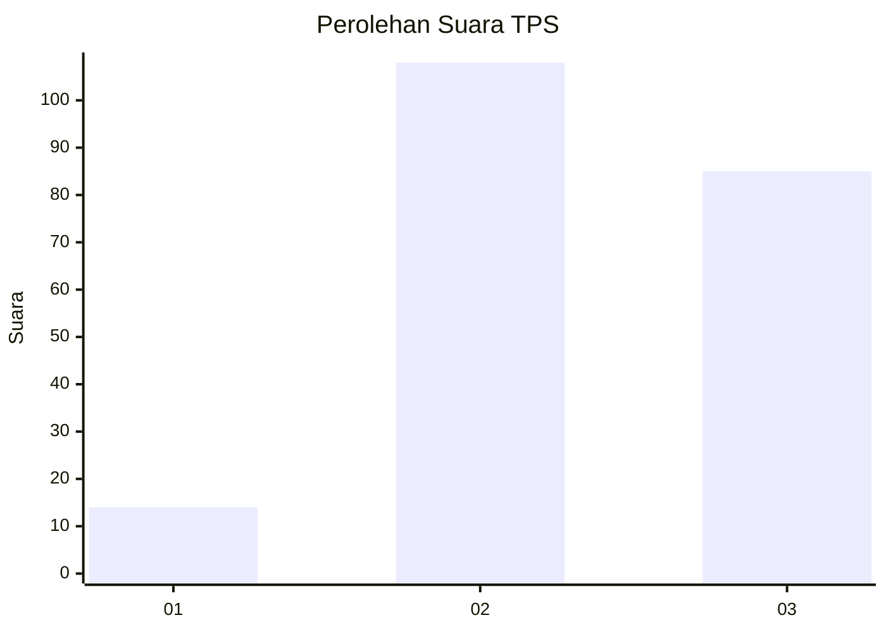
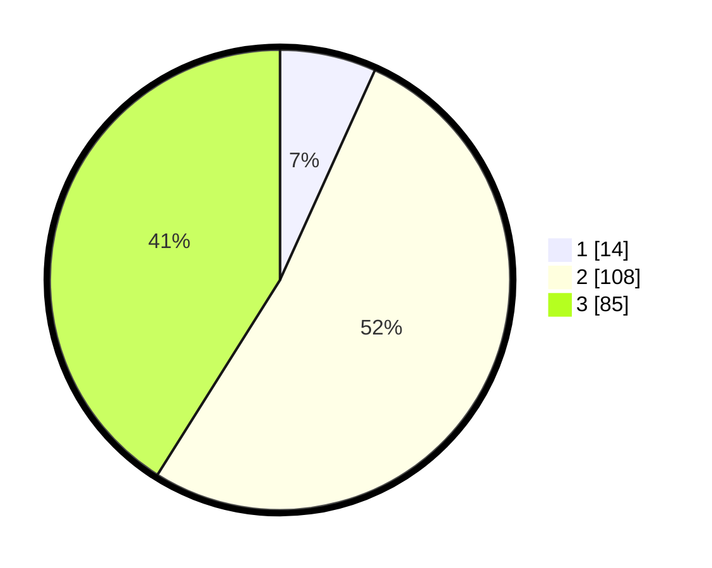

# Hasil

## Grafik

## Tabel

| No. | Nama Paslon    | Suara | Suara (raw) | Persentase |
|:--- |:-------------- | -----:| -----------:| ----------:|
| 1   | ANIES MUHAIMIN | 14    | [14][p-1]   | 6,76       |
| 2   | PRABOWO GIBRAN | 108   | [108][p-2]  | 52,17      |
| 3   | GANJAR MAHFUD  | 85    | [85][p-3]   | 41,06      |

[p-1]: https://github.com/gigit-pemilu/pemilu-2024/blob/main/pilpres/hitung-suara/sub/33-jawa-tengah/sub/25-batang/sub/07-gringsing/sub/2005-surodadi/sub/005-tps/sub/paslon-1.txt
[p-2]: https://github.com/gigit-pemilu/pemilu-2024/blob/main/pilpres/hitung-suara/sub/33-jawa-tengah/sub/25-batang/sub/07-gringsing/sub/2005-surodadi/sub/005-tps/sub/paslon-2.txt
[p-3]: https://github.com/gigit-pemilu/pemilu-2024/blob/main/pilpres/hitung-suara/sub/33-jawa-tengah/sub/25-batang/sub/07-gringsing/sub/2005-surodadi/sub/005-tps/sub/paslon-3.txt

## Foto C Plano

https://sirekap-obj-formc.kpu.go.id/ff4a/pemilu/ppwp/33/25/07/20/05/3325072005005-20240214-214849--bd414a7c-b064-4b11-9a1a-4b29ed73f254.jpg

https://sirekap-obj-formc.kpu.go.id/ff4a/pemilu/ppwp/33/25/07/20/05/3325072005005-20240214-215038--8fee6437-da8b-4bdf-8a03-6b23802aff92.jpg

https://sirekap-obj-formc.kpu.go.id/ff4a/pemilu/ppwp/33/25/07/20/05/3325072005005-20240214-200200--36859445-2366-4f65-a92d-dc4a33995334.jpg

## Metadata

| Key        | Value               |
| ---------- | ------------------- |
| Time Stamp | 2024-02-16 08:30:27 |

