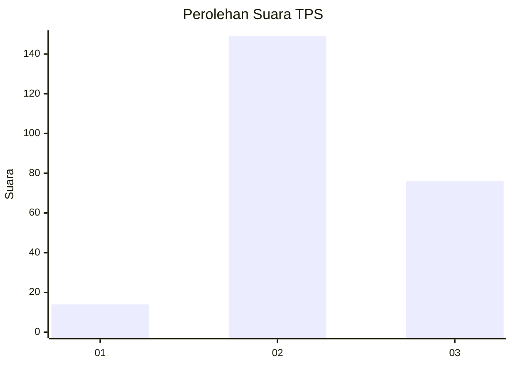
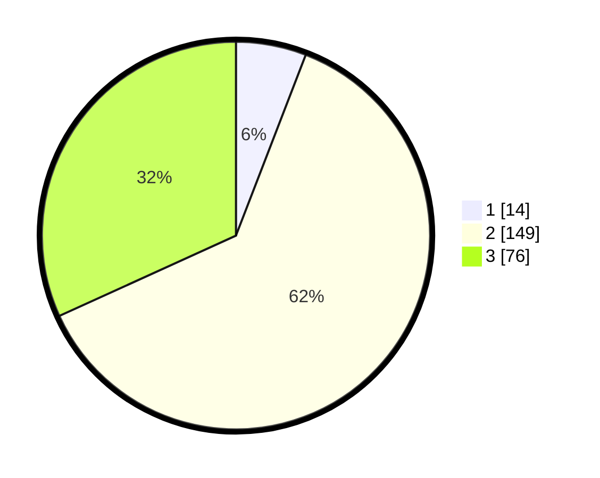

# Hasil

## Grafik

## Tabel

| No. | Nama Paslon    | Suara | Suara (raw) | Persentase |
|:--- |:-------------- | -----:| -----------:| ----------:|
| 1   | ANIES MUHAIMIN | 14    | [14][p-1]   | 5,86       |
| 2   | PRABOWO GIBRAN | 149   | [149][p-2]  | 62,34      |
| 3   | GANJAR MAHFUD  | 76    | [76][p-3]   | 31,80      |

[p-1]: https://github.com/gigit-pemilu/pemilu-2024/blob/main/pilpres/hitung-suara/sub/33-jawa-tengah/sub/25-batang/sub/07-gringsing/sub/2005-surodadi/sub/006-tps/sub/paslon-1.txt
[p-2]: https://github.com/gigit-pemilu/pemilu-2024/blob/main/pilpres/hitung-suara/sub/33-jawa-tengah/sub/25-batang/sub/07-gringsing/sub/2005-surodadi/sub/006-tps/sub/paslon-2.txt
[p-3]: https://github.com/gigit-pemilu/pemilu-2024/blob/main/pilpres/hitung-suara/sub/33-jawa-tengah/sub/25-batang/sub/07-gringsing/sub/2005-surodadi/sub/006-tps/sub/paslon-3.txt

## Foto C Plano

https://sirekap-obj-formc.kpu.go.id/f7a7/pemilu/ppwp/33/25/07/20/05/3325072005006-20240215-001851--06ecb2b5-584b-4828-86da-98450a820679.jpg

https://sirekap-obj-formc.kpu.go.id/f7a7/pemilu/ppwp/33/25/07/20/05/3325072005006-20240215-001610--94744f57-30e2-42a9-82f4-5ec45a46738f.jpg

https://sirekap-obj-formc.kpu.go.id/f7a7/pemilu/ppwp/33/25/07/20/05/3325072005006-20240215-001615--f74e8f91-2e81-418a-bb45-a282dddde7b6.jpg

## Metadata

| Key        | Value               |
| ---------- | ------------------- |
| Time Stamp | 2024-02-15 22:40:13 |

