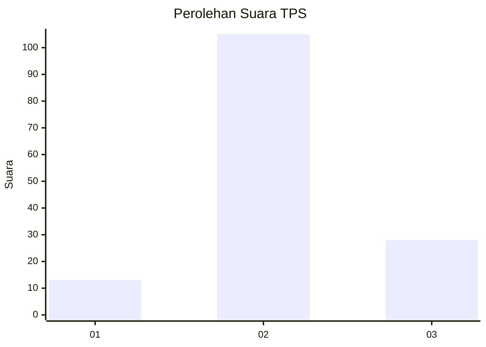
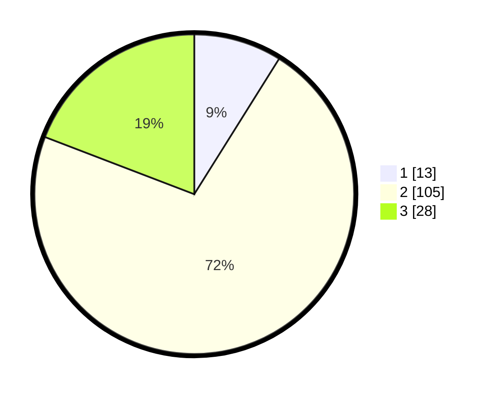

# Hasil

## Grafik

## Tabel

| No. | Nama Paslon    | Suara | Suara (raw) | Persentase |
|:--- |:-------------- | -----:| -----------:| ----------:|
| 1   | ANIES MUHAIMIN | 13    | [13][p-1]   | 8,90       |
| 2   | PRABOWO GIBRAN | 105   | [105][p-2]  | 71,92      |
| 3   | GANJAR MAHFUD  | 28    | [28][p-3]   | 19,18      |

[p-1]: https://github.com/gigit-pemilu/pemilu-2024/blob/main/pilpres/hitung-suara/sub/33-jawa-tengah/sub/25-batang/sub/07-gringsing/sub/2015-lebo/sub/005-tps/sub/paslon-1.txt
[p-2]: https://github.com/gigit-pemilu/pemilu-2024/blob/main/pilpres/hitung-suara/sub/33-jawa-tengah/sub/25-batang/sub/07-gringsing/sub/2015-lebo/sub/005-tps/sub/paslon-2.txt
[p-3]: https://github.com/gigit-pemilu/pemilu-2024/blob/main/pilpres/hitung-suara/sub/33-jawa-tengah/sub/25-batang/sub/07-gringsing/sub/2015-lebo/sub/005-tps/sub/paslon-3.txt

## Foto C Plano

https://sirekap-obj-formc.kpu.go.id/1141/pemilu/ppwp/33/25/07/20/15/3325072015005-20240214-223121--f58b0ae0-d86d-48c0-9a3b-1962f3e37d87.jpg

https://sirekap-obj-formc.kpu.go.id/1141/pemilu/ppwp/33/25/07/20/15/3325072015005-20240214-223526--3a041c32-3595-44e3-b07e-6a6b210f5fa6.jpg

https://sirekap-obj-formc.kpu.go.id/1141/pemilu/ppwp/33/25/07/20/15/3325072015005-20240214-224103--49113d2b-167a-48f5-80ad-acccece8d230.jpg

## Metadata

| Key        | Value               |
| ---------- | ------------------- |
| Time Stamp | 2024-02-15 23:29:50 |

