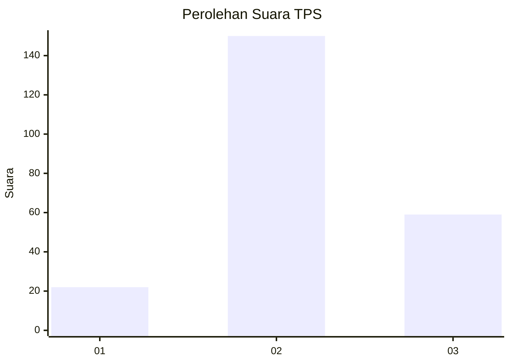
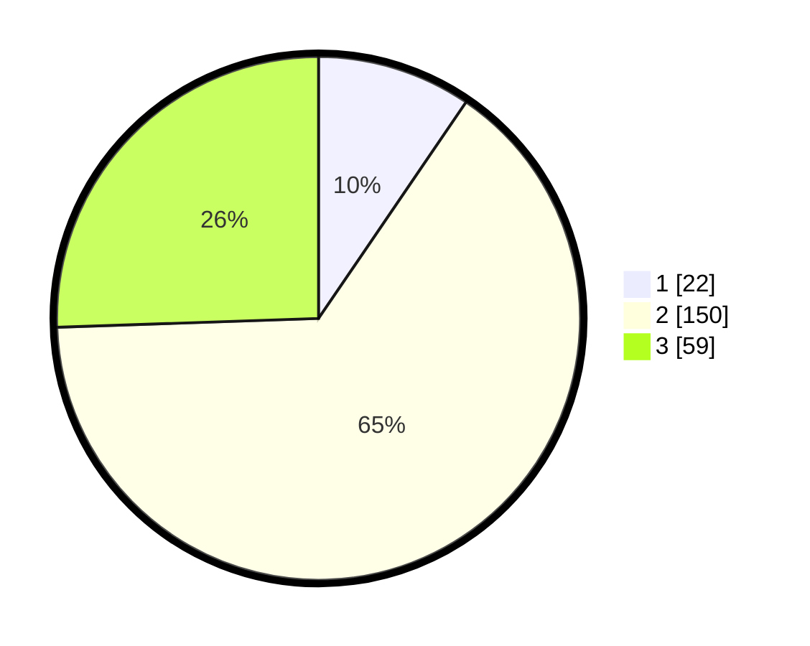

# Hasil

## Grafik

## Tabel

| No. | Nama Paslon    | Suara | Suara (raw) | Persentase |
|:--- |:-------------- | -----:| -----------:| ----------:|
| 1   | ANIES MUHAIMIN | 22    | [22][p-1]   | 9,52       |
| 2   | PRABOWO GIBRAN | 150   | [150][p-2]  | 64,94      |
| 3   | GANJAR MAHFUD  | 59    | [59][p-3]   | 25,54      |

[p-1]: https://github.com/gigit-pemilu/pemilu-2024/blob/main/pilpres/hitung-suara/sub/33-jawa-tengah/sub/25-batang/sub/09-subah/sub/2004-menjangan/sub/002-tps/sub/paslon-1.txt
[p-2]: https://github.com/gigit-pemilu/pemilu-2024/blob/main/pilpres/hitung-suara/sub/33-jawa-tengah/sub/25-batang/sub/09-subah/sub/2004-menjangan/sub/002-tps/sub/paslon-2.txt
[p-3]: https://github.com/gigit-pemilu/pemilu-2024/blob/main/pilpres/hitung-suara/sub/33-jawa-tengah/sub/25-batang/sub/09-subah/sub/2004-menjangan/sub/002-tps/sub/paslon-3.txt

## Foto C Plano

https://sirekap-obj-formc.kpu.go.id/069f/pemilu/ppwp/33/25/09/20/04/3325092004002-20240214-234632--01bccad1-4413-4d9e-9ebc-c73458e59307.jpg

https://sirekap-obj-formc.kpu.go.id/069f/pemilu/ppwp/33/25/09/20/04/3325092004002-20240214-234833--8f6c9d01-77d4-4b7e-8826-36bdf844b6ef.jpg

https://sirekap-obj-formc.kpu.go.id/069f/pemilu/ppwp/33/25/09/20/04/3325092004002-20240214-234931--197deb8e-ca12-489c-aa77-6f8f70ead5eb.jpg

## Metadata

| Key        | Value               |
| ---------- | ------------------- |
| Time Stamp | 2024-02-15 07:00:44 |

