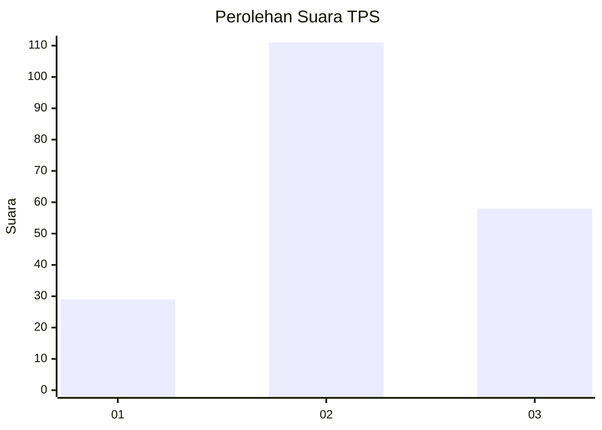
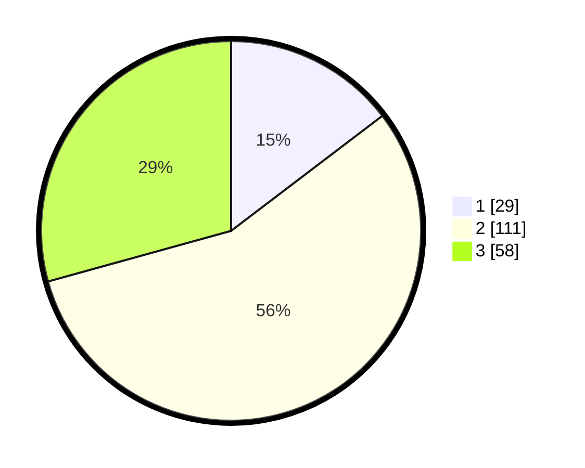

# Hasil

## Grafik

## Tabel

| No. | Nama Paslon    | Suara | Suara (raw) | Persentase |
|:--- |:-------------- | -----:| -----------:| ----------:|
| 1   | ANIES MUHAIMIN | 29    | [29][p-1]   | 14,65      |
| 2   | PRABOWO GIBRAN | 111   | [111][p-2]  | 56,06      |
| 3   | GANJAR MAHFUD  | 58    | [58][p-3]   | 29,29      |

[p-1]: https://github.com/gigit-pemilu/pemilu-2024-33-jawa-tengah/blob/main/pilpres/hitung-suara/sub/33-jawa-tengah/sub/25-batang/sub/09-subah/sub/2004-menjangan/sub/003-tps/sub/paslon-1.txt
[p-2]: https://github.com/gigit-pemilu/pemilu-2024-33-jawa-tengah/blob/main/pilpres/hitung-suara/sub/33-jawa-tengah/sub/25-batang/sub/09-subah/sub/2004-menjangan/sub/003-tps/sub/paslon-2.txt
[p-3]: https://github.com/gigit-pemilu/pemilu-2024-33-jawa-tengah/blob/main/pilpres/hitung-suara/sub/33-jawa-tengah/sub/25-batang/sub/09-subah/sub/2004-menjangan/sub/003-tps/sub/paslon-3.txt

## Foto C Plano

https://sirekap-obj-formc.kpu.go.id/4f02/pemilu/ppwp/33/25/09/20/04/3325092004003-20240220-103459--876d9360-7b6f-4608-9c27-5ed4d51baf0e.jpg

https://sirekap-obj-formc.kpu.go.id/4f02/pemilu/ppwp/33/25/09/20/04/3325092004003-20240221-100031--c693e12f-9afb-407c-ac30-d118cf20a92f.jpg

https://sirekap-obj-formc.kpu.go.id/4f02/pemilu/ppwp/33/25/09/20/04/3325092004003-20240221-095146--e7265718-1403-429a-9f6e-028cb6418cb2.jpg

## Metadata

| Key        | Value               |
| ---------- | ------------------- |
| Time Stamp | 2024-02-22 08:00:00 |

