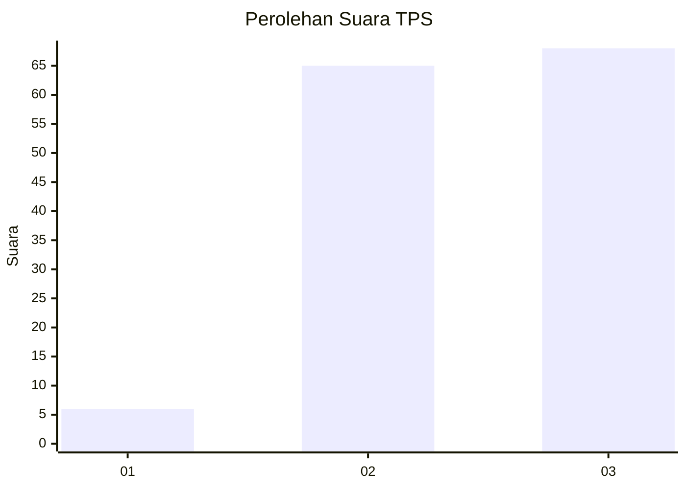
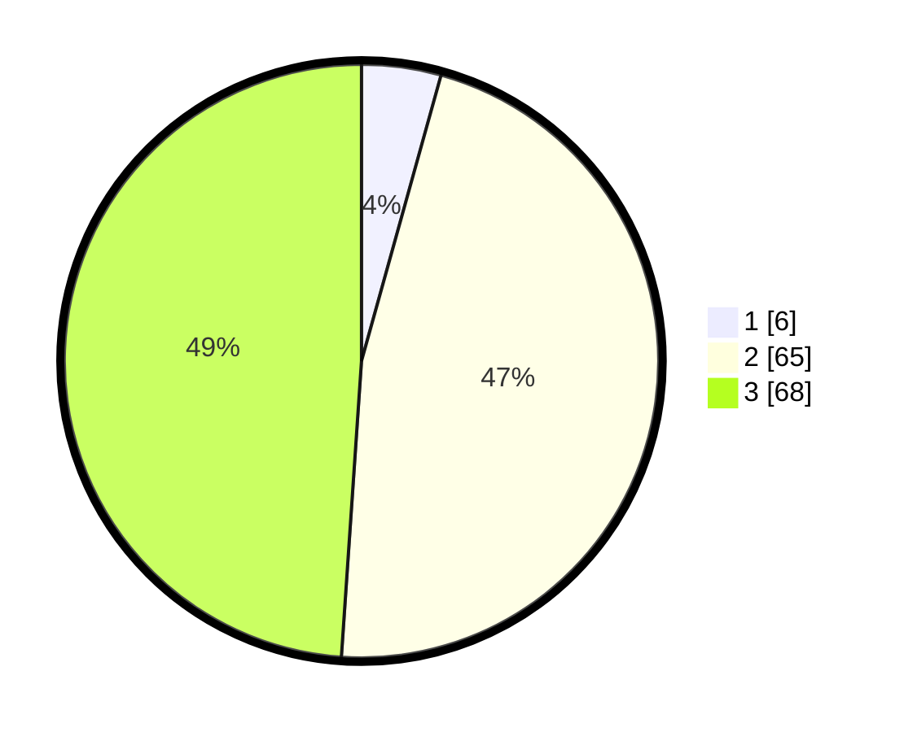

# Hasil

## Grafik

## Tabel

| No. | Nama Paslon    | Suara | Suara (raw) | Persentase |
|:--- |:-------------- | -----:| -----------:| ----------:|
| 1   | ANIES MUHAIMIN | 6     | [6][p-1]    | 4,32       |
| 2   | PRABOWO GIBRAN | 65    | [65][p-2]   | 46,76      |
| 3   | GANJAR MAHFUD  | 68    | [68][p-3]   | 48,92      |

[p-1]: https://github.com/gigit-pemilu/pemilu-2024-33-jawa-tengah/blob/main/pilpres/hitung-suara/sub/33-jawa-tengah/sub/25-batang/sub/09-subah/sub/2021-sengon/sub/018-tps/sub/paslon-1.txt
[p-2]: https://github.com/gigit-pemilu/pemilu-2024-33-jawa-tengah/blob/main/pilpres/hitung-suara/sub/33-jawa-tengah/sub/25-batang/sub/09-subah/sub/2021-sengon/sub/018-tps/sub/paslon-2.txt
[p-3]: https://github.com/gigit-pemilu/pemilu-2024-33-jawa-tengah/blob/main/pilpres/hitung-suara/sub/33-jawa-tengah/sub/25-batang/sub/09-subah/sub/2021-sengon/sub/018-tps/sub/paslon-3.txt

## Foto C Plano

https://sirekap-obj-formc.kpu.go.id/ef63/pemilu/ppwp/33/25/09/20/21/3325092021018-20240217-202052--50b4efa2-8fa0-435e-81cf-babb2da6a096.jpg

https://sirekap-obj-formc.kpu.go.id/ef63/pemilu/ppwp/33/25/09/20/21/3325092021018-20240217-203627--98645d0a-930a-4f77-8c6e-f5ece2ec9a69.jpg

https://sirekap-obj-formc.kpu.go.id/ef63/pemilu/ppwp/33/25/09/20/21/3325092021018-20240217-204313--267b674d-c679-41a8-90de-0adbe0e4d852.jpg

## Metadata

| Key        | Value               |
| ---------- | ------------------- |
| Time Stamp | 2024-02-19 06:16:00 |

