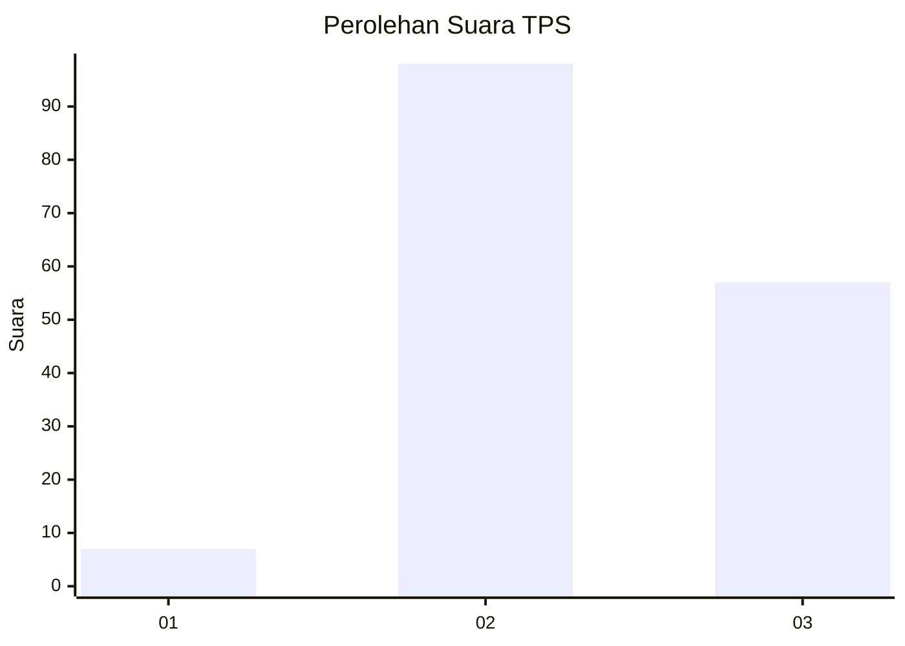
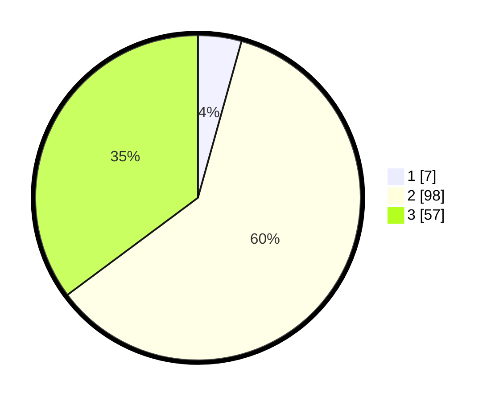

# Hasil

## Grafik

## Tabel

| No. | Nama Paslon    | Suara | Suara (raw) | Persentase |
|:--- |:-------------- | -----:| -----------:| ----------:|
| 1   | ANIES MUHAIMIN | 7     | [7][p-1]    | 4,32       |
| 2   | PRABOWO GIBRAN | 98    | [98][p-2]   | 60,49      |
| 3   | GANJAR MAHFUD  | 57    | [57][p-3]   | 35,19      |

[p-1]: https://github.com/gigit-pemilu/pemilu-2024/blob/main/pilpres/hitung-suara/sub/33-jawa-tengah/sub/25-batang/sub/10-tulis/sub/2001-wringingintung/sub/008-tps/sub/paslon-1.txt
[p-2]: https://github.com/gigit-pemilu/pemilu-2024/blob/main/pilpres/hitung-suara/sub/33-jawa-tengah/sub/25-batang/sub/10-tulis/sub/2001-wringingintung/sub/008-tps/sub/paslon-2.txt
[p-3]: https://github.com/gigit-pemilu/pemilu-2024/blob/main/pilpres/hitung-suara/sub/33-jawa-tengah/sub/25-batang/sub/10-tulis/sub/2001-wringingintung/sub/008-tps/sub/paslon-3.txt

## Foto C Plano

https://sirekap-obj-formc.kpu.go.id/afaf/pemilu/ppwp/33/25/10/20/01/3325102001008-20240214-194123--f80e4daa-4731-4e54-b9ed-c667dd587cee.jpg

https://sirekap-obj-formc.kpu.go.id/afaf/pemilu/ppwp/33/25/10/20/01/3325102001008-20240214-194140--d05e882e-6c9b-49f8-9b38-9cbddc58f354.jpg

https://sirekap-obj-formc.kpu.go.id/afaf/pemilu/ppwp/33/25/10/20/01/3325102001008-20240214-194149--466f3211-46c5-4b1a-986c-9a666d562355.jpg

## Metadata

| Key        | Value               |
| ---------- | ------------------- |
| Time Stamp | 2024-02-17 16:36:25 |

