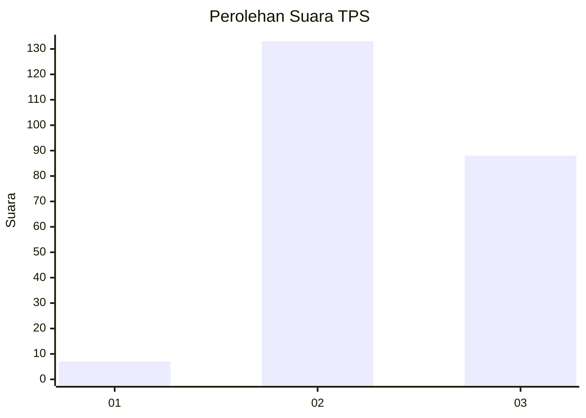
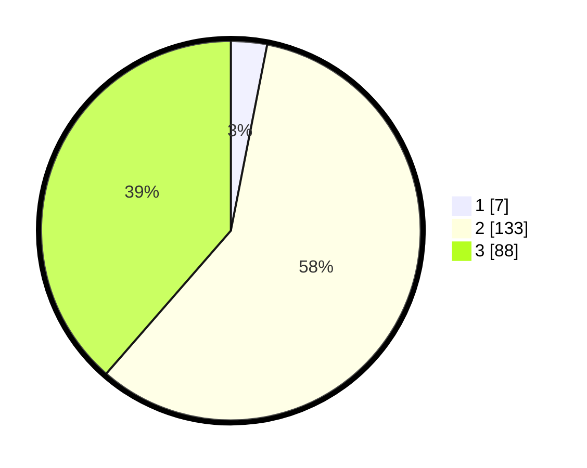

# Hasil

## Grafik

## Tabel

| No. | Nama Paslon    | Suara | Suara (raw) | Persentase |
|:--- |:-------------- | -----:| -----------:| ----------:|
| 1   | ANIES MUHAIMIN | 7     | [7][p-1]    | 3,07       |
| 2   | PRABOWO GIBRAN | 133   | [133][p-2]  | 58,33      |
| 3   | GANJAR MAHFUD  | 88    | [88][p-3]   | 38,60      |

[p-1]: https://github.com/gigit-pemilu/pemilu-2024/blob/main/pilpres/hitung-suara/sub/33-jawa-tengah/sub/25-batang/sub/10-tulis/sub/2001-wringingintung/sub/010-tps/sub/paslon-1.txt
[p-2]: https://github.com/gigit-pemilu/pemilu-2024/blob/main/pilpres/hitung-suara/sub/33-jawa-tengah/sub/25-batang/sub/10-tulis/sub/2001-wringingintung/sub/010-tps/sub/paslon-2.txt
[p-3]: https://github.com/gigit-pemilu/pemilu-2024/blob/main/pilpres/hitung-suara/sub/33-jawa-tengah/sub/25-batang/sub/10-tulis/sub/2001-wringingintung/sub/010-tps/sub/paslon-3.txt

## Foto C Plano

https://sirekap-obj-formc.kpu.go.id/6a53/pemilu/ppwp/33/25/10/20/01/3325102001010-20240214-202247--aed6e5b7-b28c-405e-b040-626b54ed7918.jpg

https://sirekap-obj-formc.kpu.go.id/6a53/pemilu/ppwp/33/25/10/20/01/3325102001010-20240214-233802--22ba2f07-14e3-432b-8fa3-11d8f65b9bdc.jpg

https://sirekap-obj-formc.kpu.go.id/6a53/pemilu/ppwp/33/25/10/20/01/3325102001010-20240214-234116--539c604d-d428-4b85-8c9a-3901b070687d.jpg

## Metadata

| Key        | Value               |
| ---------- | ------------------- |
| Time Stamp | 2024-02-16 09:30:28 |

