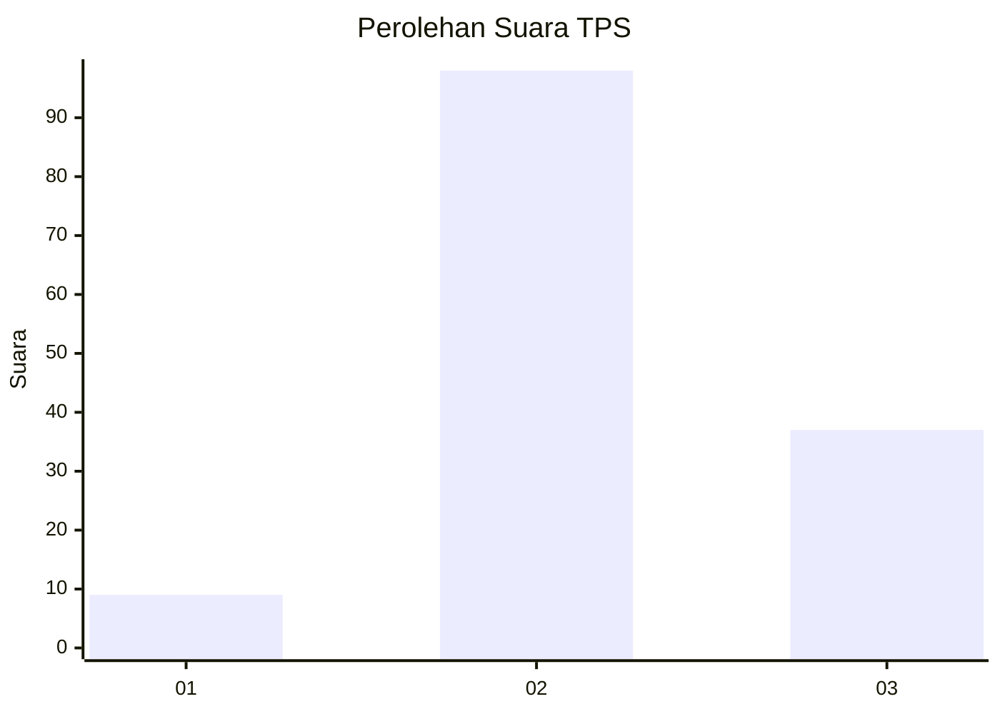
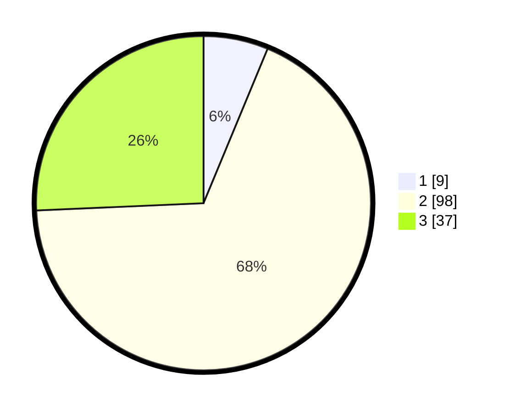

# Hasil

## Grafik

## Tabel

| No. | Nama Paslon    | Suara | Suara (raw) | Persentase |
|:--- |:-------------- | -----:| -----------:| ----------:|
| 1   | ANIES MUHAIMIN | 9     | [9][p-1]    | 6,25       |
| 2   | PRABOWO GIBRAN | 98    | [98][p-2]   | 68,06      |
| 3   | GANJAR MAHFUD  | 37    | [37][p-3]   | 25,69      |

[p-1]: https://github.com/gigit-pemilu/pemilu-2024/blob/main/pilpres/hitung-suara/sub/33-jawa-tengah/sub/25-batang/sub/10-tulis/sub/2004-kaliboyo/sub/005-tps/sub/paslon-1.txt
[p-2]: https://github.com/gigit-pemilu/pemilu-2024/blob/main/pilpres/hitung-suara/sub/33-jawa-tengah/sub/25-batang/sub/10-tulis/sub/2004-kaliboyo/sub/005-tps/sub/paslon-2.txt
[p-3]: https://github.com/gigit-pemilu/pemilu-2024/blob/main/pilpres/hitung-suara/sub/33-jawa-tengah/sub/25-batang/sub/10-tulis/sub/2004-kaliboyo/sub/005-tps/sub/paslon-3.txt

## Foto C Plano

https://sirekap-obj-formc.kpu.go.id/63a4/pemilu/ppwp/33/25/10/20/04/3325102004005-20240214-141830--b5065b1e-6d7d-462f-8917-0dcc133a4968.jpg

https://sirekap-obj-formc.kpu.go.id/63a4/pemilu/ppwp/33/25/10/20/04/3325102004005-20240214-141939--bbf44029-4ceb-4cdd-b001-a950bc33347f.jpg

https://sirekap-obj-formc.kpu.go.id/63a4/pemilu/ppwp/33/25/10/20/04/3325102004005-20240215-000701--153d8b1d-cce6-4056-bedf-cf2b40023908.jpg

## Metadata

| Key        | Value               |
| ---------- | ------------------- |
| Time Stamp | 2024-02-15 21:30:27 |

