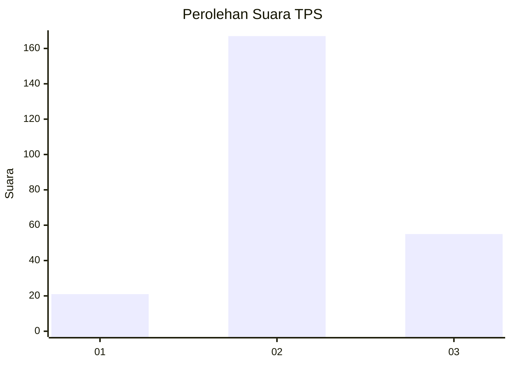
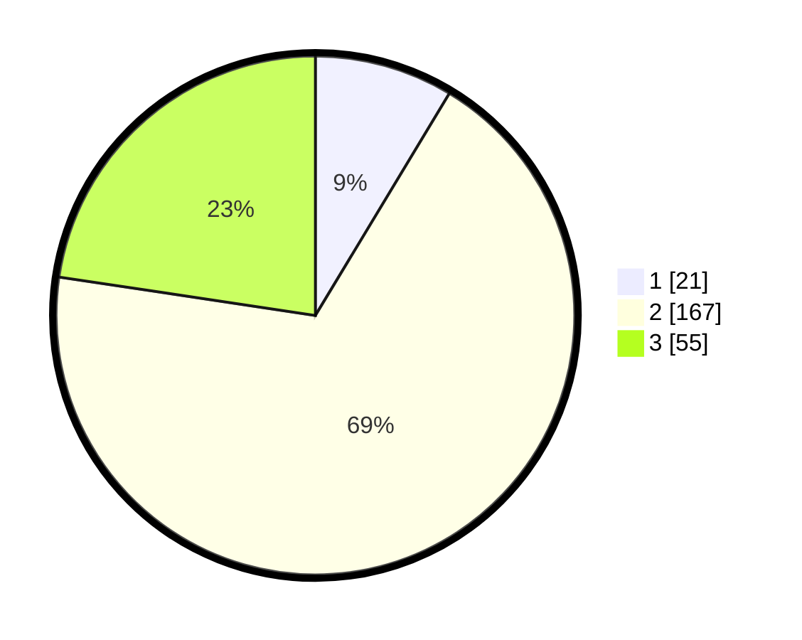

# Hasil

## Grafik

## Tabel

| No. | Nama Paslon    | Suara | Suara (raw) | Persentase |
|:--- |:-------------- | -----:| -----------:| ----------:|
| 1   | ANIES MUHAIMIN | 21    | [21][p-1]   | 8,64       |
| 2   | PRABOWO GIBRAN | 167   | [167][p-2]  | 68,72      |
| 3   | GANJAR MAHFUD  | 55    | [55][p-3]   | 22,63      |

[p-1]: https://github.com/gigit-pemilu/pemilu-2024/blob/main/pilpres/hitung-suara/sub/33-jawa-tengah/sub/25-batang/sub/10-tulis/sub/2018-kedungsegog/sub/005-tps/sub/paslon-1.txt
[p-2]: https://github.com/gigit-pemilu/pemilu-2024/blob/main/pilpres/hitung-suara/sub/33-jawa-tengah/sub/25-batang/sub/10-tulis/sub/2018-kedungsegog/sub/005-tps/sub/paslon-2.txt
[p-3]: https://github.com/gigit-pemilu/pemilu-2024/blob/main/pilpres/hitung-suara/sub/33-jawa-tengah/sub/25-batang/sub/10-tulis/sub/2018-kedungsegog/sub/005-tps/sub/paslon-3.txt

## Foto C Plano

https://sirekap-obj-formc.kpu.go.id/b5c3/pemilu/ppwp/33/25/10/20/18/3325102018005-20240214-225200--eb6267b8-9442-4042-aa08-20aeff0e17ce.jpg

https://sirekap-obj-formc.kpu.go.id/b5c3/pemilu/ppwp/33/25/10/20/18/3325102018005-20240214-232358--236c4763-aa5d-473f-a16a-0987e20f49d8.jpg

https://sirekap-obj-formc.kpu.go.id/b5c3/pemilu/ppwp/33/25/10/20/18/3325102018005-20240215-041917--89099e8b-0fb6-4f53-8ee4-eb591e328865.jpg

## Metadata

| Key        | Value               |
| ---------- | ------------------- |
| Time Stamp | 2024-02-15 22:00:27 |

