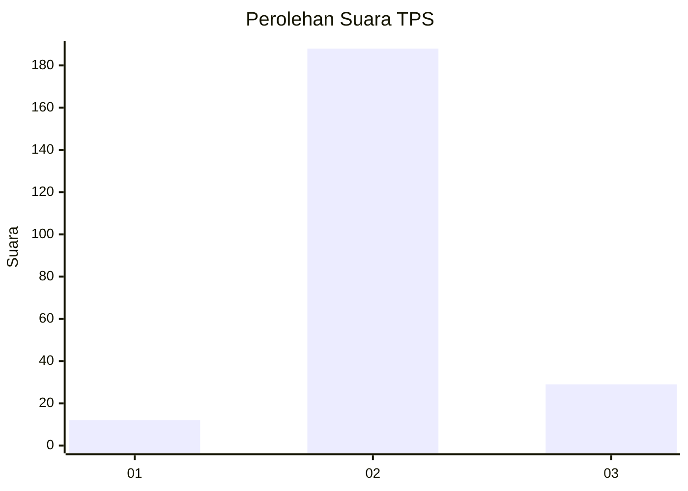
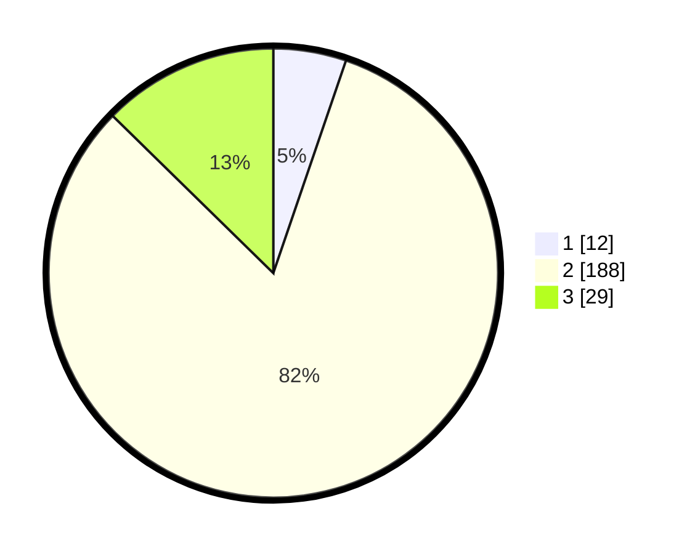

# Hasil

## Grafik

## Tabel

| No. | Nama Paslon    | Suara | Suara (raw) | Persentase |
|:--- |:-------------- | -----:| -----------:| ----------:|
| 1   | ANIES MUHAIMIN | 12    | [12][p-1]   | 5,24       |
| 2   | PRABOWO GIBRAN | 188   | [188][p-2]  | 82,10      |
| 3   | GANJAR MAHFUD  | 29    | [29][p-3]   | 12,66      |

[p-1]: https://github.com/gigit-pemilu/pemilu-2024/blob/main/pilpres/hitung-suara/sub/33-jawa-tengah/sub/25-batang/sub/10-tulis/sub/2024-siberuk/sub/003-tps/sub/paslon-1.txt
[p-2]: https://github.com/gigit-pemilu/pemilu-2024/blob/main/pilpres/hitung-suara/sub/33-jawa-tengah/sub/25-batang/sub/10-tulis/sub/2024-siberuk/sub/003-tps/sub/paslon-2.txt
[p-3]: https://github.com/gigit-pemilu/pemilu-2024/blob/main/pilpres/hitung-suara/sub/33-jawa-tengah/sub/25-batang/sub/10-tulis/sub/2024-siberuk/sub/003-tps/sub/paslon-3.txt

## Foto C Plano

https://sirekap-obj-formc.kpu.go.id/4af4/pemilu/ppwp/33/25/10/20/24/3325102024003-20240216-225354--1cb01734-95a1-41c7-9bbf-d5a0be9719a5.jpg

https://sirekap-obj-formc.kpu.go.id/4af4/pemilu/ppwp/33/25/10/20/24/3325102024003-20240216-225220--94c985ab-91cd-4fd8-b5ca-371e120ae63d.jpg

https://sirekap-obj-formc.kpu.go.id/4af4/pemilu/ppwp/33/25/10/20/24/3325102024003-20240216-225603--8ff870cf-5d3a-4ed4-853c-52fd900a1731.jpg

## Metadata

| Key        | Value               |
| ---------- | ------------------- |
| Time Stamp | 2024-02-17 12:00:00 |

