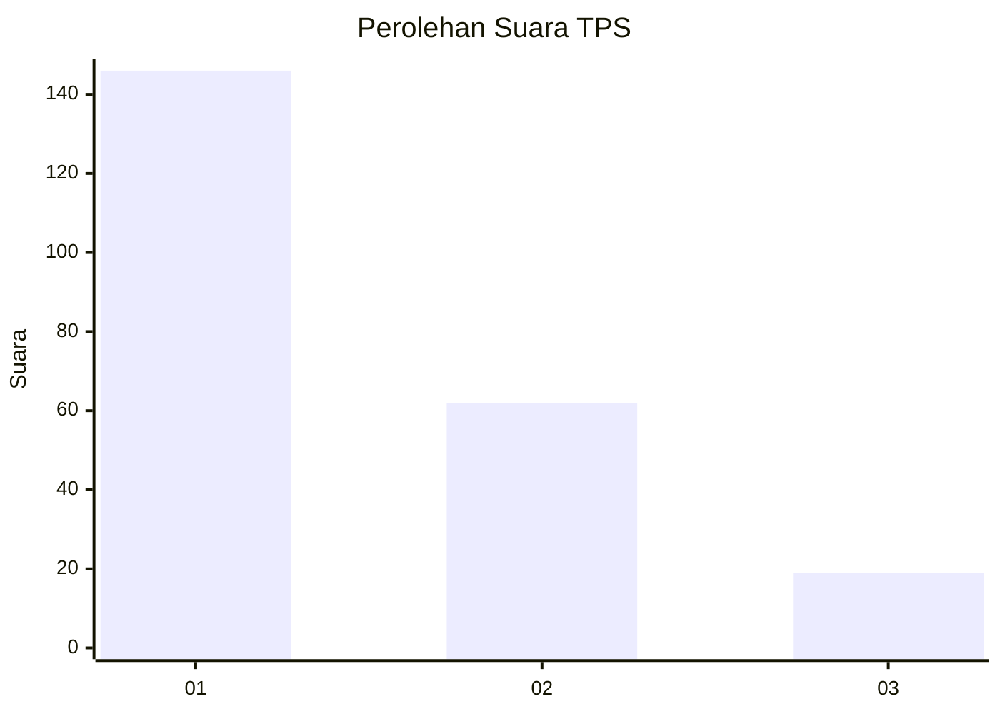
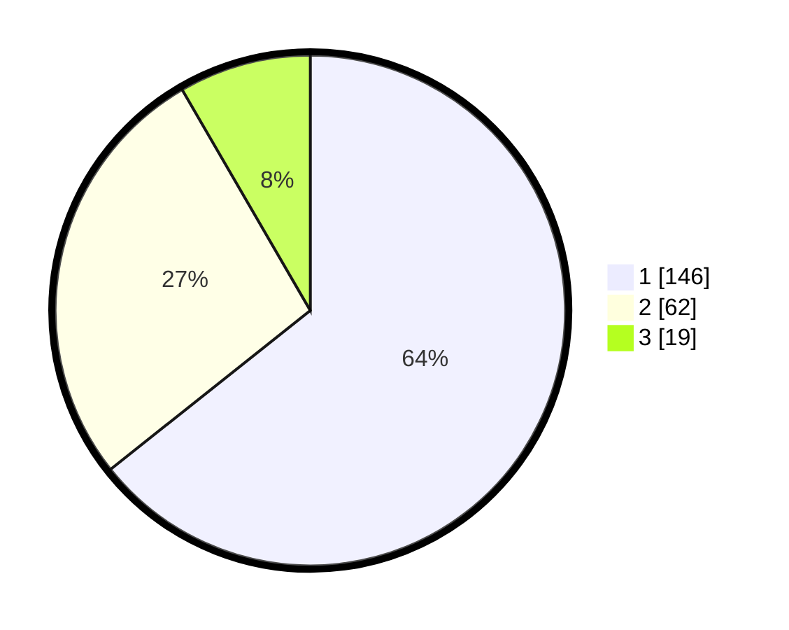

# Hasil

## Grafik

## Tabel

| No. | Nama Paslon    | Suara | Suara (raw) | Persentase |
|:--- |:-------------- | -----:| -----------:| ----------:|
| 1   | ANIES MUHAIMIN | 146   | [146][p-1]  | 64,32      |
| 2   | PRABOWO GIBRAN | 62    | [62][p-2]   | 27,31      |
| 3   | GANJAR MAHFUD  | 19    | [19][p-3]   | 8,37       |

[p-1]: https://github.com/gigit-pemilu/pemilu-2024/blob/main/pilpres/hitung-suara/sub/33-jawa-tengah/sub/25-batang/sub/11-batang/sub/1013-watesalit/sub/001-tps/sub/paslon-1.txt
[p-2]: https://github.com/gigit-pemilu/pemilu-2024/blob/main/pilpres/hitung-suara/sub/33-jawa-tengah/sub/25-batang/sub/11-batang/sub/1013-watesalit/sub/001-tps/sub/paslon-2.txt
[p-3]: https://github.com/gigit-pemilu/pemilu-2024/blob/main/pilpres/hitung-suara/sub/33-jawa-tengah/sub/25-batang/sub/11-batang/sub/1013-watesalit/sub/001-tps/sub/paslon-3.txt

## Foto C Plano

https://sirekap-obj-formc.kpu.go.id/1846/pemilu/ppwp/33/25/11/10/13/3325111013001-20240214-225753--3811f268-e42f-4c4c-aaaa-e68781669938.jpg

https://sirekap-obj-formc.kpu.go.id/1846/pemilu/ppwp/33/25/11/10/13/3325111013001-20240214-230017--27a62dc5-d5a9-41f3-9276-fc3a12c9e8f9.jpg

https://sirekap-obj-formc.kpu.go.id/1846/pemilu/ppwp/33/25/11/10/13/3325111013001-20240214-230222--f78a8d64-f9d2-4394-a2ae-c70021c41355.jpg

## Metadata

| Key        | Value               |
| ---------- | ------------------- |
| Time Stamp | 2024-02-15 20:30:46 |

