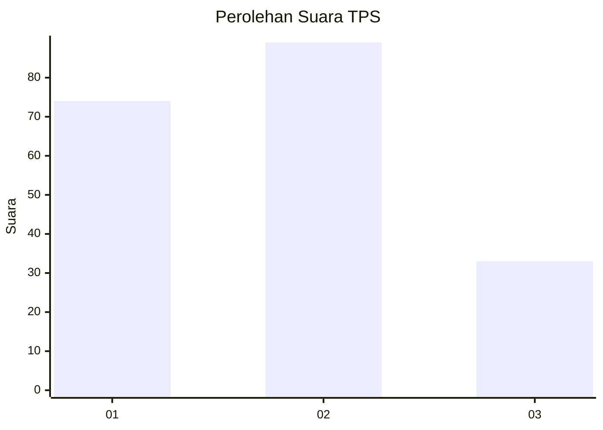
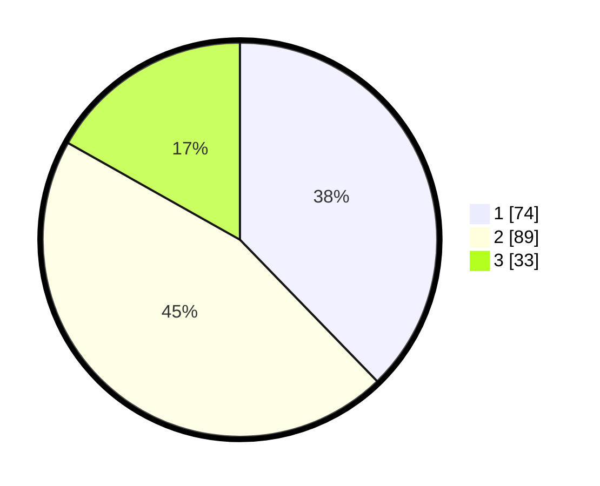

# Hasil

## Grafik

## Tabel

| No. | Nama Paslon    | Suara | Suara (raw) | Persentase |
|:--- |:-------------- | -----:| -----------:| ----------:|
| 1   | ANIES MUHAIMIN | 74    | [74][p-1]   | 37,76      |
| 2   | PRABOWO GIBRAN | 89    | [89][p-2]   | 45,41      |
| 3   | GANJAR MAHFUD  | 33    | [33][p-3]   | 16,84      |

[p-1]: https://github.com/gigit-pemilu/pemilu-2024-33-jawa-tengah/blob/main/pilpres/hitung-suara/sub/33-jawa-tengah/sub/25-batang/sub/11-batang/sub/1013-watesalit/sub/004-tps/sub/paslon-1.txt
[p-2]: https://github.com/gigit-pemilu/pemilu-2024-33-jawa-tengah/blob/main/pilpres/hitung-suara/sub/33-jawa-tengah/sub/25-batang/sub/11-batang/sub/1013-watesalit/sub/004-tps/sub/paslon-2.txt
[p-3]: https://github.com/gigit-pemilu/pemilu-2024-33-jawa-tengah/blob/main/pilpres/hitung-suara/sub/33-jawa-tengah/sub/25-batang/sub/11-batang/sub/1013-watesalit/sub/004-tps/sub/paslon-3.txt

## Foto C Plano

https://sirekap-obj-formc.kpu.go.id/3c77/pemilu/ppwp/33/25/11/10/13/3325111013004-20240215-013327--cab34771-2fde-40ea-a5a5-bbf458453865.jpg

https://sirekap-obj-formc.kpu.go.id/3c77/pemilu/ppwp/33/25/11/10/13/3325111013004-20240215-013846--9ad22ef1-a282-4211-a02a-42a0e303f8fa.jpg

https://sirekap-obj-formc.kpu.go.id/3c77/pemilu/ppwp/33/25/11/10/13/3325111013004-20240215-014122--e63d7ef7-9e2a-4b4c-963b-3d301ede70d6.jpg

## Metadata

| Key        | Value               |
| ---------- | ------------------- |
| Time Stamp | 2024-02-16 09:30:28 |

