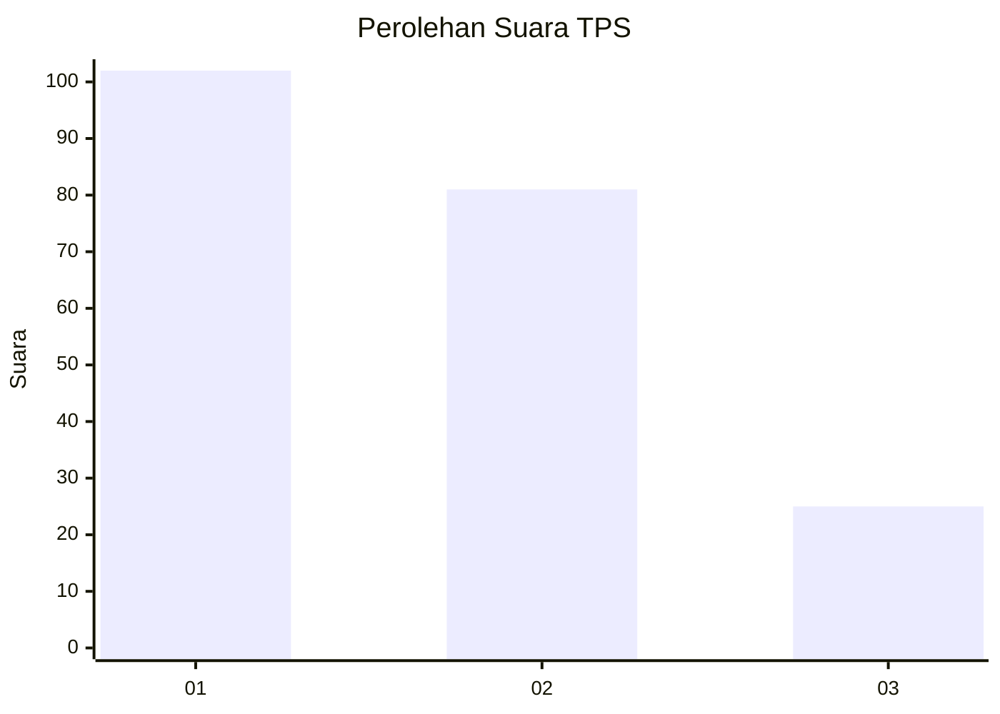
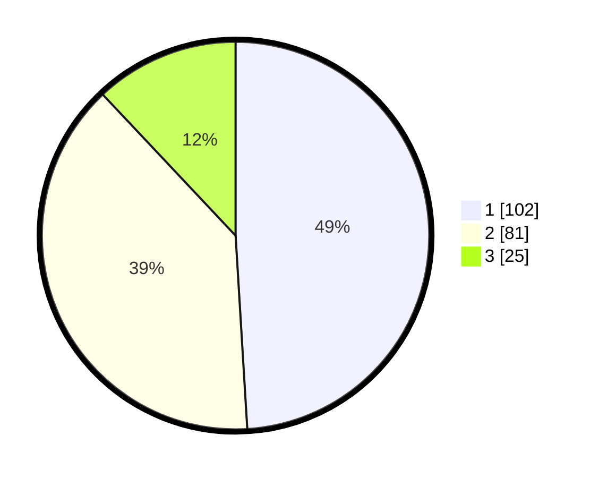

# Hasil

## Grafik

## Tabel

| No. | Nama Paslon    | Suara | Suara (raw) | Persentase |
|:--- |:-------------- | -----:| -----------:| ----------:|
| 1   | ANIES MUHAIMIN | 102   | [102][p-1]  | 49,04      |
| 2   | PRABOWO GIBRAN | 81    | [81][p-2]   | 38,94      |
| 3   | GANJAR MAHFUD  | 25    | [25][p-3]   | 12,02      |

[p-1]: https://github.com/gigit-pemilu/pemilu-2024/blob/main/pilpres/hitung-suara/sub/33-jawa-tengah/sub/25-batang/sub/11-batang/sub/1013-watesalit/sub/006-tps/sub/paslon-1.txt
[p-2]: https://github.com/gigit-pemilu/pemilu-2024/blob/main/pilpres/hitung-suara/sub/33-jawa-tengah/sub/25-batang/sub/11-batang/sub/1013-watesalit/sub/006-tps/sub/paslon-2.txt
[p-3]: https://github.com/gigit-pemilu/pemilu-2024/blob/main/pilpres/hitung-suara/sub/33-jawa-tengah/sub/25-batang/sub/11-batang/sub/1013-watesalit/sub/006-tps/sub/paslon-3.txt

## Foto C Plano

https://sirekap-obj-formc.kpu.go.id/3e18/pemilu/ppwp/33/25/11/10/13/3325111013006-20240214-234452--2043b6e6-99f0-4e81-a0b0-77938f81775b.jpg

https://sirekap-obj-formc.kpu.go.id/3e18/pemilu/ppwp/33/25/11/10/13/3325111013006-20240214-234558--24922ffb-e625-4f28-bc11-8ea208567850.jpg

https://sirekap-obj-formc.kpu.go.id/3e18/pemilu/ppwp/33/25/11/10/13/3325111013006-20240214-234711--9424dab8-0b31-4694-8832-7ec9380d786b.jpg

## Metadata

| Key        | Value               |
| ---------- | ------------------- |
| Time Stamp | 2024-02-16 09:30:28 |

