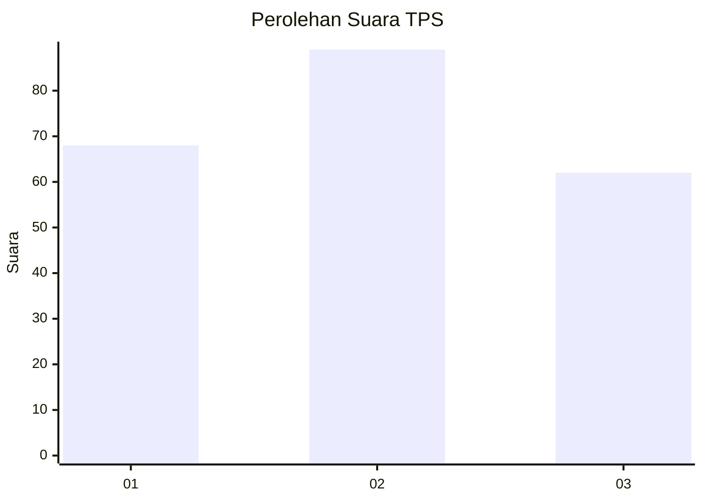
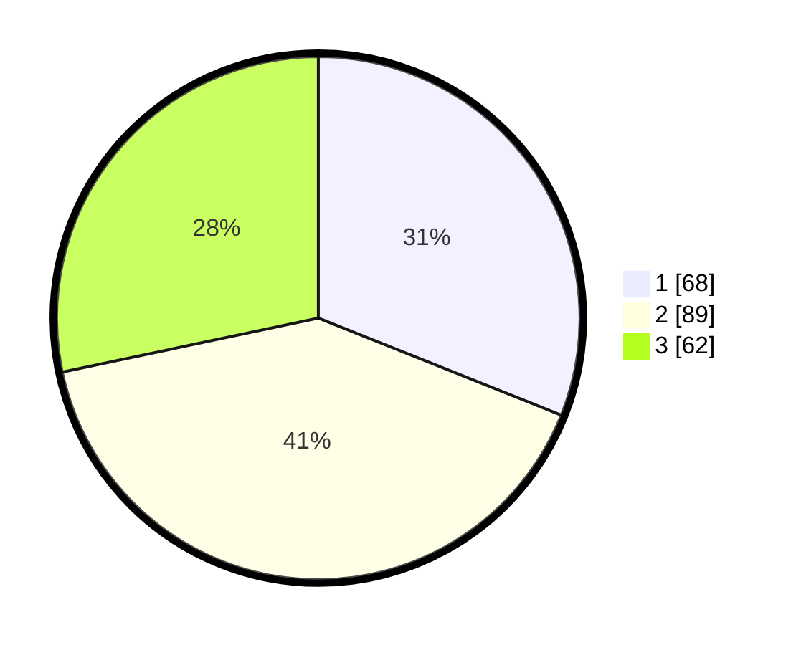

# Hasil

## Grafik

## Tabel

| No. | Nama Paslon    | Suara | Suara (raw) | Persentase |
|:--- |:-------------- | -----:| -----------:| ----------:|
| 1   | ANIES MUHAIMIN | 68    | [68][p-1]   | 31,05      |
| 2   | PRABOWO GIBRAN | 89    | [89][p-2]   | 40,64      |
| 3   | GANJAR MAHFUD  | 62    | [62][p-3]   | 28,31      |

[p-1]: https://github.com/gigit-pemilu/pemilu-2024/blob/main/pilpres/hitung-suara/sub/33-jawa-tengah/sub/25-batang/sub/11-batang/sub/1013-watesalit/sub/007-tps/sub/paslon-1.txt
[p-2]: https://github.com/gigit-pemilu/pemilu-2024/blob/main/pilpres/hitung-suara/sub/33-jawa-tengah/sub/25-batang/sub/11-batang/sub/1013-watesalit/sub/007-tps/sub/paslon-2.txt
[p-3]: https://github.com/gigit-pemilu/pemilu-2024/blob/main/pilpres/hitung-suara/sub/33-jawa-tengah/sub/25-batang/sub/11-batang/sub/1013-watesalit/sub/007-tps/sub/paslon-3.txt

## Foto C Plano

https://sirekap-obj-formc.kpu.go.id/cb13/pemilu/ppwp/33/25/11/10/13/3325111013007-20240214-185712--51e0f866-84ee-4eda-a602-14a6f66f25e8.jpg

https://sirekap-obj-formc.kpu.go.id/cb13/pemilu/ppwp/33/25/11/10/13/3325111013007-20240214-185716--01d4b9c1-0c00-4e63-bdcb-c830b89834b8.jpg

https://sirekap-obj-formc.kpu.go.id/cb13/pemilu/ppwp/33/25/11/10/13/3325111013007-20240214-185720--626acd5c-4b50-4620-8be8-a8064ac54093.jpg

## Metadata

| Key        | Value               |
| ---------- | ------------------- |
| Time Stamp | 2024-02-14 21:46:01 |

