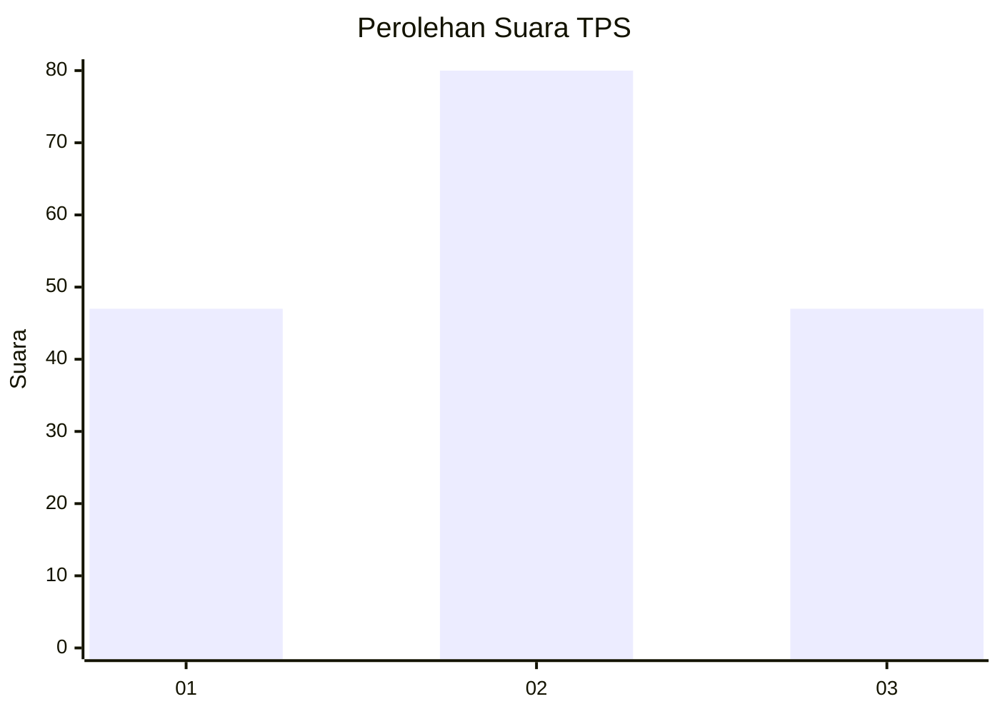
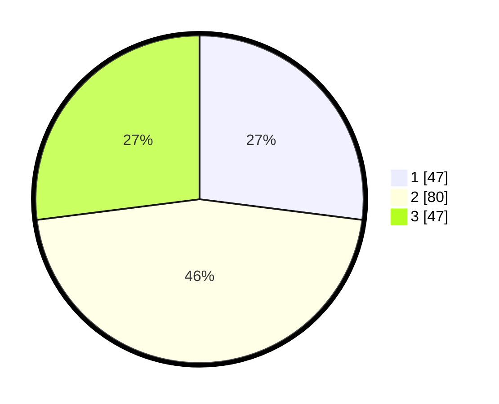

# Hasil

## Grafik

## Tabel

| No. | Nama Paslon    | Suara | Suara (raw) | Persentase |
|:--- |:-------------- | -----:| -----------:| ----------:|
| 1   | ANIES MUHAIMIN | 47    | [47][p-1]   | 27,01      |
| 2   | PRABOWO GIBRAN | 80    | [80][p-2]   | 45,98      |
| 3   | GANJAR MAHFUD  | 47    | [47][p-3]   | 27,01      |

[p-1]: https://github.com/gigit-pemilu/pemilu-2024/blob/main/pilpres/hitung-suara/sub/33-jawa-tengah/sub/25-batang/sub/11-batang/sub/1014-proyonanggan-tengah/sub/003-tps/sub/paslon-1.txt
[p-2]: https://github.com/gigit-pemilu/pemilu-2024/blob/main/pilpres/hitung-suara/sub/33-jawa-tengah/sub/25-batang/sub/11-batang/sub/1014-proyonanggan-tengah/sub/003-tps/sub/paslon-2.txt
[p-3]: https://github.com/gigit-pemilu/pemilu-2024/blob/main/pilpres/hitung-suara/sub/33-jawa-tengah/sub/25-batang/sub/11-batang/sub/1014-proyonanggan-tengah/sub/003-tps/sub/paslon-3.txt

## Foto C Plano

https://sirekap-obj-formc.kpu.go.id/16ce/pemilu/ppwp/33/25/11/10/14/3325111014003-20240215-004709--d464187e-2f1a-45a9-bd99-b15f9989a0f3.jpg

https://sirekap-obj-formc.kpu.go.id/16ce/pemilu/ppwp/33/25/11/10/14/3325111014003-20240215-004918--920ab6a8-4a4d-4f0d-8d1e-f829fbae17c5.jpg

https://sirekap-obj-formc.kpu.go.id/16ce/pemilu/ppwp/33/25/11/10/14/3325111014003-20240215-010941--6c8721b0-bebd-4311-b069-2526cafaa2c6.jpg

## Metadata

| Key        | Value               |
| ---------- | ------------------- |
| Time Stamp | 2024-02-15 20:30:46 |

