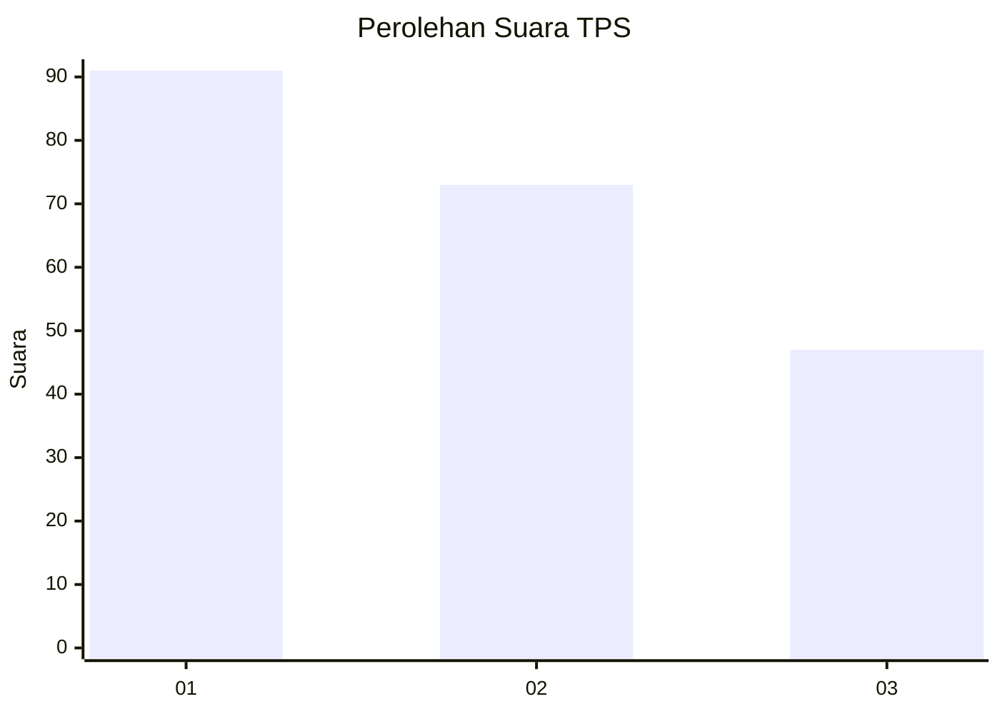
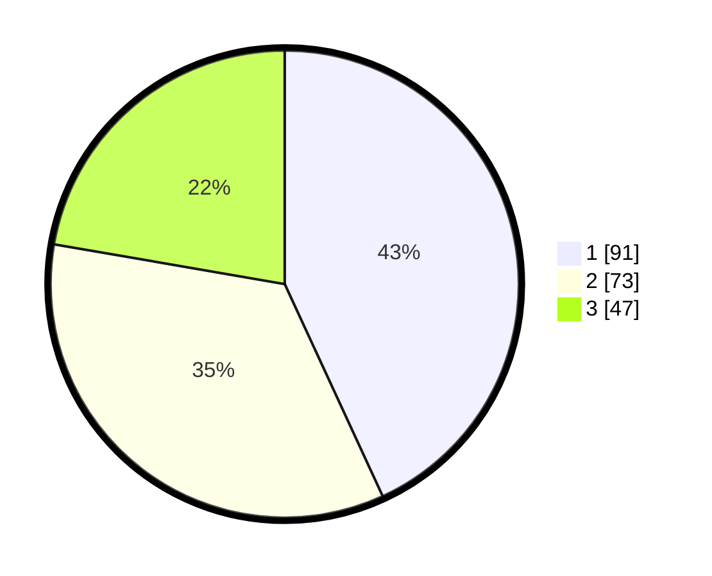

# Hasil

## Grafik

## Tabel

| No. | Nama Paslon    | Suara | Suara (raw) | Persentase |
|:--- |:-------------- | -----:| -----------:| ----------:|
| 1   | ANIES MUHAIMIN | 91    | [91][p-1]   | 43,13      |
| 2   | PRABOWO GIBRAN | 73    | [73][p-2]   | 34,60      |
| 3   | GANJAR MAHFUD  | 47    | [47][p-3]   | 22,27      |

[p-1]: https://github.com/gigit-pemilu/pemilu-2024/blob/main/pilpres/hitung-suara/sub/33-jawa-tengah/sub/25-batang/sub/11-batang/sub/1014-proyonanggan-tengah/sub/007-tps/sub/paslon-1.txt
[p-2]: https://github.com/gigit-pemilu/pemilu-2024/blob/main/pilpres/hitung-suara/sub/33-jawa-tengah/sub/25-batang/sub/11-batang/sub/1014-proyonanggan-tengah/sub/007-tps/sub/paslon-2.txt
[p-3]: https://github.com/gigit-pemilu/pemilu-2024/blob/main/pilpres/hitung-suara/sub/33-jawa-tengah/sub/25-batang/sub/11-batang/sub/1014-proyonanggan-tengah/sub/007-tps/sub/paslon-3.txt

## Foto C Plano

https://sirekap-obj-formc.kpu.go.id/9a0c/pemilu/ppwp/33/25/11/10/14/3325111014007-20240215-010952--fbac209d-7d44-4c65-a2e4-436f2857aad0.jpg

https://sirekap-obj-formc.kpu.go.id/9a0c/pemilu/ppwp/33/25/11/10/14/3325111014007-20240215-011034--fe5d8b8f-f7d4-4dde-bddf-7c53fcabaa6d.jpg

https://sirekap-obj-formc.kpu.go.id/9a0c/pemilu/ppwp/33/25/11/10/14/3325111014007-20240215-011128--f4fd1d8b-866d-4ca5-be72-6bbc6bcbe79c.jpg

## Metadata

| Key        | Value               |
| ---------- | ------------------- |
| Time Stamp | 2024-02-15 12:00:28 |

