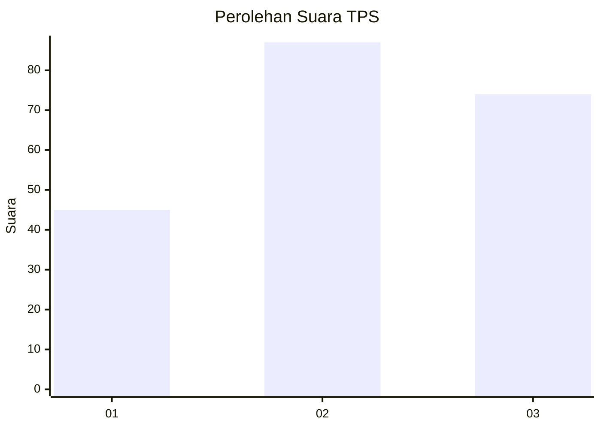
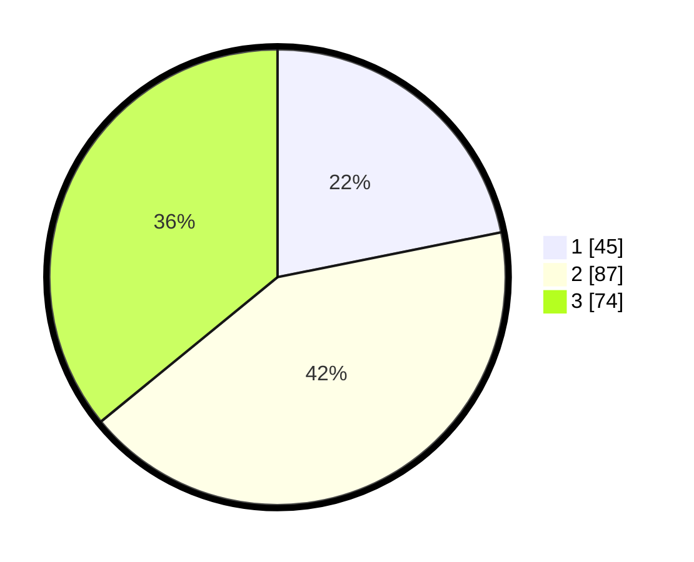

# Hasil

## Grafik

## Tabel

| No. | Nama Paslon    | Suara | Suara (raw) | Persentase |
|:--- |:-------------- | -----:| -----------:| ----------:|
| 1   | ANIES MUHAIMIN | 45    | [45][p-1]   | 21,84      |
| 2   | PRABOWO GIBRAN | 87    | [87][p-2]   | 42,23      |
| 3   | GANJAR MAHFUD  | 74    | [74][p-3]   | 35,92      |

[p-1]: https://github.com/gigit-pemilu/pemilu-2024/blob/main/pilpres/hitung-suara/sub/33-jawa-tengah/sub/25-batang/sub/11-batang/sub/1014-proyonanggan-tengah/sub/008-tps/sub/paslon-1.txt
[p-2]: https://github.com/gigit-pemilu/pemilu-2024/blob/main/pilpres/hitung-suara/sub/33-jawa-tengah/sub/25-batang/sub/11-batang/sub/1014-proyonanggan-tengah/sub/008-tps/sub/paslon-2.txt
[p-3]: https://github.com/gigit-pemilu/pemilu-2024/blob/main/pilpres/hitung-suara/sub/33-jawa-tengah/sub/25-batang/sub/11-batang/sub/1014-proyonanggan-tengah/sub/008-tps/sub/paslon-3.txt

## Foto C Plano

https://sirekap-obj-formc.kpu.go.id/900e/pemilu/ppwp/33/25/11/10/14/3325111014008-20240215-010149--b17b18ef-7be7-40df-b155-6c07544b92b3.jpg

https://sirekap-obj-formc.kpu.go.id/900e/pemilu/ppwp/33/25/11/10/14/3325111014008-20240215-010254--baa1eb1d-70b5-4fe0-9200-07b0922693ba.jpg

https://sirekap-obj-formc.kpu.go.id/900e/pemilu/ppwp/33/25/11/10/14/3325111014008-20240215-010358--bea0c107-564f-4b47-9724-a9ec38e4604a.jpg

## Metadata

| Key        | Value               |
| ---------- | ------------------- |
| Time Stamp | 2024-02-15 20:30:46 |

