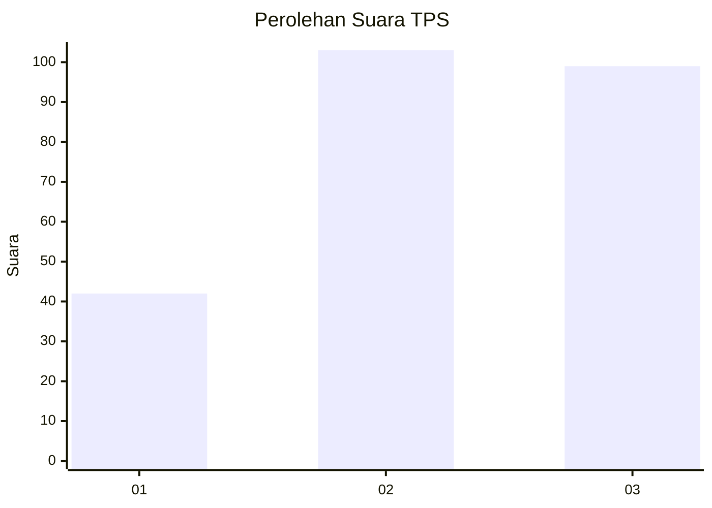
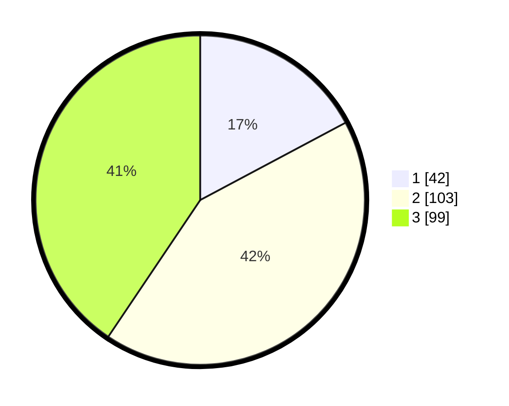

# Hasil

## Grafik

## Tabel

| No. | Nama Paslon    | Suara | Suara (raw) | Persentase |
|:--- |:-------------- | -----:| -----------:| ----------:|
| 1   | ANIES MUHAIMIN | 42    | [42][p-1]   | 17,21      |
| 2   | PRABOWO GIBRAN | 103   | [103][p-2]  | 42,21      |
| 3   | GANJAR MAHFUD  | 99    | [99][p-3]   | 40,57      |

[p-1]: https://github.com/gigit-pemilu/pemilu-2024/blob/main/pilpres/hitung-suara/sub/33-jawa-tengah/sub/25-batang/sub/11-batang/sub/1015-kauman/sub/033-tps/sub/paslon-1.txt
[p-2]: https://github.com/gigit-pemilu/pemilu-2024/blob/main/pilpres/hitung-suara/sub/33-jawa-tengah/sub/25-batang/sub/11-batang/sub/1015-kauman/sub/033-tps/sub/paslon-2.txt
[p-3]: https://github.com/gigit-pemilu/pemilu-2024/blob/main/pilpres/hitung-suara/sub/33-jawa-tengah/sub/25-batang/sub/11-batang/sub/1015-kauman/sub/033-tps/sub/paslon-3.txt

## Foto C Plano

https://sirekap-obj-formc.kpu.go.id/34e3/pemilu/ppwp/33/25/11/10/15/3325111015033-20240215-011417--790aa033-7470-4e87-b7a1-0d03769dd537.jpg

https://sirekap-obj-formc.kpu.go.id/34e3/pemilu/ppwp/33/25/11/10/15/3325111015033-20240215-011015--f117a16d-e2a5-46f2-913e-d5a837a4d7f0.jpg

https://sirekap-obj-formc.kpu.go.id/34e3/pemilu/ppwp/33/25/11/10/15/3325111015033-20240215-011512--97ed39a2-0e2f-421d-8d22-43c4aff1304e.jpg

## Metadata

| Key        | Value               |
| ---------- | ------------------- |
| Time Stamp | 2024-02-15 21:01:18 |

