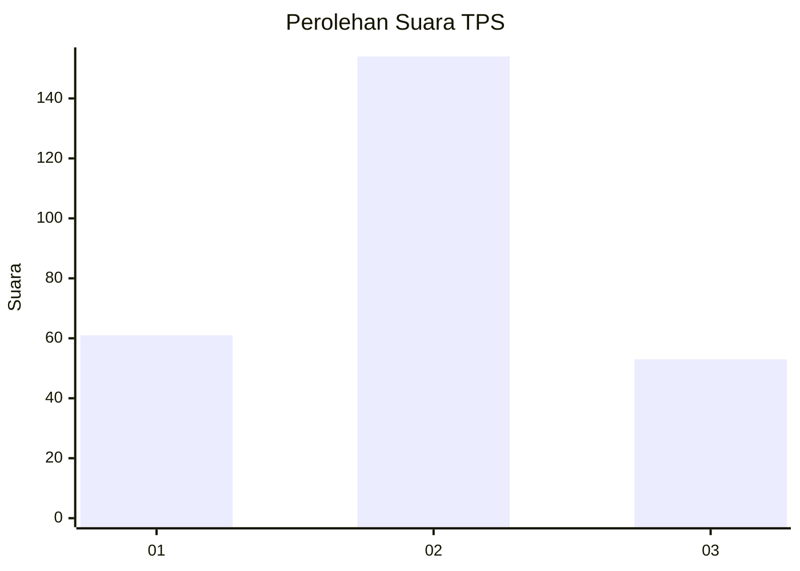
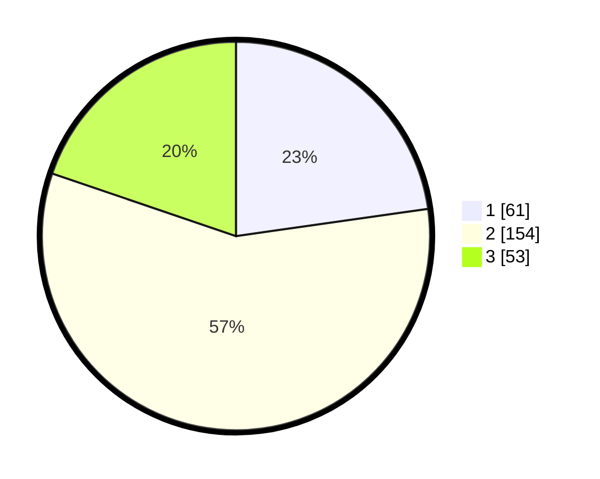

# Hasil

## Grafik

## Tabel

| No. | Nama Paslon    | Suara | Suara (raw) | Persentase |
|:--- |:-------------- | -----:| -----------:| ----------:|
| 1   | ANIES MUHAIMIN | 61    | [61][p-1]   | 22,76      |
| 2   | PRABOWO GIBRAN | 154   | [154][p-2]  | 57,46      |
| 3   | GANJAR MAHFUD  | 53    | [53][p-3]   | 19,78      |

[p-1]: https://github.com/gigit-pemilu/pemilu-2024-33-jawa-tengah/blob/main/pilpres/hitung-suara/sub/33-jawa-tengah/sub/25-batang/sub/11-batang/sub/1015-kauman/sub/043-tps/sub/paslon-1.txt
[p-2]: https://github.com/gigit-pemilu/pemilu-2024-33-jawa-tengah/blob/main/pilpres/hitung-suara/sub/33-jawa-tengah/sub/25-batang/sub/11-batang/sub/1015-kauman/sub/043-tps/sub/paslon-2.txt
[p-3]: https://github.com/gigit-pemilu/pemilu-2024-33-jawa-tengah/blob/main/pilpres/hitung-suara/sub/33-jawa-tengah/sub/25-batang/sub/11-batang/sub/1015-kauman/sub/043-tps/sub/paslon-3.txt

## Foto C Plano

https://sirekap-obj-formc.kpu.go.id/20a6/pemilu/ppwp/33/25/11/10/15/3325111015043-20240214-214459--2b1d8ef3-e9b7-4699-95aa-fd6c58f514e7.jpg

https://sirekap-obj-formc.kpu.go.id/20a6/pemilu/ppwp/33/25/11/10/15/3325111015043-20240214-214623--9a7d3d9c-44b5-46cb-93af-35f31be981dd.jpg

https://sirekap-obj-formc.kpu.go.id/20a6/pemilu/ppwp/33/25/11/10/15/3325111015043-20240214-214838--f766ec2f-9b55-4764-bbc7-8f9e13db9823.jpg

## Metadata

| Key        | Value               |
| ---------- | ------------------- |
| Time Stamp | 2024-02-15 21:01:18 |

